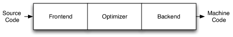
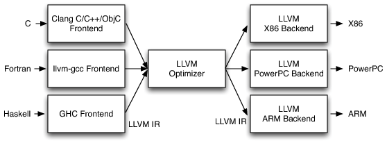
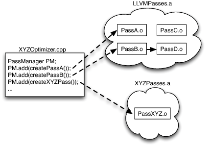
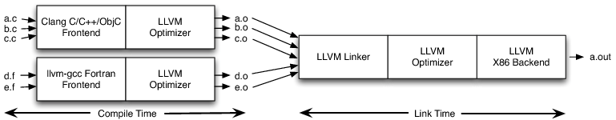

llvm 架构始于 2002-12. 目标是通过更统一清晰的接口与中间抽象层, 更多重用编译器库代码, 让 "多平台支持, 代码优化, 代码分析" 等编译器开发工作可直接基于 llvm. 可以是静态编译器 (如 gcc, free pascal), 也可以是运行时编译器 (如 vm, [jit](../JIT%20vs%20Interpreter%20vs%20AOT.md)), 灵活强大.


LLVM IR 中间代码表示有三种格式:
- `.ll` 文件: 可读 IR, 类似汇编但更易读, 称为 *llvm 汇编码*.
- `.bc` 不可读二进制 IR, 称为*位码 bitcode*. `.ll` 和 `.bc` 其实是等价的, 称为.
- 内存格式,  非持久化保存, 可以加速编译过程.

### Three-Phase Compiler Design

传统三阶段编译器架构包括: 前端, 优化器, 后端. 通过使用同一中间层, 方便了编译器支持更多高级语言和目标架构, 架构分离带来更多可能性 (如激进优化), 降低整体开发难度, 让社区更加繁荣. 



实践中这种编译器结构很少被完全实现, 前端后端难分离, 没有标准的中间代码形式, 导致各个语言的代码和优化几乎不能互相复用. 有三种实现该结构的努力:
1. Java and .Net 虚拟机. 提供 JIT 执行程序的 bytecode, [其他语言](http://en.wikipedia.org/wiki/List_of_JVM_languages) 编译为该格式即可被解释执行. 但这种方式必须使用: JIT runtime, garbage collection, particular object model. 这导致了和这种模型差异较大的语言(如C)仅有较低的执行效率.
2. 将源码翻译为 C, 然后交给 C 编译器. 这种方法很灵活, 翻译为 C 的前端也比较好写, 但此法会降低错误处理的效率, 使代码很难 debug, 并且使整个编译时间更长. 此外, 要实现一些 C 不支持的特性需要更多工作.
3. GCC. GCC 本身支持很多前后端目标, 社区也积极推荐其本身的优化迭代. 但 GCC 本身历史包袱比较重, 最初设计并不模块化, 导致对 gcc 的扩展很困难.

LLVM IR 是独立完备的, 相比之下, GCC 的 GIMPLE 中间表示并不是完备的, 编译器前后端仍需要参考其他信息来完成工作, 这导致基于 GCC 工具链的前后端实现难度较大. 

因此, llvm 分离前后端较为彻底, 原本支持 $m$ 中高级语言到 $n$ 中目标平台代码需要 $m\times n$ 种编译器实现, 现在只需要分别实现前后端到 IR 的转换, 即 $m+n$ 种实现, 大大简化了开发难度.



> [!tip] 
> There are multiple reasons why pieces of GCC cannot be reused
>  as libraries, including rampant use of global variables, 
>  weakly enforced invariants, poorly-designed data structures, 
>  sprawling code base, and the use of macros that prevent the 
>  codebase from being compiled to support more than one 
>  front-end/target pair at a time. 
>  The hardest problems to fix, though, are the inherent 
>  architectural problems that stem from its early design and age. 
>  Specifically, GCC suffers from layering problems and leaky 
>  abstractions: the back end walks front-end ASTs to generate 
>  debug info, the front ends generate back-end data structures, 
>  and the entire compiler depends on global data structures 
>  set up by the command line interface.

### Pass

llvm Optimizer 是由不同 Pass 构成的管道, 每个 Pass 读入 llvm IR 后对其进行某种优化. Pass 写在 cpp 文件的匿名 namespace 中, 并提供一个导出函数.

```cpp
// 简单例子
#include "llvm/Pass.h"
#include "llvm/IR/Function.h"
#include "llvm/Support/raw_ostream.h"

using namespace llvm;

namespace {
class MyPass : public PassInfoMixin<MyPass> {
public:
  PreservedAnalyses run(Function &F, FunctionAnalysisManager &) {
    errs() << "Function name: " << F.getName() << '\n';
    // 返回一个特殊值，表示未对IR进行修改
    return PreservedAnalyses::all();
  }
};
} // end anonymous namespace

// 导出函数
llvm::PassPluginLibraryInfo getMyPassPluginInfo() {
  return {LLVM_PLUGIN_API_VERSION, "MyPass", LLVM_VERSION_STRING,
          [](PassBuilder &PB) {
            // 注册 Pass
            PB.registerPipelineParsingCallback(
                [](StringRef Name, FunctionPassManager &FPM,
                   ArrayRef<PassBuilder::PipelineElement>) {
                  if (Name == "my-pass") {
                    FPM.addPass(MyPass());
                    return true;
                  }
                  return false;
                });
          }};
}

// 使用宏注册插件
extern "C" LLVM_ATTRIBUTE_WEAK ::llvm::PassPluginLibraryInfo
llvmGetPassPluginInfo() {
  return getMyPassPluginInfo();
}
```

llvm 仅链接入所需要的 Pass.o, 无关 Pass.o 不会产生开销. 这也是模块化的优点.





## 参考

[LLVM IR 入门](https://evian-zhang.github.io/llvm-ir-tutorial/01-LLVM%E6%9E%B6%E6%9E%84%E7%AE%80%E4%BB%8B.html)  

[LLVM Language Reference](https://llvm.org/docs/LangRef.html)  

[The Architecture of Open Source Applications (Volume 1)LLVM](https://aosabook.org/en/v1/llvm.html)
