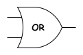

## 组合逻辑

### 逻辑门

### 半加器

### 加法器

### 选择器

## 时序逻辑

输出不仅受当前输入影响, 还受之前状态影响.

### 寄存器

### 计数器

### 状态机

https://www.tutorialspoint.com/digital-electronics/index.htm

## 参考

https://www.tutorialspoint.com/digital-electronics/index.html

图片使用 Draw.io 绘制.