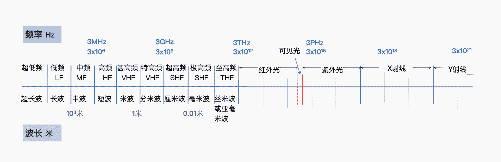
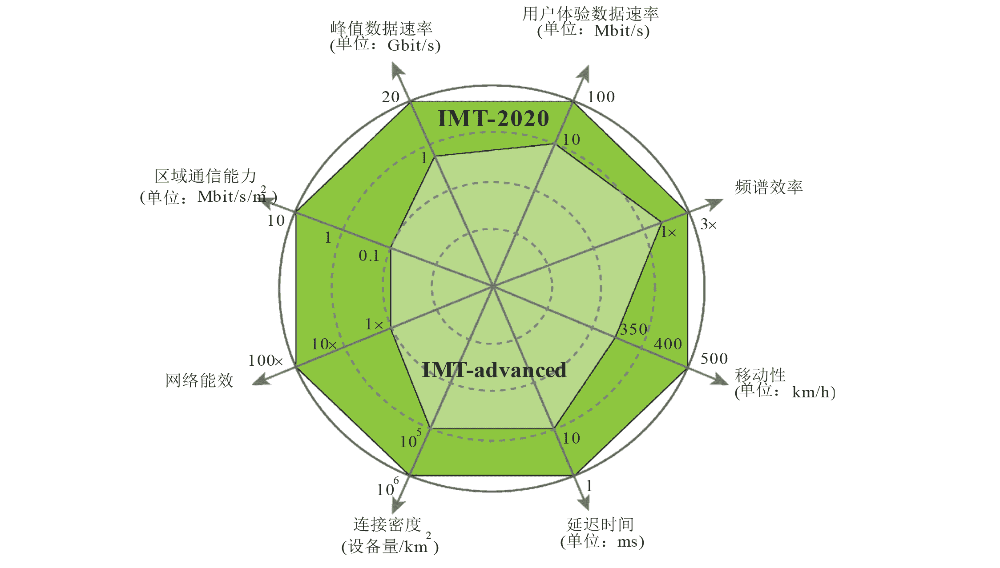

## 通信技术



由于电磁波是自然资源, 人类根据频率将电磁波分为不同类型, 称为频谱. 对于每种无线通信方式, 其可利用的电磁波频率不同, 集中分配在不同频段中. 如中国电信 5G 频段为 3400~3500MHz[^1]. 

香农-哈特利定理 $C=B\log_{2}\left( 1+\frac{S}{N} \right)$ 指出带宽 $B$ 越大, 即信号可使用频谱范围越大, 信道容量 $C$ 就越大, 可传输信息量就越多. 频率较大时, 可分配的频谱空间也较大, 带宽也较大. 信噪比, $S/N$, Signal-to-Noise Ratio 越大, 即 $SNR=10\log P_\text{signal}/P_\text{noise}$ (dB) 越大, 信道容量 $C$ 也越大. 当信号功率增大时, SNR 自然也变大.

$c=\lambda\cdot f$, $E=h\cdot f$

光速 $c$ 和普朗克常数 $h$ 为常数, 当频率增大时, 波长减小, 光子能量 $E$ 增强. 但无线通信中, 能量消耗更多是和信号发射功率相关的: $$P_{r}=P_{t}+G_{t}+G_{r}-L_{p}$$
- $P_{r}$ 接收功率, 单位是分贝毫瓦 (dBm)
- $P_t$ 发射功率 (dBm)
- $G_{t}, G_{r}$ 为天线增益 (dBi)
- $L_p$ 为路径损耗, $L_{p}=20\log d + 20\log f+20\log \frac{4}{\pi\cdot c}$ (dB)

在介电介质中传输时, 频率 $f$ 越大, 产生的电场大, 电流越大, 介质中路径损耗的能量 $L_p$ 越大, 穿透力越弱, 即传输距离 $d$ 越短. 由于低频信号的良好传播特性, 被广泛使用到不同领域, 造成低频信号频谱竞争激烈 (毕竟低频频谱本身范围也很小). 因此, 对于不同的无线通信类型, 并不是说要覆盖的通信范围越大, 就必须被分配到更低频率. 

另外, 天线物理尺寸和工作波长成反比, 高频信号的波长较短, 因而可使用更小的天线, 被封装到更便携的设备中.

[^1]: 详见 [中华人民共和国无线电频率划分规定_国务院部门文件](https://www.gov.cn/zhengce/zhengceku/2018-12/31/content_5439640.htm)

### 无线通信种类

无线通信的信号称为**无线电频率信号, 即 RF (Radio Frequency) 信号**, 指 3kHz~300GHz 频率区间的电磁波, 用于各种形式的无线电通信. 目前全球 7GHz 以下的频段基本都被占用, 并且分布零散.

- MF: 调幅广播 (AM), 海事通信
- HF: 短波, 民用电调
- VHF: 调频 (FM) 广播, 电视广播, 航空通信
- UHF: 300MHz~3GHz, **移动通信网络 (2G, 3G, 4G, 5G), 无线网络**.
- SHF: 3GHz~30GHz, **无线网络**, 卫星通信.
- EHF: 安检仪, 遥感, 射电天文.

手机常见短程无线通信:
- WiFi, Wireless Fidelity, 无线局域网. 2.4~5GHz, 覆盖范围在*几十到几百米*.
- Bluetooth, 短距离无线数据传输, 用于设备间*点对点连接*, 分布在 2.4GHz ISM 频段. 功耗低, 但传输距离较短, *一般在 10 米以内*.
- NFC, Near Field Communications, 近场通信. 在*几厘米*的距离内进行数据交换. 频段为 13.56MHz, 功耗极低, 常用于移动支付和电子卡片.

### 信号处理流程

```
信息 -> 编码 -> 加密 -> 调制 -> 传输 -> 解调 -> 解密 -> 解码 -> 信息
```

- 首先对二进制信息进行**信源编码**, 即数据压缩编码来减少冗余. 如 Huffman 编码
- **加密**编码后信息, 如 AES.
- **信道编码**, 添加纠错码, 如: 海明码, 里德所罗门编码.
- **调制**, 将基带信号 (Baseband Signal) 编码入载波 (Carrier Signal), 使其更适合传输, 如: AM, QAM, PSK.
- 调制后, 将信号放到信道上传输.[^2]
- 接收到信道上的载波信号, **解调**信号, 转化为基带信号.
- 将基带信号**解密**, **解码**, 获得原始信息.

[^2]: 这里忽略了数模转换, 手机处理信号的详细流程, 可以参考 [计算机架构](计算机架构.md) 的智能手机架构部分.

### 移动通信网络架构


手机 (用户设备, UE) 接入移动通信网络时, 会用电磁波向附近的小区基站 (eNodeB/gNodeB) 发出计入申请, 请求信道资源, 传输电磁波的这段信道称为**空口**. 这一过程称为*无线接入过程 (Random Access Procedure)*, 涉及数据链路层的 MAC 协议. 

基站的天线会捕捉该信号, 并传输给基站, 众多基站和天线组成的网络称为**无线接入网**. 基站和用户设备建立 *RRC (Radio Resource Control, 无线资源控制) 连接*, 用于配置无线链路参数. 该过程涉及数据链路层 RLC 和 RRC 协议.

电信号在长距离传输时衰减严重, 基站会将电信号转化为光信号, 在光纤中传输. 光纤也会有一定衰减, 所以每隔一段距离有一个光传信号放大器. 光传输设备和光纤组成了地下庞大的**承载网** (Bearer Network).

手机发出的申请通过承载网传输到运营商中心机房后, 机房对手机身份/状态/费用等进行核查, 然后启用拨号或联网 (分配 IP). 其中, 用户身份验证用到了 [AKA 安全协议](../Security/密码学/安全协议/认证的密钥协商协议/AKA%20协议.md), 协商密钥, 发生于网络层. 运营商中心机房和管理设备被称为**核心网** (Core Network).

用户接入网络后, 使用 PDCP 协议进行通信加密和完整性保护. 该过程使用之前 AKA 协议协商的密钥, 发生在网络层. 

## 移动通信标准
### 1G

1980s, 主流移动设备为*大哥大*, 无线通信主要指大哥大之间的通信. 大哥大使用模拟信号, 体积大笨重 (集成度不高), 信号容易受干扰.

为实现无线通信, 通信厂商将城市分为诸多六边形小区块, 每个区块中心建设一个通信基站, 大哥大手机和最近的基站进行通信. 每个区块称为一个**蜂窝小区**.

1981 年, 1G 网络在美国得到商用, 采用 AMPS 标准. 1987 年, 中国引入英国的 TACS 系统. TACS 系统有爱立信和摩托罗拉两个设备厂商, 两个厂商之间服务无法相互漫游, 成为 1G 网络最大弊端.

### 2G

1980s, 集成电路技术发展, 可以在一块芯片上集成众多晶体管. 出现了多种类型的数字芯片: 系统控制和计算的 CPU, 处理信号的 DSP/FPGA, 存储程序的 ROM 芯片等. 

由此, 2G 标准转而使用数字通信技术, 将声音等模拟信号转化为 01 数字编码在网络传播. 手机体积变得十分轻巧, 且更省电. 2G 标准要求不同厂商间兼容, 可相互漫游, 即A网用户可以打电话给B网用户, 由此通信厂间开始竞争做*标准制定者*.

2G 通信标准按*多路复用 (Multiplexing)* 技术形式, 分为基于 TDMA/FMDA 和基于 CMDA 两类. 欧洲的 GSM (Global System for Mobile Communications) 系统是基于 TDMA 的典型系统, 1991 年首次在芬兰开通 GSM 网络. 高通公司研发 CMDA 技术, 成本低质量高, 在 1993 年称为公认行业标准, 1995 年后在美国和亚洲陆续使用. 后续 3G 将 CMDA 选为基础技术, 由于高通对 CMDA 专利的垄断, 这引发了不小争议.

1990s, 互联网兴起. 由于 2G 最高速率为 171Kbps, 单用户大概为 20~40Kbps, 远不能满足上网需求, 浏览网页和邮件都非常慢.

### 3G

3~5G 通信标准由国际电信联盟 (ITU) 主导建立, 3G 主要通信协议有美国的 CDMA2000; 欧洲和韩日的 UMTS (WCDMA); 中国移动的 TD-SCDMA. 主要技术是码分多址技术 (Code Division Multiple Access, CDMA), 使多用户在同一频率下同时传输信号.

2001~2005, 成为 3G 商用第一阶段, 速率为 2Mbps. 在第一阶段, 由于技术发展尚不成熟, 网速不够快, 手机不够智能(还是打电话为主), 所以 3G 商用推广不太顺利. 

2006后, 3G 峰值下行速率可达到 14.4Mbps, 时延 100ms 左右, 称为 3G 商用第二阶段. 该阶段的主要技术是高速分组接入 (High Speed Packet Access, HSPA), 用于提高上下行数据速率. 2008 年苹果推出第一代 3G iPhone, 智能手机+应用 App 的商业模式, 极大丰富了手机互联网的功能和用途.

随着智能手机普及, 互联网生态从邮件网页等文字业务, 渐渐也变为看视频打游戏等, 对流量需求更大. 3G 网络也出现了卡顿和时延.

### 4G

2000s, 4G 技术标准制定. 2010s, 4G 大规模商用, 使用 LTE (Long Term Evolution)[^4], 进一步提升了 3G 网络速度, 峰值速度为 1Gbps, 单用户速率为 20~40Mbps, 时延为 50ms. 

[^4]: 正如 LTE 名字谕示的一样, 4G 设计之初就旨在支持长期技术进步, 最新 4G+ 网络能达到和 5G 类似的使用体验.

4G 极大改变了移动互联网生态, 移动设备通信技术从此不再仅为打电话发短信服务, 而是承载了更多价值, 产生了极大规模经济效益:
- 微信, 支付宝
- 美团, 饿了吗
- 高德地图, 嘀嘀打车
- 爱奇艺, B站, 腾讯视频
- 淘宝, 京东, 拼多多等线上购物.

4G核心技术有正交频分复用 (OFDM), 多输入多输出 (MIMO), 载波聚合 (CA), 全 IP 分组核心网等. 注意, 4G 使用 IMSI (International Mobile Subscriber Identity) 来唯一标识用户, 而 5G 使用 SUPI (Subscription Permanent Identifier). 

随着 4G VoLTE 业务的发展, 打电话可以直接使用 LTE 网络, 而无须 CDMA 1x 的支持. 因此 CMDA 在 2019 年彻底退网, 所在的频谱也被重耕伪 4G 和 5G 频段.

### 5G

5G 面向对无线连接要求更高的场景, 如: VR, 高清视频, 物联网, 车联网. 通信协议为 NR (New Radio).

ITU 提出了 5G 面向的三大目标场景:
- Enhanced mobile broadband, eMBB. 提高网速同时, 还要提供大连接容量, 尤其是对热点地区 (演唱会, 机场等) 的网速支持.
- Ultra-reliable and low latency communications, URLLC. 即要可靠和低时延, 面向一些工业需求, 如远程手术.
- Massive machine type communication, mMTc. 即支持海量物联网设备.

基于上述三大目标场景, 提出了具体8项性能关键指标: [^3]


[^3]: IMT-2020 指 5G, IMT-Advanced 指 4G. 移动性指在高度移动的场景下 5G 信号稳定性, 如动车上信号和车联网信号.

5G 如何提高通信效率?
- 增加频谱资源: (Hz)
	- 额外在中低频和毫米波 (>24GHz, mmWaves) 寻找可用频段, 其中毫米波由于路径损耗严重, 通常用于室外开阔处. 
	- 对 3G 频谱重耕. 
	- 和 4G 网络共享频谱资源, 称为动态频谱共享 (DSS, Dynamic Spectrum Sharing). 
- 提高频谱效率 (Spectral Efficiency, bits/s/Hz)
	- 提高无线空口编码效率: 5G 现行编码有 Polar 码和 LDPC 码, 其中华为主推 Polar 码, 传输小数据块时性能更优越, 计算复杂度低, 时延低; 高通主推 LDPC 码, 峰值速率更高, 解码速度更快. 都进入了 5G 标准. 
	- 提高调制解调效率: 正交频分复用技术 (OFDM)
	- 提高传输技术: 波形成束 (Beamforming), 多输入多输出技术 (Massive MIMO).
- 增加流量密度: (Traffic Density, bits/s/m^2)
	- 超密集组网 (目前没实现), 允许近距离设备直接通信.
	- 不同业务间实现网络切片

### TDD vs FDD

频分双工 (FDD, Frequency Division Duplex) 使用两个不同频段来分别支持上行和下行通信. 上下行信道在不同频率同时工作, 互相干扰少, 通信延迟低, 适合语音通话等上下行流量对称的场景. 但其需要为上下行分配成对独立频段, 频谱资源要求高, 部署难.

时分双工 (TDD, Time Division Duplex) 使用同一频段在不同时间支持上行和下行通信, 将时间划分为帧或时隙, 动态分配给上行或下行通信. 在流量不对称时, 如手机互联网应用中下行流量远大于上行流量时, 能更灵活分配上下行时隙分配, 高效利用频谱资源. 

|              | FDD                 | TDD                      |
| ------------ | ------------------- | ------------------------ |
| 频谱需求     | 高, 需要成对频谱    | 低, 只需要单一频谱       |
| 频率利用效率 | 在对称流量时高      | 在不对称流量时高         |
| 延迟         | 低                  | 相对高                   |
| 干扰管理     | 容易                | 复杂, 需要上下行时间同步 |
| 场景         | 实时通信            | 热点地区上网需求         |
| 应用协议     | GSM, WCDMA (中国联通3G), FDD-LTE (中国联通, 中国电信4G) | TD-SCDMA (中国移动3G), TD-LTE (中国移动4G), NR                         |

由于频谱资源有限, 5G 主要支持 TDD (时分双工) 而不是 FDD (频分双工). 