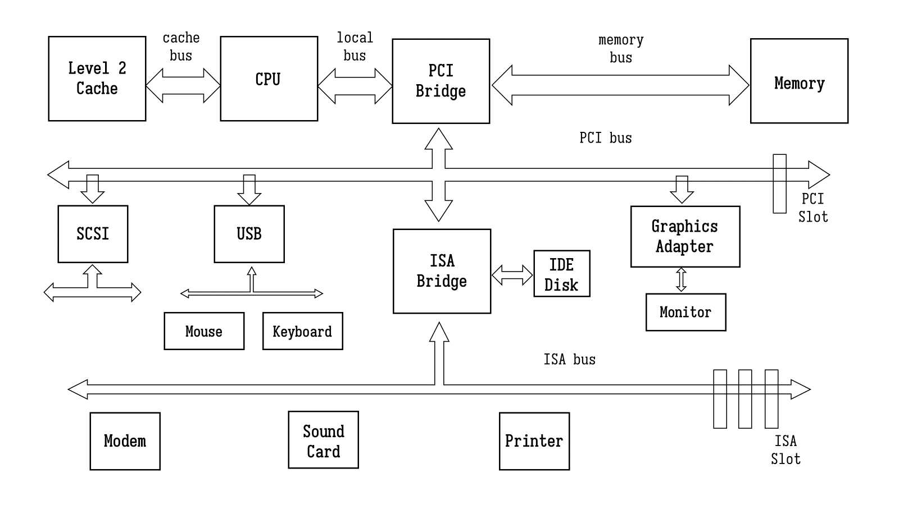
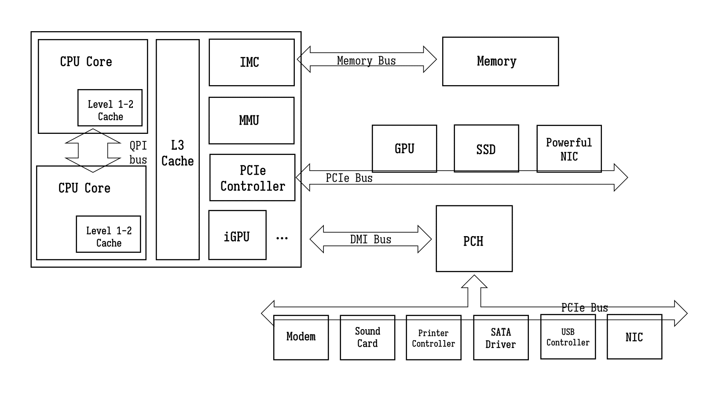
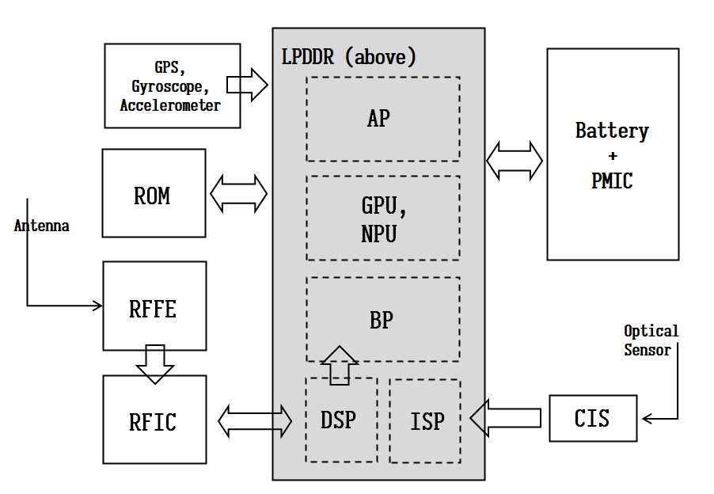

> Any problem in computer science can be solved by another layer of indirection.

### 早期计算机架构

早期计算机没有复杂图形功能 [^1], CPU核心频率也不高, 和内存频率一样. 所有设备都在同一个总线 (bus) 上. 由于音响, 键盘, 硬盘等设备本身速度很慢, 所以通常有一个控制器, 负责连接总线和控制设备输入输出.

由于 CPU 核心频率提高, 内存 (DRAM) 频率跟不上, 于是产生了系统总线 (system bus), CPU 使用倍频方式与内存通信. 同时诞生了[多级缓存技术](缓存.md), **缓存** (SRAM) 速度比内存更高, 作为 CPU 数据的缓冲.

随着图形化的操作系统普及, 多媒体和游戏发展, 图形芯片 (GPU) 也要求与 CPU 和内存之间大量交换数据, 为了协调 GPU, CPU 和 内存, 设计了高速**北桥芯片** (North Bridge, PCI Bridge).

北桥运行速度较高, 低速设备不便直接连接在其上. 所以有了处理低速设备的南桥 (South Bridge), 连接着磁盘, 键盘鼠标, 网卡, 声卡等低速设备. 20世纪90年代, 北桥总线使用 PCI, PCI Express (PCIe) 或 AGP; 南桥上则使用较慢的 ISA 总线. 

### 现代计算机架构

现代计算机架构和材料仍在不断演变, 总体是朝**高性能和集成化**发展. 为简化系统设计, 北桥和南桥功能逐步被合并, CPU芯片组的功能和能力也在不断增强. 

- NIC (网卡): Ethernet -> WiFi
- 硬盘或光驱等存储设备接口: IDE, SCSI --> SATA, SAS
- Modem (调制解调): 拨号网络 --> 数字用户线, DSL --> 光纤
- [存储设备](存储器.md): 机械硬盘, HDD --> 固态硬盘, SSD
- 总线: ISA --> PCI --> PCIe --> DMI, QPI

为提高内存速度, CPU 内部直接提供集成的内存读写控制单元 (IMC, 非 MMU), 直接访问内存. 提供集成的 PCIe 控制器, 控制外部如: GPU, SSD, 高性能网卡等高速设备. 原南北桥被合并为单一 PCH (Intel Platform Controller Hub), 处理较低速的设备, 如: 机械硬盘, 声卡, USB, ROM, 可移植媒介等.

[^1]: 程序员的自我修养--连接, 装载与库. 俞甲子等. P7

### 智能手机架构

计算机朝着"集成化, 微型化"方向发展, 目前主流的个人计算机形态是手机. 智能手机集成了: 相机, 计算机, 传呼机. 将不同功能芯片封装在一起, 称为**系统单芯片 (SoC)**, 包括 AP, BP, GPU, DSP, ISP 等等. 高度封装后, 为保证和内存通信速度, 将 LPDDR 压在 SoC 空间上方, 称为 PoP 封装技术.

智能手机拍照时, 光学传感器收集到光信号, 由 **CMOS 图像传感器芯片, CIS** 转化为电信号, 然后交给 **ISP, 图像处理芯片**. 处理电信号的芯片称为**数字芯片**, 处理模拟信号 (即连续变化的电压或电流) 的芯片称为**模拟芯片**.

智能手机处理无线电通信[^2]时, 手机天线首先接收无线电频率 (RF) 信号, 交由射频前端芯片 (RFFE) 来对模拟 RF 信号进行模拟滤波/功率放大等处理. 接着由射频芯片 (RFIC) 将**模拟信号**转换为**数字信号**, 即进行模数转换. 数字信号交由数字信号处理芯片 (DSP) 进行滤波, 然后解调解码为**基带信号**, 基带信号交由基带芯片 (BP) 处理**上层通信协议**, 并和上层应用交互.

[^2]: 详见 [无线通信技术](无线通信技术.md)

智能手机内数字芯片:
- 应用处理器 AP, Appilication Processor, 类 CPU. 对计算性能要求高, 手机厂商多自研, 如苹果 A 系列芯片和华为麒麟芯片. 现代手机的系统单芯片 (SoC) 指 AP+BP+GPU.
- 基带处理器 BP, Baseband Processor. 负责处理上层通信协议, 对实时性要求高, 如: 信令处理, 会话和连接管理, 数据包组装拆解. 支持 GSM, CDMA, LTE, 5G 等众多不同通信协议标准, 有较高专利壁垒, 手机厂商难以自研, 常用高通基带芯片. 
- 存储芯片 LPDDR (易失) + ROM (非易失). 
- 图形处理芯片 GPU, 神经网络芯片 NPU.
- DSP, 处理数字信号, 如滤波, 调制/解调, 编码/解码, 压缩/解压缩. 任务常见有语音处理, 图像处理 (还有专门的 ISP 负责), 视频处理等.

模拟芯片有:
- 电源管理芯片, PMIC, Power Managerment Integrated Circuits.
- 射频芯片, RFIC, 将模拟 RF 信号转化为基带信号. 包括数模转换器, 如 AD/DA
- 射频前端芯片, RFFE, RF Front-End Module. 用于处理模拟信号, 包括功率放大器 (PA), 滤波器 (Filter), 低噪声放大器 (LNA)等.

