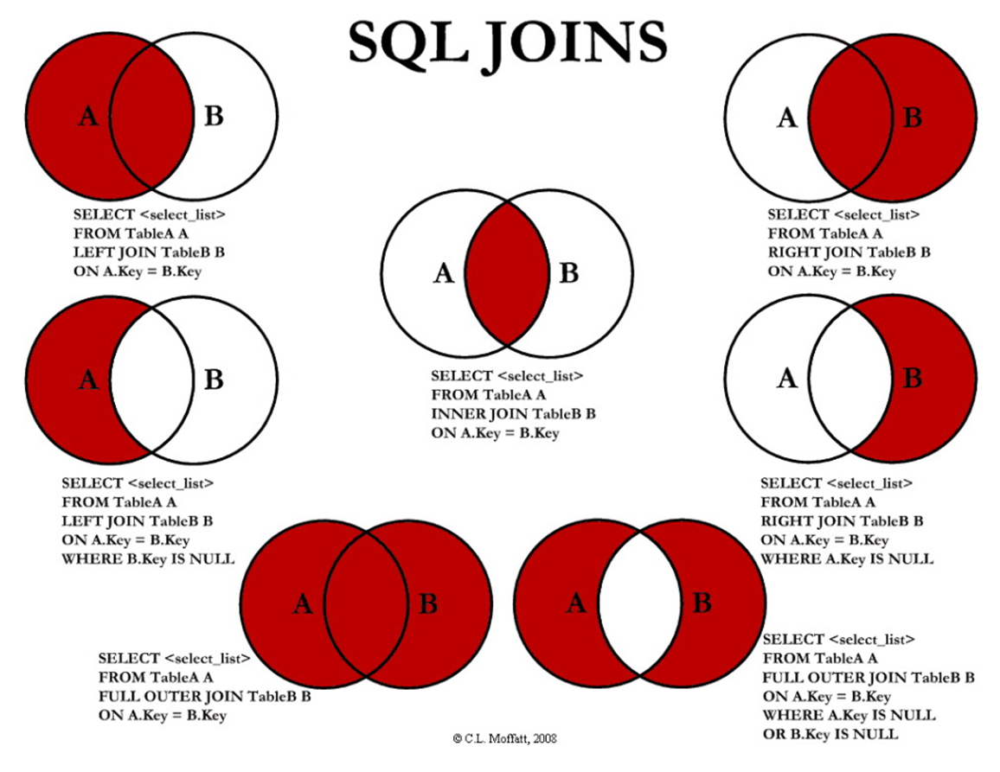

SQL (Structured Query Language) 是结构化查询语言, 专用于与数据库交互和通信. 语言类型为[声明式语言](../../../Language/DP/编程范式.md), 其功能:
- 数据定义语言 (Data Definition Lanuguage): 数据库结构定义, 用于创建, 修改和删除数据库对象 (表, 列, 索引, 视图, 存储过程)
- 数据操纵语言 (Data Manipulation Language): 管理数据库数据, 查询, 修改, 插入与删除数据对象.
- 数据控制语言 (Data Control Language): 权限控制
- 事务控制语言 (Transaction Control Language): 

| SQL 功能 | 谓词                           |
| -------- | ------------------------------ |
| DDL      | creat, drop, alter             |
| DML      | select, insert, update, delete |
| DCL      | grant, revoke                               |

## 基础概念

数据库, database.

表, table, 表是某种数据的结构化清单. 

列, column 构成表中的字段; 行, raw 构成表中的一个记录, 也称为记录, record.

模式, schema, 数据库的结构信息.

主键, primary key 指**唯一**标识该行的一列. 应总是定义主键.  
- 不应更新主键列中的值
- 不重用主键列的值
- 主键不适用将来变化的值, 如来源可能会更新

## 对象定义

| 对象                    | 创建操作      | 删除操作    | 修改操作    |
| ----------------------- | ------------- | ----------- | ----------- |
| 模式 <br> (无标准, 类似表命名空间) | create schema | drop schema |             |
| 表                      | create table  | drop table  | alter table |
| 视图                    | create view   | drop view   |             |
| 索引                    | create index  | drop index  | alter index            |

建表: 定义列时, 需要指定具体的[数据类型](数据类型.md)

```sql
create table Student(
	Sno char(9) primary key,
	Sname char(20) unique,
	Ssec char(2),
	Cno char(4),
	foreign key (Cno) reference Class(Cno)
);
```

删除表: `drop table <t> [restrict | cascade]`
- restrict: 和 cascade 相反
- cascade: 若存在其他依赖该表对象, 相关依赖对象一起删除

修改表:
```sql
alter table <表名>
[add[column] <新列名> <数据类型> [约束]]
[add <表级约束>]
[drop[column] <列名> [cascade|restrict]]
[drop constraint <完整性约束名> [restrict|cascade]]
[alter column <列名> <数据类型>];
```

## 数据查询

数据查询详见 [SQL/数据过滤](数据过滤.md).

```sql
select [all|distinct] <列表达式>[, <其他列表达式>]
from <表名> [, <其他表名>] [as] <别名>
[where <条件>]
[group by <列名> [having <条件>]]
[order by <列名> [asc|desc]];
```

常见查询条件:

| 条件     | 谓词              |
| -------- | ----------------- |
| 比较     | =, >, <, <>       |
| 字符匹配 | (not) like        |
| 空值     | is (not) null     |
| 逻辑     | and, or, not      |
| 确定范围 | (not) between and |
| 确定集合 | (not) in          |
| 存在     | (not) exists             | 

### 子语句

**嵌套查询:**



嵌套集合关系:

|     | =   | <>     | <    | <=    | >    | >=    |
| --- | --- | ------ | ---- | ----- | ---- | ----- |
| ANY | IN  | --     | <MAX | <=MAX | >MIN | >=MIN |
| ALL | --  | NOT IN | <MIN | <=MIN | >MAX | >=MAX      |

数据库没有全称量词 (for all), 需要用存在量词等价转换: $(\forall x) P\equiv \neg (\exists x(\neg P))$, 其中量词 $x\in Q$, P 为谓词. 举例而言, "选择了所有课程的学生" 等价于 "不存在有课程没有被该学生选过", 其中 $x=\text{课程}\in Q=\text{所有课程集合}$, $P=\text{学生选择了该门课}$.

### 查询优化

数据库 SQL 处理过程: 


查询优化分类
- 代数优化: 关系代数表达式优化
- 物理优化: 存取路径和底层操作算法优化

```
SQL 语句
  |
  | 编译
  v
关系代数
  |
  | 代数优化
  v
关系代数
  |
  | 物理优化
  v
执行程序
```

#### 执行开销

- 磁盘存取块数 (IO代价), **主要代价**.
- 处理机时间 (CPU代价).
- 查询的内存开销.
- (通信开销)

#### 启发式代数优化

1. **选择**运算尽可能先做
2. 投影和选择同时进行 (运算顺序接近), 对行列同时运算
3. 将投影同其前后的双目运算符结合. 
4. 选择操作和前面的笛卡尔积结合. 如 $R\substack{\bowtie\\A\theta B}S=\sigma_{t[A]\theta s[B]}(R\times S)$
5. 找出并合并公共子表达式

## 数据修改

详见 [SQL/基础语法](基础语法.md)

```sql
update <table>
set <col> = <expr> [, ...]
[where <condition>];

insert
into <table> [<col1>, ...]
values (<cosnt1 [, ...]);

delete
from <table>
[where <condition>];
```