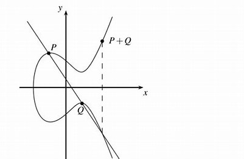
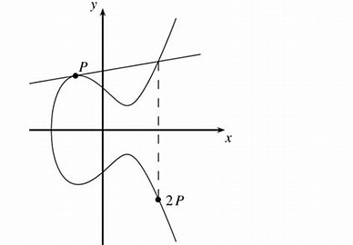

> 更详细公式推导可见[椭圆曲线-wiki](https://zh.wikipedia.org/wiki/%E6%A4%AD%E5%9C%86%E6%9B%B2%E7%BA%BF)
> 椭圆曲线主要用于ECC

$y^2 = x^3+ ax+b$ 是一类加密用的简单椭圆曲线, 密码学中用有限域将其离散化.

可以在两种有限域中计算椭圆曲线:
1. 模素数有限域 $GF(p)$, 适用于一般算法
2. 特征为2的伽罗华域 $GF(2^m)$, 适用于硬件加速

$GF(p)$上曲线 $E_p(a,b)$ 表示为 $y^2 = x^3+ax+b(mod p)，x,y\in[0,p]$  
该曲线关于x轴对称。并且要求满足曲线非奇异 ($4a^3+27b^{2} \ne0$)

> 非奇异的, 意味着曲线几何上无尖点/自相交点/孤立点, 平滑. 并且处处可导

 

## 1 椭圆曲线上的运算

### 1.1 负元

点P, $(x,y)$, 的负元是 $(x,-y \pmod p) =(x,p-y)$ . 几何上, 是P关于x轴的对称j点

### 1.2 点加法

**定义**  
$P(x_{1},y_{1})$, $Q(x_{2},y_{2})$ 和 $R(x_{3},y_{3})$ , 若$P+Q = R$, 则三点有如下关系:

$x_3≡k^2-x_1-x_2(mod p)$  
$y_3≡k(x_{3}-x_{1})+y_{1}(mod p)$

其中, 斜率k计算方式如:

$$k=\left\{
\begin{align}
\frac{3x_{1}+a}{2y_{1}},\ if\ P=\ Q\hspace{100cm}\\
\frac{y_2-y_1}{x_2-x_{1}},\ if\ P\neq\ Q\hspace{100cm}
\end{align}\right.$$

几何上, R是PQ直线与曲线交点的关于x轴的对称点.  

#### $P\neq Q$ 推导

- **先求直线PQR**

设$P(x_{1}, y_{1})$, $Q(x_{2}, y_{2})$

斜率k: $k=\frac{y_{2}-y_{1}}{x_{2}-x_{1}}$

所以直线表示为: $y=k*x+t$

- **计算直线PQR与椭圆曲线的交点**

得 $(k*x+t)^2=x^3+a*x+b$, 化简为 $x^3-k^2*x^2+(a-2kt)*x+b-t^2=0$

又已知PQR三点应满足 $(x-x_{1})(x-x_{2})(x-x_{3})=0$

两者比较得 $-(x_{1}+x_{2}+x_{3})*x^2=-k^{2}*x^2$, 即 $x_{1}+x_{2}+x_{3}=k^2$

要求$y_{3}$, 使用斜率公式即可: $k=\frac{y_{3}-y_{1}}{x_{3}-x_{1}}$

#### $P=Q$ 推导

依点加法几何含义, 此时直线RPQ为P点的切线, 求此时斜率:  

同时对$x$求导: $2*y*y'=3*x^{2}+a$  

得斜率: $k=y'=\frac{3*x^{2}+a}{2*y}$

其余公式和 $P\neq Q$ 情景相同

#### 无穷远点

以上加法不完备(满足封闭性), 存在两点x坐标相同时, 不存在第三个点的情况. 

因此定义无穷远为"无穷远点", 记为 $\mathbb{O}$, 有 $P=\mathbb{O}+P$

由于当$b\neq{0}$时, $y^2=x^3+ax+b$ 形式的曲线不过 $(0, 0)$ 点, 故程序中通常记$\mathbb{O}=(0, 0)$

### 1.3 点数乘
**定义**  
对于正整数$n$和椭圆曲线上点$P$, 定义数乘运算: $[n]P=P+P+P+\dots+P$

为提高计算效率, 计算$[n]P$时, 可以模仿快速幂算法, 复杂度为$\mathbf{O}(n)$

> 更多优化细节与方法见[EC point multiplication](https://en.wikipedia.org/wiki/Elliptic_curve_point_multiplication)

 

## 2 椭圆曲线上的群

椭圆曲线在有限域$\mathbb{Z}_{p}$上的点集, 构成一个Abel交换群:

**证明**  
- 封闭性: 由"1.2 点加法"中的论述显然
- 有单位元: $\mathbf{P}+\mathbf{O}=\mathbf{O}+\mathbf{P}=\mathbf{P}$
- 有逆元: $\mathbf{P}+(\mathbf{-P})=\mathbf{O}$
- 结合律: $\mathbf{(P+Q)+R}=\mathbf{P+(Q+R)}$
- 交换律: $\mathbf{P+Q}=\mathbf{Q+P}$

### 2.1 群阶
**该点集群的阶即有限域上的椭圆曲线的点个数**, 注意不是p

求曲线$y^{2}=x^{3}+ax+b\pmod p$上的点, 可以在$\mathbb{Z}_{p}$上遍历x坐标, 然后检测 $x^3+ax+b$ 是否是模p的二次剩余.  

由[二次剩余](../../../数论/二次剩余.md)知识, 有限域 $\mathbb{Z}_{p}$ 元素是否为二次剩余的概率约为`50%`, 所以推测点集上的点个数约为 $\lVert E(\mathbb{Z}_{p})\rVert=0.5*p*2+1$ , 其中, $p*2$代表$y^2$有一正一负两解, 1代表无穷远点$(0,0)$.

事实上, 上述推测较准确: $\lVert E(\mathbb{Z}_{p})\rVert=p+1-t_{p}\text{,  where  }\lvert t_{p}\rvert\leq2\sqrt{ p }$

#### 子群的阶与基点G

ECC选择G时, 需选一个阶比较大的点, 以保证有足够的私钥$d$

> 见 [ECC](../../../Security/密码学/公钥密码/ECC/ECC.md)

> 子群阶 to be continue...

 

## 3 ECDLP

椭圆曲线上的离散对数问题: **给出点 `P` 和 `[n]P`, 求出n是困难的**

目前最快的ECDLP算法, 也需要$\mathbf{O}(\sqrt{ p })$求解

> `ECdLP, Elliptic Curve Discrete Logarithm Problem`  
> 基于椭圆曲线上的离散对数困难问题, 有[ElGamal-协议](../../../Security/密码学/公钥密码/ElGamal-协议.md)的变体

> 离散对数问题定义见 [欧拉定理](../../../数论/欧拉定理.md)  
> 基于该问题的有 [DiffieHellman-密钥交换](../../../Security/密码学/公钥密码/DiffieHellman-密钥交换.md)

 

## 参考文章

- [有限域上的椭圆曲线 by Ruan Xingzhi](https://www.ruanx.net/elliptic-curve/)
- [椭圆曲线上的相同点相加与相异点相加的推导计算-CSDN博客](https://blog.csdn.net/guyongqiangx/article/details/121793398)