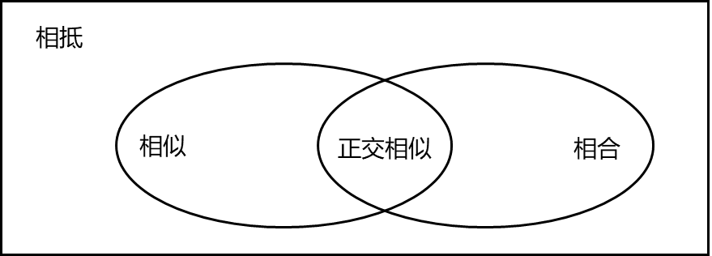

## 矩阵的关系

| 矩阵关系        | 定义域        | 定义                                                           | 代表                                                        | 不变量        |
| ----------- | --------------- | -------------------------------------------------------------- | ----------------------------------------------------------- | ---------- | 
| [等价](矩阵等价.md) (相抵) | ${R}_{m\times n}\cong R_{m\times n}$ | 对于初等矩阵 $P,Q$, 有 $B=P_{1}\cdots P_{s}AQ_{1}\cdots Q_{t}$ | 相抵标准型 $E^{(r)}_{m\times n}$                            | 秩         |     
| [相似](矩阵相似.md)        | $R_{n\times n}\sim R_{n\times n}$ | 存在可逆矩阵 $P$, 有 $B=P^{-1}AP$                              | 相似对角矩阵 $\Lambda=diag(\lambda_{1},\cdots,\lambda_{k})$ | 特征值, 秩 |    
|[合同](矩阵相合.md)  (相合) | $R_{n\times n}\simeq R_{n\times n}$ | 存在可逆矩阵 $P$, 有 $B=P^{\top}AP$                            | 合同标准型 $\Lambda=diag(1,\cdots,1,-1,\cdots,-1,0,\cdots)$ | 惯性指数, 秩           |    

