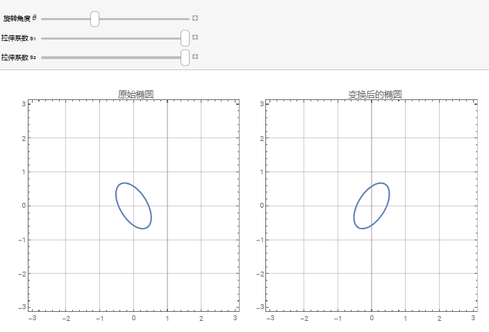
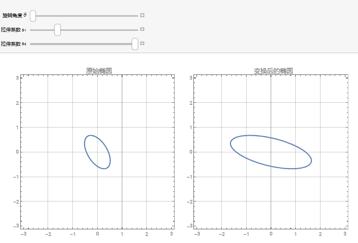
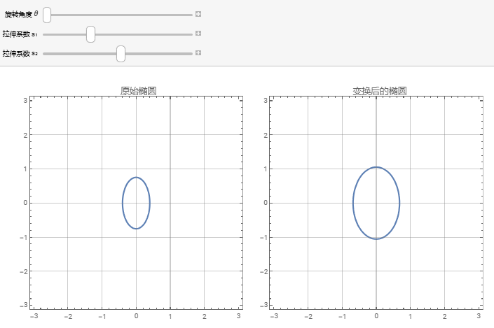
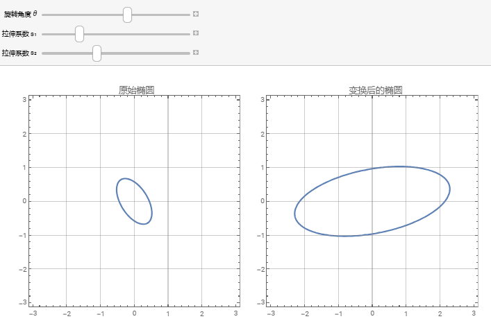

## 矩阵相合

二次型

$f=\mathbf{x}^{T}A\mathbf{x}$, 令 $\mathbf{x}=P\mathbf{y}$, 有 $$f=(P\mathbf{y})^{T}A(P\mathbf{y})=\mathbf{y}^{T}P^{T}AP\mathbf{y}$$

记 $P^{T}AP$ 相合于 A

### 二次型的线性变换

向量线性变换只有三种类型: 反射, 旋转, 伸缩

二次型旋转: $\mathbf{y}=P\mathbf{x}=\begin{bmatrix}\cos\theta & -\sin\theta \\ \sin\theta & \cos\theta\end{bmatrix}\mathbf{x}$

二次型伸缩: $\mathbf{y}=V\mathbf{x}=\begin{bmatrix}s_{1}&\\&s_{2}\end{bmatrix}\mathbf{x}$

.... 这里最后对角元乘的都是平方数, 如果可逆 (没有 $s_{i}=0$), 那么就可以保持对角元的正负性. 所谓的配方法也是找合同标准型的一种方法, 有时候比用特征算更方便.

注意到拉伸时, 即使使用对角矩阵 $D\mathbf{x}$, 拉伸的方向仍不是沿着二次型的主轴方向. 要使拉伸沿着主轴方向进行, 需要先将 $\mathbf{x}$ 坐标旋转到主轴坐标系中. 

由于二次型的矩阵 $A$ 是实对称的, 一定可以被某个正交矩阵[相似对角化](矩阵相似.md), 此时坐标 $\mathbf{x}$ 转换到了 $A$ 的主轴方向.

$$Q^{T}AQ=\Lambda$$

