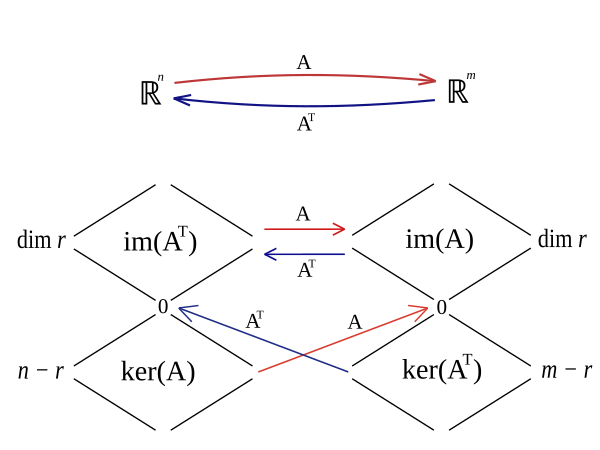
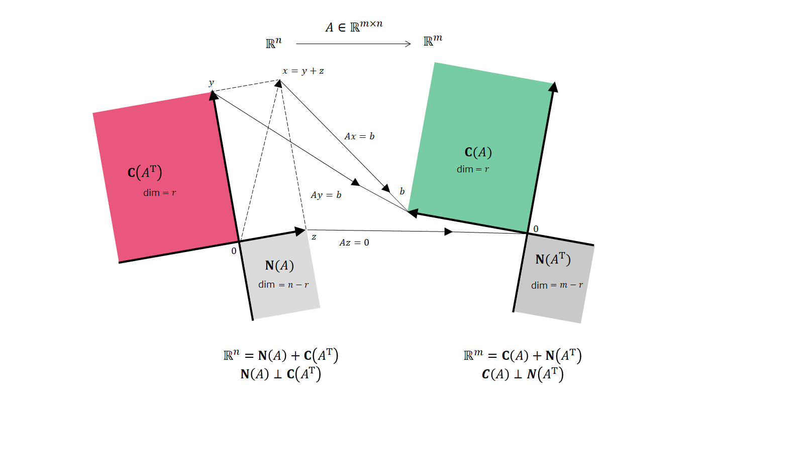

## 线性代数基本定理

任意秩为 $r$ 的矩阵 $A_{m\times n}$ 可被奇异值分解: $$A=U\Sigma V^\top$$

因而, 矩阵 $A\in \mathbb{R}^{m\times n}$ 产生了四个基本线性子空间:

| 名称             | 记号                            | 包含于           | 维数 | 基                |
| ---------------- | ------------------------------- | ---------------- | ---- | ----------------- |
| 列空间, 值域, 像 | $im(A)$ 或 $range(A)$           | $\mathbb{R}^{m}$ | r    | $U$ 的前 $r$ 列   |
| 左零空间, 上核   | $ker(A\top)$ 或 $null(A^\top)$  | $\mathbb{R}^{m}$ | m-r  | $U$ 的后 $m-r$ 列 |
| 行空间, 余像     | $im(A^\top)$ 或 $range(A^\top)$ | $\mathbb{R}^{n}$ | r    | $V$ 的前 $r$ 列   |
| 零空间, 核       | $ker(A)$ 或 $null(A)$           | $\mathbb{R}^{n}$ | n-r  | $V$ 的后 $n-r$ 列    | 

其中, 存在两对正交关系:
- 在 $\mathbb{R}^{n}$ 中, $Ker(A)=(im(A^{\top})^{\bot}$, 即零空间为行空间的正交补.
- 在 $\mathbb{R}^{m}$ 中, $Ker(A^\top)=(im(A))^\bot$, 即左零空间为列空间的正交补.

### 秩-零化度定理

...