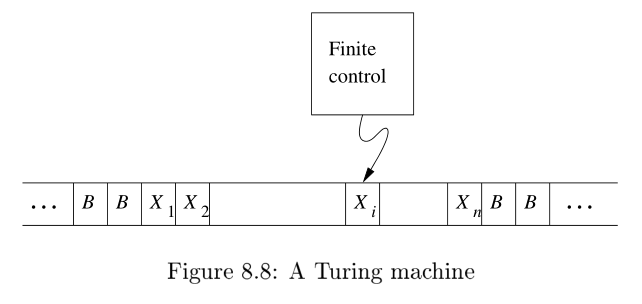

## 图灵机

一台图灵机是一个七元有序组 $(Q,  \Sigma,  \Gamma,  \delta,  q_0,  q_{accept},  q_{reject})$,  其中 $Q,  \Sigma,  \Gamma$ 都是**有限集合**,  且满足:  

1. $Q$ 是非空有穷状态集合
2. $\Sigma$ 是非空有穷输入字母表, 其中不包含特殊的空白符 $\textvisiblespace$
3. $\Gamma$ 是非空有穷带字母表且 $\Sigma \subseteq \Gamma; \textvisiblespace \in \Gamma$. 其中 $\textvisiblespace$ 为空白符, 也是唯一允许出现无限次的字符; 
4. $\delta :  Q \times \Gamma \rightarrow Q \times \Gamma \times \{L,  R,  \_ \}$ 是转移函数,  其中 $L,  R$ 表示读写头是向左移还是向右移,  $\_$ 表示不移动
5. $q_0 \in Q$ 是起始状态
6. $q_{accept} \in Q$ 是接受状态
7. $q_{reject} \in Q$ 是拒绝状态,  $q_{reject} \neq q_{accept}$

图灵机 $M = (Q,  \Sigma,  \Gamma,  \delta,  q_0,  q_{accept},  q_{reject})$ 将以如下方式运行: 

1. 开始的时候将输入串 $\omega = \omega_0 \omega_1 ... \omega_{n-1} \in \Sigma^*$ 从左到右依次填在纸带的第 0,1,...,n-1 号格子上, 其他格子保持空白 (即填以空白符 $\textvisiblespace$). $M$ 的读写头指向第 0 号格子, $M$ 处于状态 $q_0$. 
2. 机器开始运行, 按照转移函数 $\delta$ 所描述的规则进行计算. 例如, 若当前机器的状态为 $q$, 读写头所在格子的符号为 $x$,  设 $\delta(q,  x) = (q',  x',  L)$, 则机器进入新状态 $q'$, 将读写头所指的格子中的符号改为 $x'$, 然后将读写头向左移动一个格子. 
3. 若在某一时刻, 读写头所指的是第0号格子, 但根据转移函数数它下一步将继续向左移, 这时它将停止在原地不动. 换句话说, 读写头终将停在纸带的左边界. 
4. 若在某个时刻 $M$ 根据转移函数数进入了状态 $q_{accept}$, 则它到此刻停止并接受输入的字符串; 
5. 若在某个时刻 $M$ 根据转移函数数进入了状态 $q_{reject}$, 则它到此刻停止并拒绝输入的字符串. 

注意, 转移函数 $\delta$ 是一个部分函数, 换句话说对于某些 $(q,x)$, $\delta(q,x)$ 可能没有定义, 如果在运行中遇到下一个操作没有定义的情况, 机器将立刻停止. 

### 图灵机的格局

设$M = (Q,  \Sigma,  \Gamma,  \delta,  q_0,  q_{accept},  q_{reject})$是一台图灵机, 

1. $M$ 的*带描述 (tape description)* 是一个函数 $F:  \mathbb{N} \rightarrow \Gamma$, 其中 $F(i)$ 表示 $M$ 的带上第 $i$ 个格子的符号; 
2. $M$ 的*构局 (configuration)* 是一个三元组 $(q,  F,  e)$, 其中 $F:  \mathbb{N} \rightarrow \Gamma$ 是当前的带描述, $q \in Q$ 是当前的状态, $e \in N$ 是当前读写头所处的位置;
3. 设 $C_1 = (F_1,  q_1,  e_1),  C_2 = (F_2,  q_2,  e_2)$ 是 $M$ 的格局, 设 $\delta(q_1,  F_1(e_1)) = (q,  x,  d)$, 若满足 $q_2 = q$, 

    $$ e_2 = \begin{cases}
    e_1 - 1 & d = L \\
    e_1 + 1 & d = R
    \end{cases}$$

    以及

    $$ F_2(i) = \begin{cases}
    F_1(i) & i \neq e_1 \\
    x & i = e_1
    \end{cases}$$

    则称 $M$ 从格局 $C_1$ 产生格局 $C_2$, 记作 $C_1 \rightarrow_M C_2$. 

4. 设 $C = (F,  q,  e)$ 为 $M$ 的格局, 若 $q = q_{accept}$ 则称 $C$ 为**接受格局**; 若 $q = q_{reject}$ 则称 $C$ 为**拒绝格局**. 接受格局和拒绝格局统称为**停机格局**. 

### 图灵机的计算历史

设 $M$ 是一台图灵机, 将字符串 $\omega = \omega_0 \omega_1 ... \omega_{n-1}$ 作为输入, 若存在格局序列 $C_1,  C_2,  ...,  C_k$, 使得: 

1. $C_1$ 是 $M$ 在输入 $\omega$ 上的起始格局, 即 $(F_1,  q_0,  0)$, 其中

    $$ F_1(i) = \begin{cases}
    \omega_i & 0 \leq i \leq n-1 \\
    \textvisiblespace & otherwise
    \end{cases}$$

2. $C_i \rightarrow_M C_{i+1}$, 其中 $i = 1,  2,  ...,  k - 1$; 
3. $C_k$ 是接受格局. 

则称 $M$ 接受字符串 $\omega$. 且 $C_1,  C_2,  ...,  C_k$ 称为图灵机 $M$ 在输入 $\omega$ 上的**接受计算历史**. 同理, 若 $C_k$ 是拒绝格局, 则称 $M$ 拒绝 $\omega$, 且 $C_1,  C_2,  ...,  C_k$ 称为图灵机 $M$ 在输入 $\omega$ 上的**拒绝计算历史**. $M$ 所接受的所有字符串的集合称为 $M$ 的语言, 记作 $L(M)$. 

## Rice 定理

**Theorem (Rice’s Theorem)**:  let a property about Turing machines,  formalized as a language consisting of Turing machine descriptions. If: 

1.  is non-trivial:  and there exists some Turing machine such that .
2.  is a property about the language of the Turing machine:  if then .

Then P is undecidable.

We’ll prove this theorem in class on Friday. In this reading,  we’ll discuss the practical ramifications of this theorem.