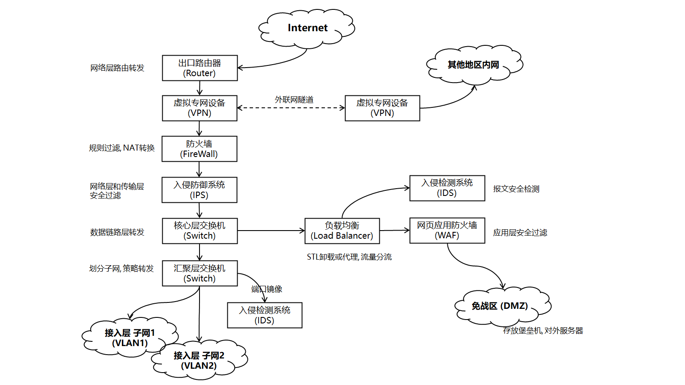

## 网络体系架构

| OSI 七层参考模型 | 五层参考模型 | TCP/IP 四层参考模型 |
| ---------------- | ------------ | ------------------- | 
| 应用层, Application Layer           |              |                     |          
| 表示层, Presentation Layer           |              |                     |          
| 会话层, Session Layer           | 应用层       | 应用层 ...          |      
| 传输层, Transport Layer           | 传输层       | 传输层      | 
| 网络层, Network Layer           | 网络层       |                     | 
| 数据链路层, Data Link Layer       | 数据链路层   | 网际层           | 
| 物理层, Physical Layer           | 物理层       | 网络接口层          | 

| 层次       | 通信功能                                          | 数据单元 | 协议 |
| ---------- | ------------------------------------------------- | -------- | ---- |
| 应用层     | 提供网络服务或应用程序接口                        |          | SMTP, HTTP, FTP     |
| 表示层     | 提供格式化, 序列化, 加解密, 压缩与解压缩 (源编码) |          | SSL/TLS     |
| 会话层     | 管理程序间的会话和连接                            |          |  RPC    |
| 传输层     | 提供端到端的数据传输                              | 数据报   | TCP, UDP     |
| 网络层     | 数据在网络中的路由与转发                          | 分组     | IP      |
| 数据链路层 | 维护数据链路, 帧封装, 透明传输和差错检测 (信道编码)         | 帧       |  Ethernet    |
| 物理层     | 传输介质连接, 双工通信, 调制解调                           | 位       |      |

## Internet 协议总览

| 层     | 协议                           |
| ------ | ------------------------------ |
| 网络层 | ARP, IP, ICMP, IGMP, BGP, OSPF, RIP |
| 传输层 | TCP, UDP                       |
| 应用层 |           <table> <tr><td><table><tr> <td>SMTP</td></tr> <tr> <td>IMAP4</td> </tr> <tr> <td>PGP</td> </tr><tr> <td>POP3</td> </tr></table></td><td><table> <tr> <td>HTTP</td> </tr> <tr> <td>HTTPS</td> </tr> <tr> <td>FTP</td> </tr>  <tr> <td>SSH</td> </tr></table></td><td> <table><tr><td>H.323</td></tr><tr><td>SIP</td><tr><td>LDAP</td></tr></table></td><td><table><tr><td>DHCP</td></tr><tr><td>DNS</td><tr><td>NFS</td></tr><tr><td>RIP</td></tr></table></td></tr></table>                     |

## 网络设备拓扑

### DMZ区

Demilitarized Zone, 非军事化区, 隔离区. 用于对外服务, DMZ区域对内网访问有限制策略.

黑客攻破DMZ, 也很难进入内网区域.

在更复杂或更严格的网路中, DMZ区域会和内网用**网闸**完全"断开式"隔离开.

总体而言, 访问控制需要做到:
- 内网可以访问外网, 可以访问其他区域内网.
- 内网可以访问DMZ
- 外网不能访问内网
- 外网可以访问DMZ
- DMZ访问内网有限制.
- DMZ不能访问外网. (有例外, 如邮件服务器)

DMZ 区域还会放**堡垒机 (Bastion Host)**, 运维人员通过它作为跳板访问内网服务器. 本质是通过 Windows RDP, FTP 或 SSH 技术远程访问服务器进行维护或操作. 运维人员先连接到堡垒机, 在堡垒机上远程登录内网服务器, 期间行为操作被堡垒机记录, 方便安全审计.

### 安全设备

- 防火墙 (FireWall): 流量控制, NAT, VPN, 流量过滤. 属于**访问控制类**产品.
- IPS (Intrusion Prevention System): 入侵检测与防御. 属于**访问控制类**产品.
- IDS (Intrusion Detection System): 入侵检测, 被动不防御. 通常为 TAP (Test/Traffic Access Point) 设备, 监听和转发网络流量. 属于**审计类**产品.

其中, 防火墙一般通过扫描报文的端口和地址来访问控制, IPS 则可以深入检测攻击内容, 如异常的请求头和请求体. 通常出于成本原因防火墙在IPS流量前, 但实际场景中, 某些组织需要对特定流量进行深入检查, 可能将IPS放在防火墙后; 还有将防火墙和IPS结合一起的设备, 称为下一代防护墙(NGFW).

### 网路设备

核心层有两个三层交换机, 负责负载均衡 (Load Balancer) 和热备份.

出口路由器由两个不同运营商提供, 提供对公网路由.

两地三中心模式?? 

交换机 (Switch): 在局域网 (LAN) 中转发数据包, 二层交换机 (以太网交换机) 工作在数据链路层. 三层交换机工作在网络层, 兼顾交换和路由功能.

路由器 (Router): 在广域网 (WAN) 和局域网间转发数据包, 工作在网络层, 需要用拓扑算法和IP路由表决定最佳路由路径.

### 云服务

CDN, WAF, ....

### 数据中心架构

**两地三中心**架构 = 同城双中心 + 异地灾备中心

同城双中心指同城或临近城市建立两个可独立承担系统业务的数据中心. 两者能力接近, 并可通过高速链路近乎实时同步数据. 日常可同时分担业务 (Active-Active) 平衡负载, 也可切换运行 (Active-Passive) 用于热备份.

异地灾备中心, 指在异地建立数据备份中心, 定义备份数据. 当双中心受不可抗力影响而故障时, 异地灾备中心作为"冷备份"用于恢复数据.