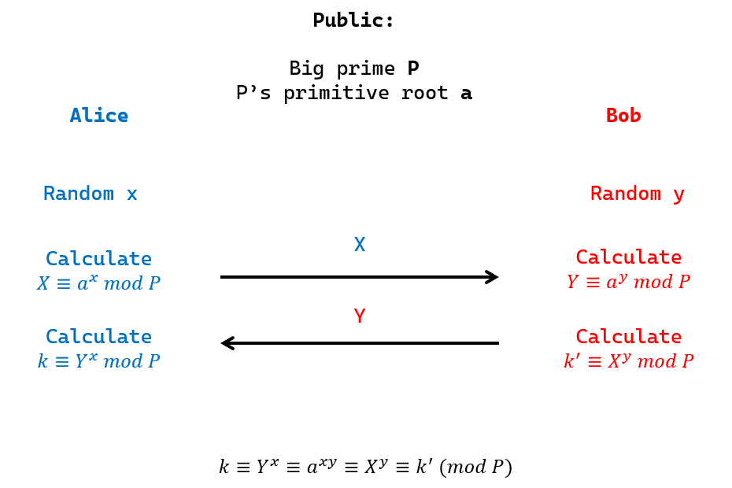
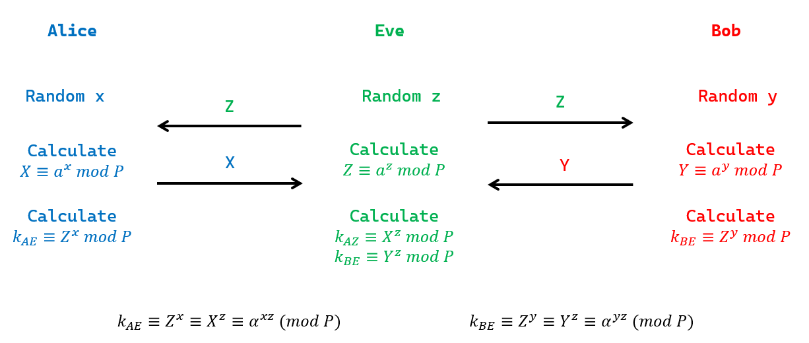

> **WE STAND TODAY on the brink of a revolution in cryptography.**  
> [Diffie, W.; Hellman, M. -- New directions in cryptography](https://drive.google.com/open?id=1ROHVZjHb6rskYYETAOaYdIpj7cqmszsX)

DH 算法是第一个公开的非对称加密算法, 但只被设计用于密钥交换, 没有实现加密.   
DH 算法安全性基于**[有限域离散对数困难问题](../../../Math/数论/欧拉定理.md)**

## DH 密钥交换描述

Alice 和 Bob 协商密钥, 但信道并不安全  

1. Alice 选择随机数 $x$,  计算 $\mathbb{X}\equiv\alpha^{x}\pmod p$, 并将 $(\mathbb{X}\text{ , }\alpha\text{ , p})$ 公开
2. Bob 同样执行上述操作, 选择 $y$, 公开 $\mathbb{Y}\equiv\alpha^{y}\pmod p$
3. Alice 计算 $k=\mathbb{Y}^{x}\equiv\alpha^{xy}\pmod p$, Bob 同, 两人获得相同协商值

信道中敌手知 $\mathbb{X, Y}$ , 但由于离散对数问题困难性, 无法求解 $k$

DH 协议容易扩展为多方, 只需要顺序交换公钥 $\alpha^{x}$ 即可.

## 公钥密码体制

**公钥密码**体制构造基于数学困难问题, 要求找到**单向陷门函数 $f$**满足条件:  
1. 计算 $y=f(x)$ 容易
2. 给定 $y$, 计算 $x$, 使得 $y=f(x)$ 是困难的
3. 存在 $\delta$, 若 $\delta$ 已知, 则计算第 $2$ 条件是容易的.

满足第 $1$ 和第 $2$ 条件, 称为**单向函数**  
第 $3$ 条件称为**陷门性**, $\delta$ 称为*陷门信息*

**公钥密码体制基于数学困难问题, 但其难度不难于基于的数学问题, 两者困难性不等价**.  
这是因为, 攻击公钥密钥体制的方式, 可能不是攻击数学问题本身, 而是通过窃取篡改信道/误导用户等方式.  
所以**DH 问题困难性弱于离散对数问题**

> 复杂度与规约理论见 [P NP NPH](../../../Math/计算理论/P%20NP%20NPH.md)

## 中间人攻击

中间人 Eve, 通过**截获与欺骗**方式, 与 Alice 和 Bob 分别通讯  

- 截获: Eve 截获 Alice/Bob 发送给对方的公钥信息
- 欺骗: Eve 与 Alice/Bob 分别建立起共同密钥

图中 Eve 使用了同一个密钥 $a^z$, 如果 Alice 和 Bob 容易通过这一点识别出攻击者的存在, 不隐蔽. 改进方法 (也是更常用的中间人攻击方式) 是 Eve 使用不同密钥与 Alice/Bob 进行交换.

**为了防止中间人攻击, 需要引入认证**, 比如 A 和 B 互相提供数字签名证书. 改进方案见[有认证性的 MTI 协议](Security/密码学/公钥密码/MTI%20协议.md)
