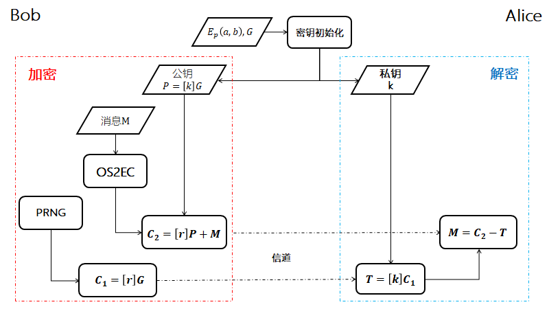

##  ECC-Elgamal

基于 Elgamal 公钥体制建立,  Elgamal 体制基于[离散对数困难问题](../../../../Math/数论/欧拉定理.md), ECC-Elgammal 基于[椭圆曲线群中的离散对数困难问题](../../../../Math/抽象代数/椭圆曲线/椭圆曲线.md).

### 密钥生成

1. Alice 选定一条椭圆曲线 $E_{p}(a, b)$, 并取椭圆曲线上基点 $G$.  
2. Alice 选择一个私钥 $k$, 并生成公钥 $P=[k]G$.  
3. Alice 公开 $E_{p}(a, b)$ 和 $P,\ G$

###  加密

1. Bob 将明文编码至 $E_{p}(a, b)$ 上一明文点 $M$, 同时生成一随机数 $r$
2. Bob 计算 $C_{1}=[r]G$
3. Bob 计算 $C_{2}=M+[r]P$
4. Bob 将 $C_{1},\ C_{2}$ 发送给 Alice

### 解密

1. Alice 计算 $T=[k]C_{1}=[k][r]G$
2. Alice 计算 $C_{2}-T=M+[r]P-[k][r]G=M+[r][k]G-[k][r]G=M$ 

### 安全性

此过程中, 信道公开值有 $E_{p}(a, b)$, $P$, $G$, $C_{1}$, $C_{2}$

安全性保证:   
- **知道 $C_{1}=[r]G$ 和 $G$, 求不出 $r$**  
- **知道 $P=[k]G$ 和 $G$, 求不出 $k$**

所以 Elgamal 体制实际有两组密钥, 其中一组是随机数临时密钥.
