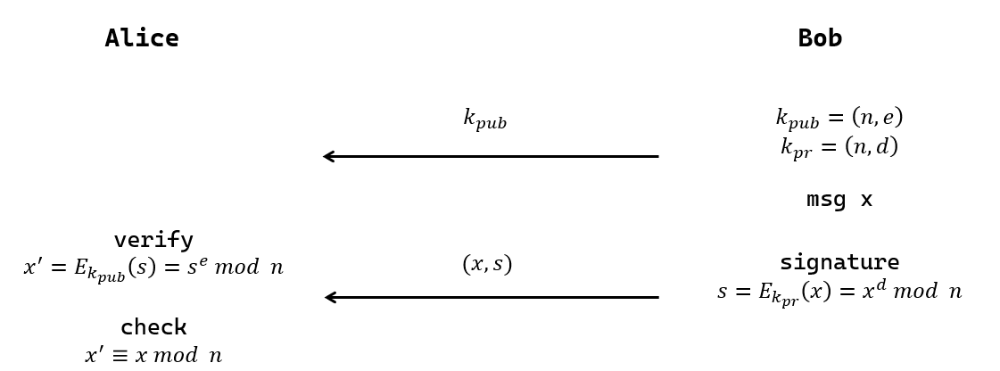

## 1 RSA签名

签名用于认证，**防止信息被篡改**

1. A 生成密钥, 在公共频道公开公钥 $(e, N)$, 自己保留私钥 $d$
2. A 对消息 msg 加签, 以防篡改: $s \equiv m^{d}\; (mod\ N)$, 并将 ${} (s, m) {}$ 发送给 B
3. B 用公钥 $e$ 验签, 即检验 $s$ 验签结果是否和m一致 $m' \equiv s^{d}\; (mod\ N)$, 检查 $m'\equiv m$

签名中 $m$ 虽然公开, 但只有 A 有能力生成 $s$

### 带附录的签名方式

明密文长度太长, 为加快速度减少成本, 通常采用取[杂凑值](../../消息摘要/ReadMe.md)的方法.  
除此之外, 采用哈希值, 长度易控制, 并且有很好的抗碰撞性.

签名流程:
1. 计算原始明文的哈希值 $H$
2. 用私钥对哈希值H进行加密, 生成数字签名
3. 发送者将数字签名附加到原始明文上, 发送

一般情况下, 带附录的签名长度更长. 对于 RSA 签名, 若消息长度小于 $\frac{len(n)}{2}$ `bits`, 使用带消息恢复的 RSA 签名; 否则使用带附录的 RSA 签名.

## 2 先签名再加密

为了同时实现保密性和认证性，需要同时采用双重公钥加解密：

$$A\longrightarrow E_{SK_{A}} \longrightarrow E_{PK_{B}}\longrightarrow D_{SK_{B}}\longrightarrow D_{PK_{A}} \longrightarrow B$$

其中 $PK_{B}$ 用于保密, $PK_{A}$ 用于认证.  

### 顺序合理性

先签名再加密, 只有接收者可以验证.  
先加密再签名, 可以公开验证.

推荐使用先签名再加密, 主要有以下优点:  
- 防止中间人攻击, 同时防止接收方抵赖
- 保护签名者身份

#### 中间人攻击

不对签名加密是危险的.

- Alice 发送: 加密消息 $C$ + 对 $C$ 签名 $S_{A}$
- Miledy 截获 Alice 的信息, 替换为用自身私钥的签名, 转发给 Bob: 加密消息 $C$ + 签名 $S_{M}$
- Bob 收到: $C$ + $S_M$, 在证书中匹配身份, 误认消息来源是 Miledy. 即使 Miledy 并不知道消息明文.

结论是, 从机制上, 必须确保签发者清楚明文内容, 才能执行签名操作.

事实上, 对于教科书式RSA, **先加密**还是**先签名**都是相同的, 因为 $(m^{d_{A}})^{e_{B}}=(m^{e_{B}})^{d_{A}}$. 即使先签名后加密, 仍然防御不了中间人攻击, 敌手可以用A的公钥恢复出 $(m^{e_{B}})^{d_{A}\times e_{A}}\equiv m^{e_{B}}$, 从而假冒消息来源. 为了保证==知道明文才能签名==, 可以将消息 $m$ 和签名 $m^{d_{A}}$ "组合"起来, 一起加密: $E(m\ \Vert\ m^{d_{A}})$.

### 混合加密的签名方式

指同时使用公钥密码和对称密码, 其中对称密码用于加密, 公钥密码用于签名. 该场景常见的安全问题是, 错误认为只用公钥密码对对称密码的密钥 $K$ 进行签名, 就可以保证数据的不可伪造特性.