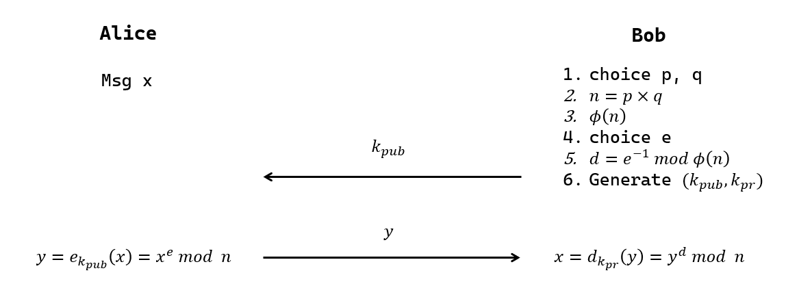

## RSA密码体系

RSA, Rivest-Shamir-Adleman 公钥体系基于大数分解的NPC困难问题, 被广泛部署使用, 构造原理为:

对于大数 $N=p\times q$, 其中 $p,q$ 为素数, 存在 $gcd(e,\ \phi(N))=1$, $d=e^{-1}\pmod{N}$,   

那么 $x^{e}\equiv c\ \   (mod\; N)$ 有解 $$x\equiv x\cdot 1^{h}\equiv x\cdot (x^{\phi(N)})^{h}\equiv x^{1+h\cdot \phi(N)}\equiv x^{d\cdot e}\equiv c^{d}\ (mod\; N)$$

$\begin{array}{l}{{(c^{d})^{e}\equiv c^{d e}({\mathrm{mod~}}p q)}}\\ {{\equiv c^{1+k(p-1)(q-1)}({\mathrm{mod~}}p q)}}\\ {{\equiv c\cdot(c^{(p-1)(q-1)})^{k}({\mathrm{mod~}}p q)}}\\ {{\equiv c\left({\mathrm{mod~}}p q\right)}}\end{array}$

### 1 加解密

0. [密钥生成](RSA-密钥生成.md)
1. 加密算法: $C=M^{e}\pmod n$, 其中 $(e,n)$ 为公钥
2. 解密算法: $M=C^{d}\pmod n$, 其中 $d$ 为私钥

### 2 数字签名

见 [RSA-签名](RSA-签名.md)

**公钥加密, 私钥解密, 私钥签名, 公钥验签**

### 3 算法加速

RSA比DES慢100倍以上, 一般不用于直接加密数据, 而用于安全传输密钥.

#### 3.1 利用 $p,q$ 加速解密

利用已知 $p$ 和 $q$ 加速算法解密速度. 一般RSA的私钥 $d$ 比公钥 $e$ 大很多, 所以解密成本更高.  

优化步骤:

1. 利用 $N=p\times q$, 将 $m \equiv c^{d}\ (mod\ N)$ 化为方程组, 并用费马定理化简指数. $c^{d}$ 实质是消息

$\Leftrightarrow\begin{cases}V_{p}\equiv c^{d}\ (mod\ p)\\V_{q}\equiv c^{d}\ (mod\ q)\end{cases}$

$\Leftrightarrow\begin{cases}V_{p}\equiv (c\ \ mod\,p )^{d\ (mod\;p-1)}\ (mod\ p)\\V_{q}\equiv (c\ \ mod\,q)^{d\ (mod\;p-1)}\ (mod\ q)\end{cases}$

2. 利用**中国剩余定理**计算方程组
   
>  原理见[中国剩余定理](../../../../Math/数论/中国剩余定理.md)
   
定义 $X_{p}=q*(q^{-1}\pmod p)$, $X_{q}=p*(p^{-1}\pmod q)$,

所以 $m=V_{p}X_{p}+V_{q}X_{q}\pmod n$.

PS, $d\pmod{p-1}$ 和 $X_p$ 等都可以预先计算.

#### 3.2 等效模数

因为 $\begin{cases}m^{(p-1)(q-1)/g}\equiv (m^{p-1})^{(q-1)/g}\equiv1\pmod{p} \\ m^{(p-1)(q-1)/g}\equiv (m^{q-1})^{(p-1)/g}\equiv1\pmod{q} \end{cases}$, 

所以 $m^{\frac{(p-1)\times(q-1)}{g}}\equiv 1\pmod{p\times q}$, 其中 $g=gcd(\ p-1,\ q-1\ )$, 

所以对于 $d'$ 满足: $d'\times e\equiv 1\pmod{\frac{(p-1)\times (q-1)}{g}}$, 有 $m^{d'\times e}\equiv m^{1+k\cdot\frac{(p-1)\times(q-1)}{g}}\equiv m\pmod{p\times q}$.

可见, $d'$ 和原私钥是**等效**的, 但值更小, 计算速度更快. 当然, 代价是安全性下降, 因此应避免 $g=gcd(p-1,\ q-1)$ 过大, 防止存在较小等效私钥 $d'$, 缩小密钥空间.

#### 更多相关数学算法

- [欧几里得算法](../../../../Math/数论/欧几里得算法.md)求最大公因子和逆元
- [快速模幂算法](../../../../Math/数论/快速模幂算法.md)求指数运算
- [米勒罗宾方法](../../../../Math/数论/素性检测-米勒罗宾方法.md)判断素数
- 算法集中程序实现见 [附录/数论工具库](../../../../src/密码学算法/数论.py.md)

### 4 安全性分析

截至2020年, RSA 建议的密钥位数升至 `2048b`. 详细安全性分析见 [RSA-合数分解](RSA-攻击/RSA-合数分解.md).  

教科书式RSA不安全, 其数学性质易被利用, 见 [篡改攻击](RSA-攻击/RSA-篡改攻击.md), [选择密文攻击](RSA-攻击/RSA-选择密文攻击.md), [循环攻击](RSA-攻击/RSA-循环攻击.md).

在**已知明文攻击**下, RSA 安全性受离散对数问题的影响. 容易已知 $m,c$, $m=c^{d}\pmod{N}$, 需要保证敌手不能恢复出 $d$, 即离散对数困难问题, 虽然不是有限域, 但子群也很大.

RSA 时间攻击[^1]比较有意思, 利用比特 `1` 处理时间比 `0` 长的特点 (如快速幂算法), 可快速推测出密钥 $d$. 

[^1]: Remote Timing Attacks are Practical -- Dan Boneh, David Brumley.

### 5 RSA 实现

明文数据需要分组加密, 每组长度 i, 应满足 $2^{i}<n\leq 2^{i+1}$. 

RSA应填充后使用... [OAEP-填充](OAEP-填充.md)

[RSA.py](../../../../src/密码学算法/RSA.py.md)