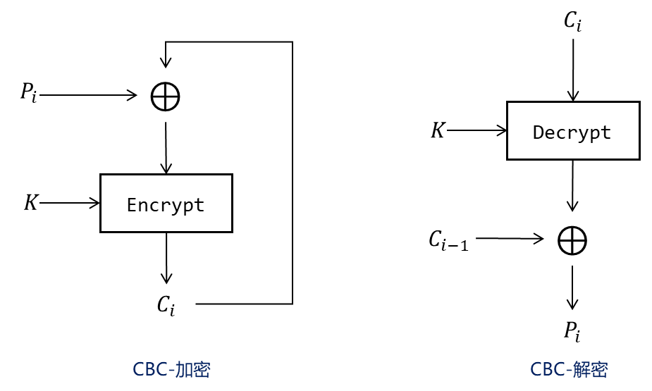
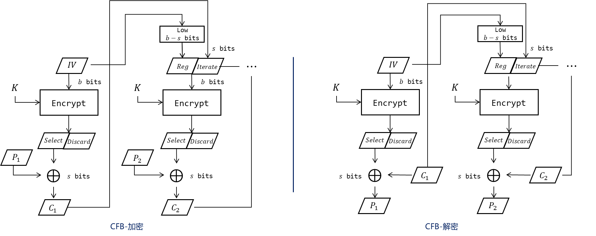

工作模式主要分为分组密码模式和流密码模式, 分组密码模式又分为有反馈和无反馈. 分组密码借助密码算法的加解密模块实现加解密, 流密码借助生成乱源流密钥进行加解密.

- 电码本模式 ECB
- 密文分组链接模式 CBC
- 密码反馈模式 CFB
- 输出反馈模式 OFB
- 计数器模式 CTR

## ECB

电话本模式, ECB, electronic codebook.

 

迭代公式为:[^1] 

$$\begin{align}
C_{i}\leftarrow \mathrm{enc}(P_{i})  \\
P_{i}\leftarrow \mathrm{dec}(C_{i})
\end{align}$$ 

对于给定密钥, 同一明文组总产生相同密文, 因此 ECB 不适合模式类似的大量数据 (如图片).

## CBC

密码分组链接模式, CBC, cipher-block chaining. 重复的明文分组不会暴露. 

$$\begin{align*}
C_{0}&\leftarrow IV \\
C_{i}&\leftarrow \mathrm{enc}[P_{i}\oplus C_{i-1}]\\
P_{i}&\leftarrow \mathrm{dec}[C_{i}]\oplus C_{i-1}
\end{align*}$$

**有反馈的链接模式需要用到*初始向量* (IV), 每次加密需使用随机值, 提供新鲜性, 无需加密. (当然加密更好).**

## CFB

密码反馈模式 (CFB, Cipher Feedback) 模拟了流密码加密模式, 不需要块填充. 是[自同步流密码](../流密码与伪随机数/流密码与伪随机数.md).

### CFB + LSB 

...

带左移寄存器的 CFB 链接模式, 分组长度可变. 在普通 CFB 模式中, 不改变加解密算法的分组长度, 即明密文分组长度 `s bits` 等于加解密算法分组长度 `b bits`.

$$\begin{align}
I_{1}&\leftarrow IV \\
I_{i}&\leftarrow lsb_{n-s}(I_{i-1})\Vert C_{i-1} \\
O_{i}&\leftarrow enc(I_{i}) \\
C_{i}&\leftarrow P_{i}\oplus msb_{s}(O_{i}) \\
P_{i}&\leftarrow C_{i}\oplus msb_{s}(O_{i})
\end{align}$$

> LSB: Leatest Significant Bits 

当加解密算法的分组长度 `b` 不等于明密文分组长度 `s` 时, 一般有 `b>s`, 此时截取加解密算法输出的高 `s` 位作为明密文. 由于密文需要反馈到下一组加密模式中, 而 `b>s`, 所以引入 LSB, Leatest Significant Bits, 充当一个左移位寄存器的作用. 初始填入 `IV`, 然后每产生一组密文, 就推入 LSB 右侧.

## OFB

输出反馈模式 (OFB, Output Feedback Mode) 使用[同步流密码](../流密码与伪随机数/流密码与伪随机数.md)加密模式.

OFB 的密钥可以提前生成. 输入全 `0` 的 CBC 模式可以模拟该密钥流生成过程.

$$\begin{align}
K_{o}&=IV  \\
K_{i}&=\mathrm{enc}(K_{i-1}) \\
C_{i}&=P_{i}\oplus K_{i}
\end{align}$$

## CTR

计数器模式 (Counter Mode, CTR. Integer Counter Mode, ICM. Segemented Integer Counter, SIC) 使用[同步流密码](../流密码与伪随机数/流密码与伪随机数.md)加密模式. CTR 模式适合并行加解密, 加解密皆支持随机寻址访问. 计数器可以是简单计数器, 也可以是某种随机数生成函数.

$$\begin{align}
K_{0} & =IV  \\
K_{i} & =\mathrm{tick}(K_{i-1})\\ 
C_{i} & =P_{i}\oplus K_{i}
\end{align}$$

## GCM

GCM, Galois Counter Mode. GCM = CTR + GMac. GMAC 是一种改良的[全域哈希](Security/密码学/消息摘要/消息认证码/UMAC.md)

用 IV 生成生成初始计数器: $IC=IV\Vert 0^{32}$, 第一次计数器使用 $IV\Vert {0}^{31}\Vert 1$, 后续不断递增.

密文生成过程:
1. 将密文分为 $n$ 个 128 位的数据块: $P_1, P_2, ..., P_n$.
2. 使用计数器作为 AES 输入, 输出值与明文异或: ${} E_{i}=\mathrm{AES}_{K}(C_{i})\oplus P_{i} {}$
3. 增加计数器值, 并模 $2^{32}$
4. 最终密文为 $E=E_{1}\Vert E_{2}\Vert \dots\Vert E_{n}$

计算标签值: (GHash)
1. 定义一个 128 位的哈希密钥 $H = \text{AES}_K(0^{128})$.
2. 定义输入为: $A\ \Vert\ E\ \Vert\ \text{len}(A)^{64}\ \Vert\ \text{len}(E)^{64}$, 其中 $A$ 为附加认证数据 (AAD)
3. 将输入拆分为多个 128 位数据块: $X_1, X_2, ..., X_m$, 不足 128 位用 `0` 填充.
4. 每个数据块进行全域哈希操作: $$Y_{i}=(Y_{i-1}\oplus X_{i})\cdot H\pmod{x^{128}+x^{7}+x^{2}+x+1}$$, 其中 $Y_{0}=0^{128}$, 并记 ${} Y_{m}=GHASH(A,E) {}$
5. 最终标签为: $$TAG=\text{AES}_{K}(IC)\oplus GHASH(A,E)$$

加密方发送: $TAG, IV, E$, 并和解密方共享密钥 $K$.

## 安全特性

|         | 初始向量 | 加密并行性 | 解密并行性 | 需要解密模块 | 含有反馈 | 需要填充 |
| --- | -------- | ---------- | ---------- | ------------ | -------- | -------- | 
| ECB          |           | Y          | Y            |        |          |        
| CBC | Y        |        | Y          | Y            | Y        |          |       
| CFB | Y        |           | Y          |            | Y        |          |     
| OFB | Y        | - [^3]          | -          |             | Y        |          |      
| CTR | Y        | Y          | Y          |             |         |          |       

|     | 密文单比特错误传播 [^2] | IV 单比特错误传播 | 加密类型         |
| --- | ----------------------- | ----------------- | ---------------- |
| ECB | 当前块                  | -                  | 分组密码         |
| CBC | 当前块, 下一个块的某位  | 第一个块                  | 有反馈的分组密码 |
| CFB | 当前块, 下一个块的某位  | 第一个块                  | 自同步流密码     |
| OFB | 当前块某位              | 全部错误                  | 同步流密码       |
| CTR | 当前块某位              |  全部错误                 | 同步流密码       |

误码扩散
- 加密时错误...
- 块顺序错误
- 密文上传输错误

有反馈的链接模式对于*加密时密文被篡改*是敏感的, 对于*传输信道中密文被篡改*也是较敏感的, 安全性高但不能用于卫星等有扰信道.
流密码的加解密结构类似??? 都不需要解密模块
- OFB: 对密文篡改(或传输错误)不敏感, 没有自同步能力.

并行性:
- CBC: 加密必须串行, 解密可以并行.
- CFB 的加解密模块相同. 解密可以并行(加密不行).
- OFB: 可以提前生成密钥, 但是密钥生成不能并行

### 可变长度加密

非流密码的模式需要[明文填充](填充.md), 使其长度对齐分组密码输入长度 (恰好对齐也要额外填充).... 可能导致...

....

无须填充不意味着安全性高, 敌手可通过输出长度推测密文长度.

### 自同步能力

[流密码自同步能力](../流密码与伪随机数/流密码与伪随机数.md): 各项无码扩展...

CBC 无自同步能力. 流密码都有自同步能力.

### 随机访问

[^1]: 迭代公式中, $i=1,2,3,\dots$. 后同.
[^2]: 指传输过程中, 某密文组的某个比特发生比特翻转.
[^3]: OFB 并行性依赖于整个密钥流的提前生成, 如果未提前生成密钥流, 就没有并行性.