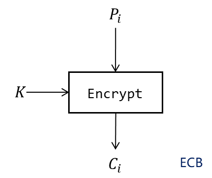
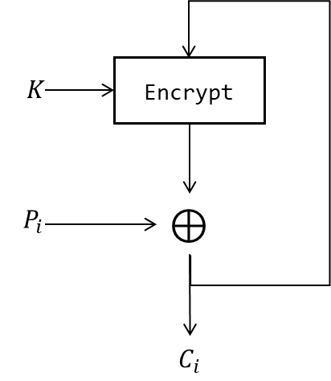
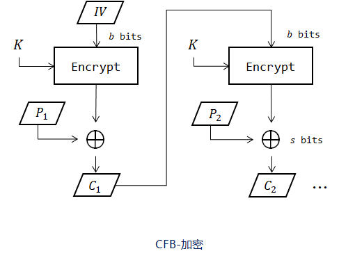
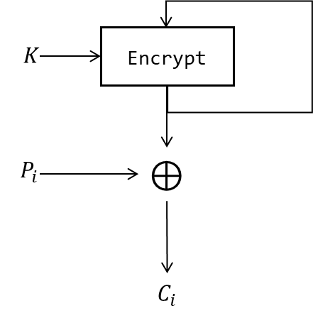
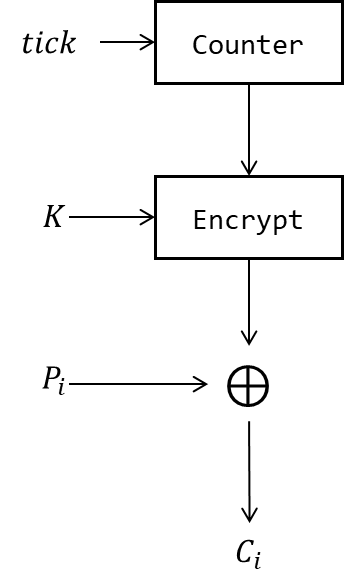

工作模式主要分为分组密码模式和流密码模式, 分组密码模式又分为有反馈和无反馈. 分组密码借助密码算法的加解密模块实现加解密, 流密码借助生成乱源流密钥进行加解密.

- 电码本模式 ECB
- 密文分组链接模式 CBC
- 密码反馈模式 CFB
- 输出反馈模式 OFB
- 计数器模式 CTR

> 支持随机访问??

## ECB

电话本模式, ECB, electronic codebook.

 [^1]

$$\begin{align}
C_{i}\leftarrow enc(P_{i})  \\
P_{i}\leftarrow dec(C_{i})
\end{align}$$

[^1]: 另一版本绘图见 [ECB](../../../attach/密码学-ECB链接模式.png), [CTR](../../../attach/密码学-CTR链接模式.png), [OFB](../../../attach/Pasted%20image%2020240312093238.png), [CBC](../../../attach/Pasted%20image%2020230612112531.png)

对于给定密钥, 同一明文组总产生相同密文, 因此 ECB 不适合加密结构类似的大量数据 (如图片).

## CBC

密码分组链接模式, CBC, cipher-block chaining. 重复的明文分组不会暴露. 加密必须串行, 解密可以并行. 初始 IV 可以使用 ECB 模式共享给收发双方. 有反馈的链接模式对于*加密时密文被篡改*是敏感的, 对于*传输信道中密文被篡改*也是较敏感的, 安全性高但不能用于卫星等有扰信道. 

$$\begin{align*}
C_{0}&\leftarrow IV \\
C_{i}&\leftarrow enc[P_{i}\oplus C_{i-1}]\\
P_{i}&\leftarrow dec[C_{i}]\oplus C_{i-1}
\end{align*}$$

> CBC 和 ECB 即使是整数倍块大小, 仍然会进行填充, 防止 Padding Oracle 攻击.

## CFB

密码反馈模式, CFB, cipher feedback 将**分组对称密码转换为了流密码**, 即不需要块填充, 非阻塞运行. 由于形式类似流密码, 仅使用对称密码的 Encrypt 部分产生密钥流, 所以 CFB 的加解密模块相同. 解密可以并行(加密不行).

$$\begin{align}
I_{1}&\leftarrow IV \\
I_{i}&\leftarrow lsb_{n-s}(I_{i-1})\Vert C_{i-1} \\
O_{i}&\leftarrow enc(I_{i}) \\
C_{i}&\leftarrow P_{i}\oplus msb_{s}(O_{i}) \\
P_{i}&\leftarrow C_{i}\oplus msb_{s}(O_{i})
\end{align}$$

> lsb: leatest significant bits 

### CFB + LSB 

> LSB: Leatest Significant Bits

带左移寄存器的 CFB 链接模式, 分组长度可变. 在普通 CFB 模式中, 不改变加解密算法的分组长度, 即明密文分组长度 `s bits` 等于加解密算法分组长度 `b bits`.

当加解密算法的分组长度 `b` 不等于明密文分组长度 `s` 时, 一般有 `b>s`, 此时截取加解密算法输出的高 `s` 位作为明密文. 由于密文需要反馈到下一组加密模式中, 而 `b>s`, 所以引入 LSB, Leatest Significant Bits, 充当一个左移位寄存器的作用. 初始填入 `IV`, 然后每产生一组密文, 就推入 LSB 右侧.

## OFB

输出反馈模式, OFB, Output Feedback Mode, 的密钥生成仍不能并行化, 但是可以提前生成, 可以使用 CBC(P=0) 来模拟. OFB 完全流密码化, 对称密码算法仅用于生成流密钥, 对密文篡改(或传输错误)不敏感, 没有自同步能力.

$$\begin{align}
I_{1}&\leftarrow IV \\
I_{i}&\leftarrow lsb_{n-s}(I_{i-1})\Vert O_{i-1} \\
O_{i}&\leftarrow msb_{s}(enc(I_{i})) \\
C_{i}&\leftarrow P_{i}\oplus O_{i}\\
P_{i}&\leftarrow C_{i}\oplus O_{i}
\end{align}$$

## CTR
计数器模式, CTR, counter mode, Integer Counter Mode (ICM), Segemented Integer Counter (SIC). CTR 模式适合并行和密钥预生成, 并且可以随机寻址访问. 计数器可以是简单计数器, 也可以是某种随机数生成函数.

## GCM

GCM, Galois Counter Mode. GCM = CTR + GMac. GMAC 是一种改良的[全域哈希](Security/密码学/消息摘要/消息认证码/UMAC.md)

IV 不用保密???

***

|                | 加密递推式                              | 解密递推式                              | 初始向量 | 加密并行性 | 解密并行性 | 需要解密模块 | 含有反馈 |
| -------------- | --------------------------------------- | --------------------------------------- | -------- | ---------- | ---------- | ------------ | -------- |
| ECB            | $C_i=Enc(P_i)$                        | $P_i=Dec(C_i)$                        | N        | Y          | Y          | Y            | N        |
| CBC            | $C_i=Enc(C_{i-1}\oplus P_{i})$   $C_0=IV$ | $P_i=C_{i-1}\oplus Dec(C_{i})$          | Y        | N          | Y          | Y            | Y        |
| CFB            | ${} rk_i=Enc(rk_{i-1}[:-s],\ \ C_{i-1}) {}$   $C_i=P_i\oplus rk_{i}[:s]$ | $P_i=C_i\oplus rk_{i}[:s]$            | Y        | N          | Y          | N            | Y        |
| OFB            | $rk_i=Enc(rk_{i-1})$   $rk_0=IV$   $C_i=rk_i\oplus P_i$ | $P_i=rk_i\oplus C_i$                   | Y        | Y          | Y          | N            | Y        |
| CTR            | $C_i=Enc(cnt_{i})\oplus P_i$            | $P_i=Enc(cnt_{i})\oplus C_i$           | Y        | Y          | Y          | N            | N        |
