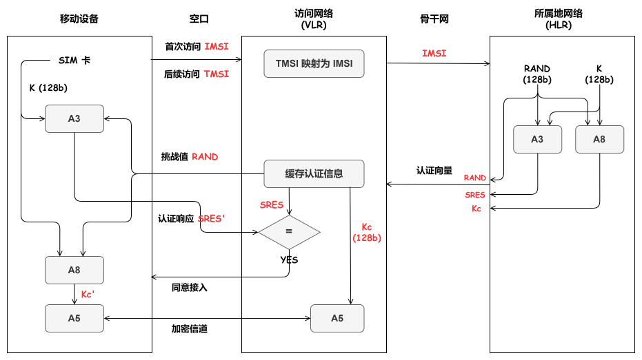

## AKA 协议

传统计算机网络接入互联网的方式是有线接入, 运营商分配固定 IP; [无线网络通信](../../../../HardWare/无线通信技术.md)则是手机与基站在空口无线接入, 动态分配 IP. 由于手机移动的特性, 每次接入时, 需要对用户身份 (SIM 卡身份)进行认证, 认证成功后才分配资源. *AKA (Authentication and Key Agreement)*  协议就是 3G/4G/5G 网络中完成用户认证的协议.

### 2G-GSM AKA

GSM 安全性缺陷:
- 主密钥 $K$ 存储在 SIM 卡中, 有复制 SIM 卡风险.
- 首次开机时泄露 IMSI 信息.
- 基站对用户实施单向认证, 存在伪基站.
- 骨干网数据传输无加密
- 无数据完整性验证机制
- $K$ 直接参与认证和加密, 有泄露主密钥风险, 缺少层次化密钥保护.

### 2G-CDMA AKA

CDMA 使用防篡改的 UMI (UserIdentity Module) 卡替代了 GSM 的 SIM 卡.

### 3G-WCDMA AKA

3G 网络的新增安全机制
- 用户网络间双向认证
- 用户网络间使用会话密钥, 并保证会话密钥的新鲜性
- 数据完整性验证机制

3G 网络新增的安全缺陷:
- 安全算法 $f_{1}\sim f_{10}$ 过多
- 完整性验证密钥 (IK) 和加密密钥 (CK) 直接传输, 存在窃听风险.

### 4G-LTE EPS-AKA

4G 网络的新增安全机制
- 实现了层次化密钥管理
- 隐藏了 CK 和 IK