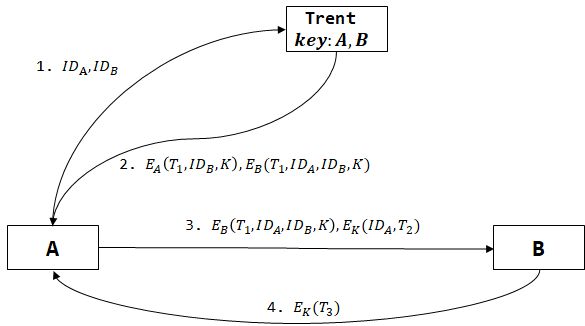

 Kerberos (地狱三头犬) 通信协议, 基于对称密码, 目前广泛应用于操作系统中. 该协议中, 客户 C 向 KDC 发送安全通信请求, 获得会话密钥后, 与特定服务器 S 通信.

## 名词解释

- KDC: 密钥分配中心
- AS: 认证服务器
- TGS: 票据授权服务器
- TGT: 票据授权票据
- 主密钥: 用户 $C$ 与 TGS 间通信的密钥.
- $K_{A,B}$ 指实体 A 和 B 间共享的对称密钥.

***

Kerberos的完整过程分三部分:

## 客户认证过程

使用户 $C$ 拥有与 TGS 间通信的主密钥 $K_{C,TGS}$

1. 用户向 AS 发送: $$ID_C, ID_{\mathrm{TGS}}, \mathrm{IPs}, \text{Lifetime}$$  其中 $IPs$ 是 $C$ 的 IP 地址范围. 而 LifeTime 是票据 TGT 存续时间.
2. AS 向用户发送: $$A1=\set{ID_{\mathrm{TGS}}, T_1, \text{Lifetime}, K_{C, TGS}}_{K_{AS,C}}$$ $$A2=\set{ID_C, ID_{\mathrm{TGS}}, \mathrm{IPs}, T_1, \text{Lifetime}, K_{C, TGS}}_{K_{AS,TGS}}$$ 其中 $T_{1}$ 是时间戳, $A2$ 也被称为 $\set{TGT}_{K_{AS,TGS}}$
3. C 解密 $A1$, 获取 AS 分配的 $K_{C,TGS}$

## 服务授权过程

使用户与 TGS 之间进行通信, 从而获取与目的服务器 S 间的会话密钥 $K_{C,S}$

1.  用户向 TGS 发送: $$ID_{S}, \text{Lifetime}, A2, \set{ID_C, T_{2}}_{K_{C, TGS}}$$
2. TGS 解密 A2, 得到 TGT, 也得到 $ID_C, T_{2}$, 依次检查:
	- TGT 未过期, 即当前时间离 $T_{1}$ 的时差在 $\text{LifeTime}$ 内.
	- 收到两部分消息中 $ID_{C}$ 一致.
	- $T_{2}$ 也未过期.
	- 若 $IPs$ 非空, 检查发送源 IP 是否在其中.
3.  TGS 向用户发送: $$B1=\set{ID_S, T_3, \text{Lifetime}, K_{C, S}}_{K_{C, \mathrm{TGS}}}$$ $$B2=\set{ID_C, ID_S, T_{2}, \mathrm{IPs}, \text{Lifetime}, K_{C, S}}_{K_{TGS, S}}$$ 其中 $\set{B2}_{K}^{-1}$ 被称作票据, Ticket.

4.  用户解密 $B1$, 获得 TGS 分配的会话密钥 $K_{C,S}$

## 服务请求部分

使用户 $C$ 与目的服务器 $S$ 间建立安全信道.

1.  用户向 S 发送: $$B2, \set{ID_C, T_4}_{K_{C, S}}$$
2.  $S$ 解密 $B2$, 获得 Ticket, 也得到 $ID_{C},T_{4}$. 随后检查:
	- Ticket 未过期.
	- 收到两部分消息中 $ID_{C}$ 一致.
	- $T_4$ 也未过期.
	- 若 $IPs$ 非空, 检查发送源 IP 是否在其中.

| 密钥 | $K_{C,AS}$ | $K_{TGS,AS}$ | $K_{TGS,S}$ | $K_{C,TGS}$ | $K_{C,S}$  |
| ---- | ---------- | ------------ | ----------- | ----------- | ---------- |
| C    | 预获取     |              |             | 客户认证 3  | 服务授权 4 |
| AS   | 预获取     | 预获取       |             | 派生        |            |
| TGS  |            | 预获取       | 预获取      | 服务授权 2  | 派生           |
| S    |            |              | 预获取      |             |    服务请求 2        |
