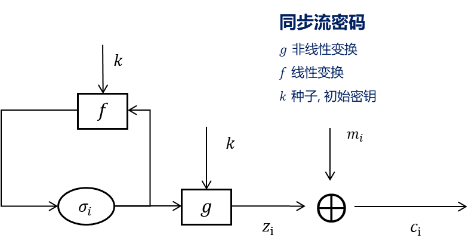
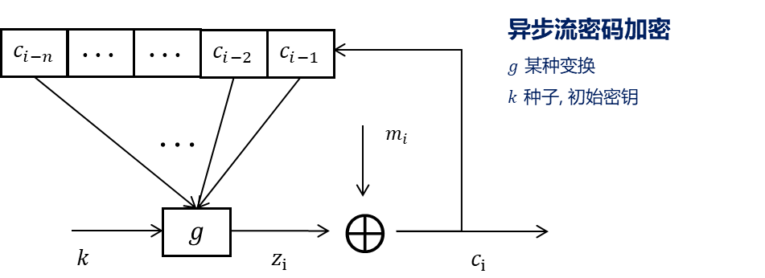
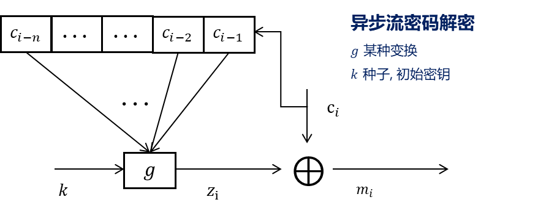
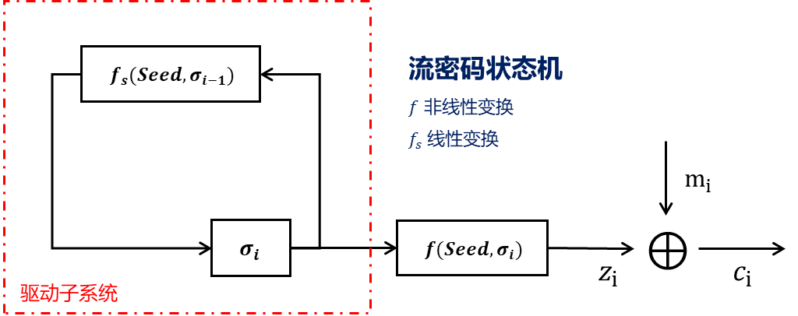

## 流密码

$c_{i}=m_{i}\oplus k_{i}$

流密码也称为序列密码, 用生成*长密钥序列 (伪随机数序列)* 加密明文, 适用于对数据流进行加密. 流密码相比于分组密码的优势在于加解密速性能更高, 劣势是由于 [RC4](流密码算法/RC4.md) 等传统算法的漏洞, 曾被认为安全性弱于分组密码. 但随着 [Salsa20/ChaCha20](流密码算法/Salsa20.md) 等现代流密码提出, 流密码安全性被认为和分组密码相当, 彼此应用场景互有优劣.

其安全性依赖于**密钥流生成器**的不可预测, 设计原则有:
- 长周期
- 高线性复杂度
- 抗统计分析
- 密码安全性, 需: "扩散", "混乱", 抵抗各类攻击

## 伪随机数产生原则

1. **随机性**

随机性通常有两个含义:
- 分布均匀性: 序列中位分布均等, 0和1数量也大致相等. 换言之, 某位上0/1概率应接近0.5.
- 独立性: 序列中任何子序列不能由其他子序列推出.

2.  **不可预测性**

对于伪随机数列, 需防范敌手从前序序列预测出后续序列 (前向), 或从后续值推断出 `seed` (后向). 注意, 这里是指伪随机数生成过程中, 预测尚未给出的序列, 而独立性指的是已存在序列中各子序列的独立.

### 伪随机数生成器和伪随机数函数

$PRNG(seed)$ 输入是固定长度的种子, 输出任意长度的随机序列. 用于生成随机序列, 如流密码.

$PRF(k, data)$ 输入是密钥和任意数据, 输出是固定长度的伪随机值. 用于提供伪随机性, 如密钥派生函数 KDF, 消息认证码 HMAC.

## 1 流密码分类

### 1.1 同步流密码

SSC, Synchronous Stream Cipher. 内部无记忆 (明文寄存器), 且无自同步功能. 同步流密码的密钥流生成器内部状态与输入明文无关, 因此可以独立为**伪随机比特发生器** (PRBG).

### 1.2 自同步流密码

SSSC, Self-Synchronous Stream Cipher. 某一时刻密钥流不仅取决于初始密钥, 还取决于前若干密文的线性组合, 强化抗统计分析能力. 有自同步功能. 

**自同步能力指: 产生的传输错误 (码翻转, 丢失, 插入), 经过有限迭代次数后, 输出序列会被自动校正, 但可能有局部错误传播.** 在同步流密码中, 密钥流和密文流不对齐的错误 (如 比特丢失, 或比特重复) 会导致整个加密过程失败. 在自同步流密码中, 由于密钥仅取决于前有限位密文, 而没有长期的状态机内部记忆, 所以密文流总能自动校正. 类比看, 自同步流密码就像组合电路, 同步流密码就像时序电路.

同步流密码将密钥流和密文流的同步交付给外部机制, 自身密钥流和明文独立, 有更快的加解密速度和并行性能.  另外, 同步流密码也比自同步流密码更容易进行理论分析, 产出研究成果. 因此, **同步流密码实际应用更加广泛**. 对鲁棒性和低噪声要求较高的场景, 会使用自同步流密码.

## 2 线性反馈移位寄存器序列

如图, 同步流密码的常见密钥流 (伪随机比特) 生成器由**线性驱动子系统**和**非线性子系统**, 驱动子系统生成*统计特性好*的序列, 非线性组合子系统将其变换为*密码特性*好的输出序列. 

常见驱动子系统为LFSR, 见 [PRBG-线性部分](PRBG-线性部分.md)

常见非线性子系统见 [PRBG-非线性部分](PRBG-非线性部分.md)
