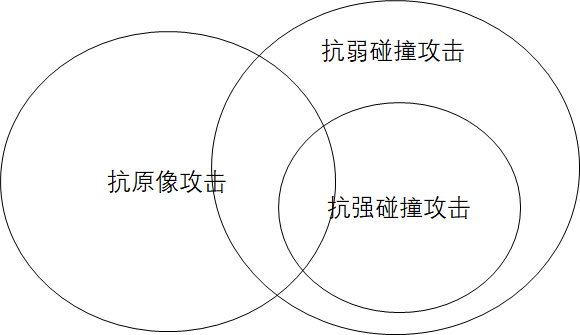
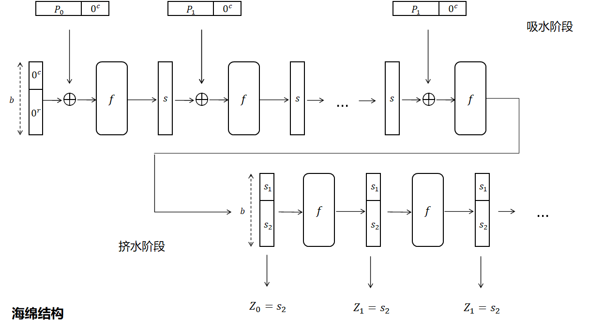

**单向散列函数** (one-way hash function) 是指对不同的输入值, 通过单向散列函数进行计算, 得到固定长度的输出值. **在常见安全需求中, 单向散列函数仅能保护信息完整性**, 应用场景如:
- 检验公开下载的文件或程序的完整性, 有没有传输错误或被恶意篡改.
- 公共存储云中, 利用抗碰撞特性, 检测用户上传的大型文件是否在云端已存在, 如果已经存在则不重复上传节省带宽.

单向散列函数也被称为**消息摘要函数**（message digest function）, **哈希函数**或者**杂凑函数**. 输入的消息也称为**原像** (pre-image). 输出的散列值也称为**消息摘要** (message digest) 或者**指纹** (fingerprint), 相当于该消息的身份证.

## 杂凑函数安全需求

| 需求                        | 描述                                                       |
| --------------------------- | ---------------------------------------------------------- |
| 输入长度可变                |                                                            |
| 输出长度固定                |                                                            |
| 效率高                      | 函数实现容易, 速度快 (实际上比对称加密还快)                |
| 单向性 (抗原像攻击)         | 任意给定 hash(y), 找到 y 满足 `Hash(y)=y` 计算不可行                  |
| 抗弱碰撞性 (抗第二原像攻击) | 任意给定 x, 找到 y 满足 `Hash(y)=Hash(x)` 计算不可行 |
| 抗强碰撞性 (抗碰撞攻击)   | 找出任意 (x,y), 使得 `Hash(x)=Hash(y)` 计算不可行, $x\neq y$         |
| 伪随机性                    |                                                            |

  
抗强碰撞性, 预示着也抗弱碰撞性.

哈希函数常见攻击方法是[生日攻击](生日攻击.md)

#### Q: 输出长度为什么固定?

1. 便于存储和管理, 有一致性和兼容性
2. 固定长度安全性较高. 如果输出长度可变, 一是敌手可能通过输出长度预测输入; 二是敌手会针对较短的输出进行攻击, 增加了碰撞攻击威胁. 统一长度, 也便于对其安全性进行分析.
3. 传统杂凑函数使用 [Merkel-Damgard 结构](Security/密码学/消息摘要/MD%20迭代结构/MD%20结构.md), 每轮压缩函数 $f$是定长的, 方便进行迭代.

事实上, 基于海绵结构的SHA3可实现输出长度的改变, 但那是另一种密码学原语: [Extendable Output Function](https://crypto.stackexchange.com/questions/54248/what-is-an-extendable-output-function). 要改变输出长度, 还可以使用[不同链接模式](../分组密码/链接模式.md).

## 常见算法

- MD5: 经典算法
- SHA: (Security Hash Alogorithm) 由 NIST 设计, 作为 FIPS 标准发布. (FIPS180, 1993) 称为 SHA0, (FIPS180, 1995) 称为 SHA1. NIST 在 2007 启动下一代算法竞赛, 发布 (FIPS 202, 2015) 称为 SHA3. 
- Whirlpool, 基于 AES 的哈希算法. 由 Vincent Rijmen (AES 设计者之一) 和 Paulo Brreto 设计, 标准化为 (ISO/IEC 10118-3, 2004).
- BLAKE 算法: 也参与 SHA3 标准竞赛的决赛角逐. BLAKE2 是性能优化版本, BLAKE3 则支持并行处理. 基于 HAIFA (Hash Iterated FrAmework) 结构, 是 Merkle-Damgard 架构的安全性改进. 
- Bcrypt...

| 算法                        | 消息长度/b | 分组长度/b           | 字长度/b | 消息摘要长度/b       | 描述                                    |
| --------------------------- | ---------- | -------------------- | -------- | -------------------- | --------------------------------------- |
| **[SHA1](SHA-1.md)**        | $<2^{64}$  | 512                  | 32       | 160                  | Merkle-Damgard 迭代结构, 已淘汰         |
| **SHA2-256**                | $<2^{64}$  | 512                  | 32       | 256                  | SHA2 套件                               |
| SHA2-384, 512               | $<2^{128}$ | 1024                 | 64       | 384, 512             | SHA2 套件                               |
| **[MD-5](Security/密码学/消息摘要/MD%20迭代结构/MD-5.md)**         | 无限制     | 512                  | 32       | 128                  | Merkle-Damgard 迭代结构, 已淘汰         |
| **[SM-3](Security/密码学/消息摘要/MD%20迭代结构/SM-3.md)**         | $<2^{64}$  | 512                  | 32       | 256                  | 仿 SHA256, 中国国密标准                 |
| SHA3-224, **256**, 384, 512 | 无限制     | 1152, 1088, 832, 576 | 64       | 224, 256, 384, 512   | Sponge 结构, 安全性推荐.                |
| BLAKE2                      | 无限制     | 512 或 1024          | 32 或 64 | 可变 (常用 256, 512) |HAIFA 架构和 ChaCha/Salsa20 流加密函数.                                         |
| BLAKE3                      | 无限制     | 512                  | 32 或 64 | 可变 (常用 256)      | 额外引入树形哈希 (类似 Merkle Tree), 支持并行计算加速 |
| Whirlpool                   | 无限制     | 512                  | 64       | 512                  | 基于 AES 的 Sponge 结构                 |

> 消息长度限制是由于填充过程中对消息长度值所占位数进行了限定. 字长一般由硬件的地址字长 (`x64, x86`) 决定.

## 构造方法

### 1 基于经典迭代结构

基于[迭代型散列函数结构](Security/密码学/消息摘要/MD%20迭代结构/MD%20结构.md), 将数据分为大小固定的块, 分块进行处理压缩.

SHA1, MD5 是第一代安全散列算法的代表, 基于 Merkle-Damgard 迭代结构. 但这两个算法现在已不再安全.

SHA-2 系列散列函数是第二代安全散列算法, 它们仍基于Merkle-Damgard结构, 做出了一些安全性改进. (比如消息扩展为更多字, 压缩函数更复杂, 轮数更多, 增加输出变换等) 但仍被担心会像 MD5/SHA1 一样, 存在未知安全漏洞.

### 2 基于海绵结构

SHA-3 ([Keccak算法](https://keccak.team/files/CSF-0.1.pdf)) 和 Whirlpool 使用海绵 (Sponge) 构造结构, 是第三代安全散列算法.

Sponge 结构虽然支持任意长度输出, 但是标准算法都会固定特定一些输出长度, 以更安全地算法实现.

### 3 基于树型哈希

见 BLAKE3, 见 Merkel Tree...

### 4 基于分组密码

MMO 构造, **Davies-Meyer 构造**, 基于 CBC 构造....

### 5 基于宽管道结构

Wide Pipe Hash

### 6 基于全域哈希

[UMAC](Security/密码学/消息摘要/消息认证码/UMAC.md)

基于有限域的数学运算. 普通迭代结构是通过伪随机置换来不断更新内部状态.

..

