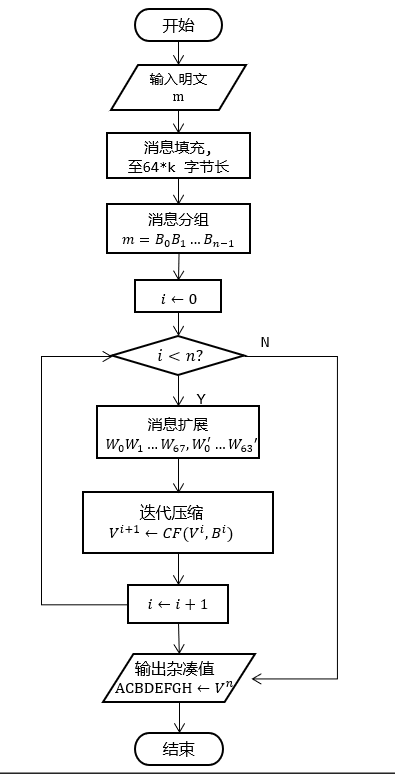

> 详见 [SHA1与SM3实现](../../paper/crypto/SHA1%20and%20SM3%20implement.pdf)

**SM3密码杂凑算法**于 2010 年发布, 2012 年发布为密码行业标准 (GM/T 0004-2012), 2016年发布为国家密码杂凑算法标准 (GB/T 32905-2016).

### SM3总体结构

SM3 采用 [Merkle-Damgard 结构](迭代型散列函数.md), **基于 SHA-256**, 安全性和SHA-256相当. 



### 代码实现

```python
from typing import NewType, List, Tuple
import sys

# 定义些类型
Int32 = NewType('Int32', int)  # 32bit int
Word = Int32
Int256 = NewType('Int256', int)  # 256bit int
Int512 = NewType('Int512', int)  # 512bit int
BitLen = NewType('BitLen', int)  # bit length
ByteLen = NewType('ByteLen', int)  # byte length

def _i2os(num, len: BitLen):
	return num.to_bytes(len//8, 'big')

def _os2i(bstr): 
	'''按二进制转化为整型'''
	return int.from_bytes(bstr, 'big')

def _rotate(x: Int32, base: int) -> Int32:
	base = base % 32
	return ((x << base) & 0xffffffff) | (x >> (32-base))

class SM3:
	def __init__(self):
		self.digest_size: ByteLength = 32
		self.block_size: ByteLength = 64
		self.name: str = 'SM-3'
		
		# init internal state with IV
		self._state = [0x7380166f, 0x4914b2b9, 0x172442d7, 0xda8a0600, 0xa96f30bc, 0x163138aa, 0xe38dee4d, 0xb0fb0e4e]
		self._buffer = b''

	@staticmethod
	def _padding(msg: bytes):
		'''padding msg end to 512*k length'''
		m_len: ByteLen = len(msg)
		# 填一位1，补0至一字节(0x80), 然后继续补0
		padding_zero_len: ByteLen = (56-m_len % 64) % 64
		padding1 = b'\x80'+ padding_zero_len * b'\x00'
		# 填充长度
		padding2 = _i2os(m_len*8, 64)
		return msg + padding1 + padding2

	@staticmethod
    def _extend_block(block: Int512):
        '''return words1[68], words2[64]'''
        # aiding functs
        _lsh = _rotate
        def _p1(x: Int32) -> Int32: 
            return x ^ _lsh(x, 15) ^ _lsh(x, 23)

        # initial words
        words1 = [0]*68 
        # divide block into word
        for j in range(16):
            words1[15-j] = block & 0xffffffff
            block >>= 32

        for j in range(16, 68):
            _tmp = _p1(words1[j-16] ^ words1[j-9] ^_lsh(words1[j-3], 15))
            words1[j] = _tmp ^ _lsh(words1[j-13], 7) ^ words1[j-6]

        words2 = [0] * 64
        for j in range(64):
            words2[j] = words1[j] ^ words1[j+4]

        return words1, words2
        
    def _compress_block(self, block: Int512) -> Int256:
        # 初始化寄存器 和 扩展消息
        a, b, c, d, e, f, g, h = self._state
        ss1, ss2 = 0, 0
        tt1, tt2 = 0, 0
        words1, words2 = self._extend_block(block)

        # 辅助函数
        _lsh = _rotate  # 缩短点函数名hh
        
        def _p0(x: Int32) -> Int32: 
            return x ^ _lsh(x, 9) ^ _lsh(x, 17)

        def _t(j: int) -> Int32:
            if j >= 0 and j <= 15:
                return 0x79cc4519
            elif j >= 16 and j <= 63:
                return 0x7a879d8a
            else:
                raise ValueError('index j for T is out of range')

        def _ff(x: int, y: int, z: int, j: int) -> int:
            if j >= 0 and j <= 15:
                return x ^ y ^ z
            elif j >= 16 and j <= 63:
                return (x & y) | (x & z) | (y & z)
            else:
                raise ValueError('j is out of range')

        def _gg(x: int, y: int, z: int, j: int) -> int:
            if j >= 0 and j <= 15:
                return x ^ y ^ z
            elif j >= 16 and j <= 63:
                return (x & y) | (~x & z)
            else:
                raise ValueError('j is out of range')

        # 压缩函数主体
        for j in range(64):
            _tmp = _lsh(a, 12) + e + _lsh(_t(j), j % 32)
            ss1 = _lsh(_tmp & 0xffffffff, 7)
            ss2 = ss1 ^ _lsh(a, 12)
            _tmp = _ff(a, b, c, j)
            tt1 = (_tmp + ss2 + d + words2[j]) & 0xffffffff
            _tmp = _gg(e, f, g, j)
            tt2 = (_tmp + ss1 + h + words1[j]) & 0xffffffff
            d = c
            c = _lsh(b, 9)
            b = a
            a = tt1
            h = g
            g = _lsh(f, 19)
            f = e
            e = _p0(tt2)

        # return new state
        return a,b,c,d,e,f,g,h

    def update(self, msg: bytes):
        '''更新buffer, 并处理已有64bytes块'''
        self._buffer += msg
        while len(self._buffer) >= 64:
            # 处理块，并更新state
            new_state = self._compress_block(_os2i(self._buffer[:64]))
            # xor new state
            self._state = [x^y for x,y in zip(self._state, new_state)]
            self._buffer = self._buffer[64:]

    def digest(self)->bytes:
	    '''可以基于当前 buffer 进行digest, 但是保持其继续 update 的能力'''
        # 填充buffer并保存到临时变量
        msg = self._padding(self._buffer)
        tmp_state = self._state.copy()
        while len(msg) > 0:
            # 处理块，并更新临时state
            new_state = self._compress_block(_os2i(msg[:64]))
            tmp_state = [x^y for x,y in zip(tmp_state, new_state)]
            msg = msg[64:]

        digest = 0
        for word in self._state:
            digest <<= 32
            digest += word
        return _i2os(digest, 256)
    
    def hexdigest(self)->str:
        return self.digest().hex()
        
    def copy(self):
        backup =  self.__class__()
        backup._buffer = self._buffer
        backup._state = self._state.copy()
        return backup


def main():
    hasher = SM3()
    while True:
        byte = sys.stdin.buffer.read(1)
        if not byte:
            break
        else:
            hasher.update(byte)
    print(hasher.hexdigest())


if __name__ == '__main__':
    main()
```