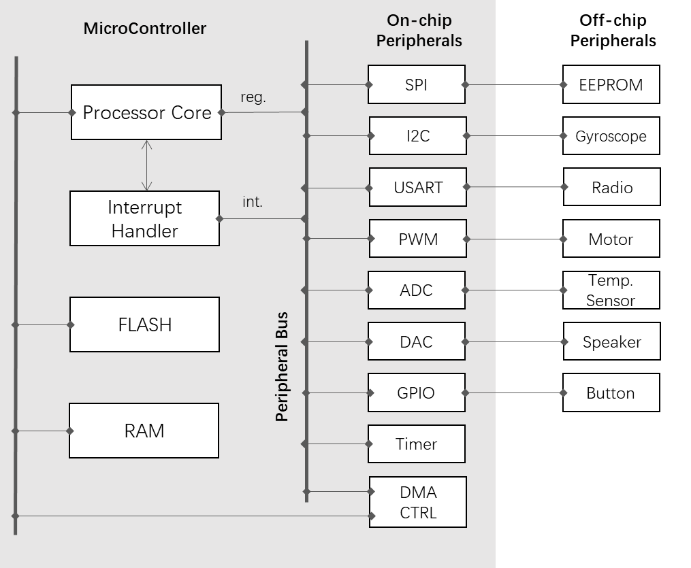

## Target Description

二进制固件特征:

- 静态链接的, 精简标准库 (newlib 等)
- 中断驱动的
- 静态内存分配的, 没有堆内存. 资源受限 (内存或性能)
- 裸机 (Bare-Metal) 无操作系统, 或有简单的 RTOS (Monolithic)
- 不一定有 ELF 信息, 需要手动指定加载信息.

二进制固件的输入口有: MMIO, Interrupts, DMA
- MMIO (Memory-Mapped I/O): 将设备状态和数据直接映射到 MMIO 内存区域, 程序可以主动读取 
- Interrupt: 设备异步地触发事件, CPU 通过向量表来跳转到服务程序.
- DMA (Direct Memory Access): 设备直接写入内存, 无需 CPU 参与.

常见指令集架构:

- ARM-v7M / ARM-v8M 系列, THUMB 指令集
- RISC-V 
- SPARC v8, LEON3/LEON4 架构.
- PowerPC 

### 虚拟机仿真

测试时, 固件一般跑在虚拟机中. 常见类型有:
- QEMU: 全系统虚拟机. 从 v6.1.x 开始有 tcg plugin, v8 以上有内存监视能力. 
- Unicorn: 仅指令集仿真. 提供了多种插桩接口.
- PANDA: 基于 QEMU v2.6.1, 提供了多种插桩接口和内置程序分析能力. 将 TCG 反向翻译为 LLVM IR, 从而实现污点分析和插桩等. 
- Rednode: C# 写的, 不评价.

#### 指令集支持

- 指令集完整支持: 支持大部分官方子集, 支持特权模式, 仿真精度较高.
- 外围功能支持: MMU, 中断模拟, 外设模拟, 系统调用模拟, 其他声明的特色功能 (如 PANDA 的污点分析功能)

|         | 嵌入式 ISA          | 通用 ISA   |                                |
| ------- | ------------------- | ---------- | ------------------------------ |
| QEMU    | ARM-M, RISC-V, MIPS | x86, Arm-A |                                |
| PANDA   | 烂                  | x86, Arm   |                                |
| Unicorn | 仅指令              | 仅指令     | 仅 CPU 指令仿真, 基于 capstone |
| Renode  | ARM-M, RISC-V       | 烂         | 专注嵌入式系统                 |
| gem5    | ARM-M, RISC-V       | x86, PPC            |                                |

#### 快照功能

- 快照 (Snapshot): 捕获某一时刻的静态状态: CPU 寄存器, RAM, PC, 设备状态. 可恢复继续执行.
- 重放 (Record + Replay): 快照 + 所有非确定性输入记录 (中断, I/O, 计时器等). 按字节重放 I/O, 甚至可以时间回溯.


#### 插件及外设系统

QEMU 通过 `qemu-plugin.h` 中的接口进行 TCG 插桩, 插件是一个树外 `.so`, 支持热加载. QEMU 的外设模型需要在树内进行, 继承 MemoryRegionOps + DeviceState, 和插件系统不互通.

PANDA 基于早期版本的 QEMU, 所有插件都是树内, 嵌入整个编译过程. 外设模型同 QEMU, 不常用.

Unicorn 通过 C/C++/Python 绑定接口, 从外部控制 Unicorn, 更干活. 不支持外设仿真, 需要手动模拟 总线/中断 概念.

Renode: 通过 REPL 和 C# 脚本, 直接从外部控制 Renode. 自带 UART / SPI / GPIO 等设备模型, 也是通过脚本控制.

gem5: 通过 Probe, Listener, Statistic Hook 等接口. 支持外设建模. 但是接口笨重.


#### 内存访问插桩

内存访问监视有两条路线:
- 逐条指令监视: 在 TCG 翻译阶段, 逐条访存指令插入回调.
- MMIO/总线监视: 直接监视一个内存区域的访存行为, 相当于在内存总线上做中间人.


#### 时序模型

虚拟机时序:
- 功能级 (functional): 只保证指令语义正确
- 指令级 (instrution-timed): 支持逐条 PC 步进, 一条指令等价于一个裸机时钟
- 周期级 (cycle-accurate): 模拟流水线阶段, 缓存, 硬件信号
- 内存一致性模型: 仿真 Cache Line, 内存屏障, TSO / SC / ARM 等内存一致性模型.

QEMU, Unicorn, PANDA 默认都是功能级仿真, 能最大程度优化代码块执行速度; 但也支持步进调试. gem5 和一些商业软件支持更底层的仿真.
过高的时序精度会让仿真速度降低几个数量级.

## Key Challenges 

*Hardware Interactions*: 环境或配置复杂. 硬件行为缺少描述, 甚至没有源码.

*Platform Heterogeneity*: 缺少标准, 不同 MCU 的架构和行为区别大. 需要大量手动配置.

*Difficulty of Instrumentation*: 缺少标准库, 缺少源码, 资源受限 (严格内存分配和性能要求), 导致插桩难度高.


## Existing Methods 

**Fuzzware**: 监控固件的每次 MMIO 访问, 自动对外设进行建模. 使用 Unicorn + AFL + Angr. 利用 Requeen 算法来仿真.

**Halucinator**: STM32 开发常用 HAL 库, Halucinator 劫持了这个库的所有接口, 从而实现固件自动托管. 使用 Avatar2/QEMU + AFL-Unicorn

**P2IM**: (Processor-Peripheral Interface Modeling): 纯黑盒, 自动外设仿真 (但抽象建模要手动). AFL + QEMU. 使用 QEMU NVIC 触发中断.

**uEMU**: QEMU + S2E (concolic execution). 将寄存器视作抽象符号. 固件代码覆盖率大概为 30%??? AFL + QEMU + S2E (符号执行)

**FirmHybridFuzzer**: PANDA framework. 这个是我理想的框架. QEMU + PANDA (fault detection) + Angr (periphera-based)

**Hoedur/MultiFuzz**: QEMU. 多流输入. + "Thomson Sampling / Redqueen Algorithm fuzzing"

[Fuzzing Zephyr with AFL and Renode](https://renode.io/news/fuzzing-zephyr-with-afl-renode/): Renode 官方的安全实验室. zephyr + uart 

自动建模外设:
- memory-mapped peripheral 
- interrupt-based peripheral 
- DMA 

P2IM 中对外设的分类: 详见 
- 片上外设 (on-chip peripherals): SPI, I2C, USART, PWM, ADC, DAC, GPIO, Timer, DMA 
- 片外外设 (off-chip peripherals): 



固件的输入口:
- entry point of firmware 
- memory layout 
- memory access 

fuzzware 思路:
```
firmware        --->  Fuzzware       --->   find MMIO visit: 0x4001xxxx
                 (symbolic concolic)   |
                                       |
                             Hook Read/Write
                                       |
              symbolic val = BitVec("mmio_4001", 32)
                                       |
               val == 0xDEAD?  --> generate input: mmio_4001 = 0xDEAD
                                       |
                     pass to AFL++ as seed
```

## Potential  Directions 


## 参考

Bare-Metal Firmware Fuzzing: A Survey of Techniques and Approaches. 2025. Asmita, Ryan TSang.