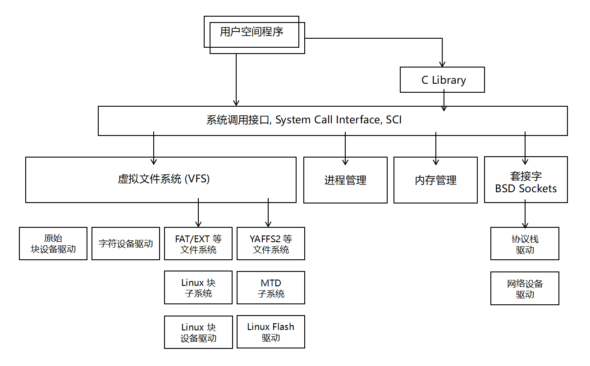

无操作系统时:

``` 
应用软件 --> 设备驱动 --> 硬件
```

有操作系统时: 操作系统负责统一定义各类设备的外部接口.

```
应用软件 --> 操作系统 API --> 操作系统 
                            +--(设备驱动中独立于设备的接口)
                            +--(设备驱动中的硬件操作) --> 硬件
```

设备驱动针对的对象是存储器和外设 (包括 CPU 中集成的存储器), 而不是 CPU 内核. Linux 将外设分为三类:
1. 字符设备: 以串行顺序依次进行访问的设备. 如触摸屏/鼠标.
2. 块设备:   以任意顺序进行访问的设备, 以块为单位. 如硬盘.
3. 网络设备: 使用套接字接口, 接受和发送数据包.

虽然 *字符设备* 和 *块设备* 的驱动设计有很大差异, 但对于而言, 都是使用虚拟文件系统 (VFS) 接口进行访问. (`open, close, read, write`). 


