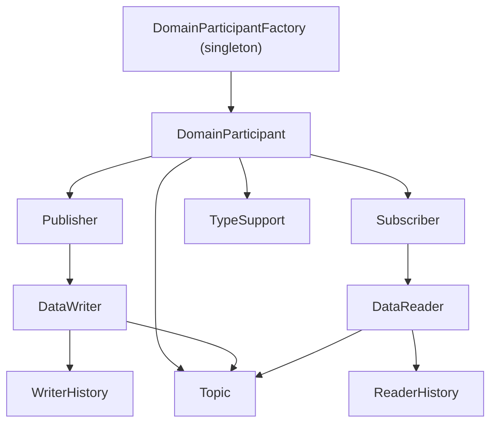

DDS （Data Distribution Service）是一种多对多通信协议，在同一域（domain）内的节点，可以通过“发布、订阅”方式进行通信，并且支持不同 QoS 配置。 DDS 通常基于 RTPS （Real-Time Publish-Subscribe）协议，RTPS 基于 UDP；当然，DDS 服务也能基于共享内存、TCP 等，满足其定义的语义即可。

* DDS Entity: containing a QoS Policy and a Lisenter (callback to standard DDS event). including Topic, Particpant, Publisher, Subsciber, DataWriter, DataReader.
* Domain Participant: binding with a domain number, participants in the same domain can communicate. containing Publishers,Subscribers and Topics.
* Publisher: binding with Topics and DataWriters.
* Subscriber: binding with Topics and DataReaders

## IDL 

DDS 用 `*.idl` 文件定义序列化数据格式。

## Publisher & Subscriber

以 FastDDS 为例，创建 Publisher 的过程：
1. 初始化一个消息（结构体对应 IDL 中定义）
2. 在 Domain 中创建一个 Participant，并定义其 QoS 
3. 通过 Participant 注册消息定义（IDL）
4. 通过 Participant 创建一个 Topic 
5. 创建一个 Publisher
6. 通过 Publisher 创建一个 DataWriter，绑定 Listener Callback 与 Topic。Callback 在每次绑定某个 Listener 时被调用，DataWriter 用于发送消息。

同理，DDS Subscriber 也对应一个 RTPS DataReader。

## 参考

https://www.omg.org/spec/DDSI-RTPS/About-DDSI-RTPS/

https://fast-dds.docs.eprosima.com/en/latest/fastdds