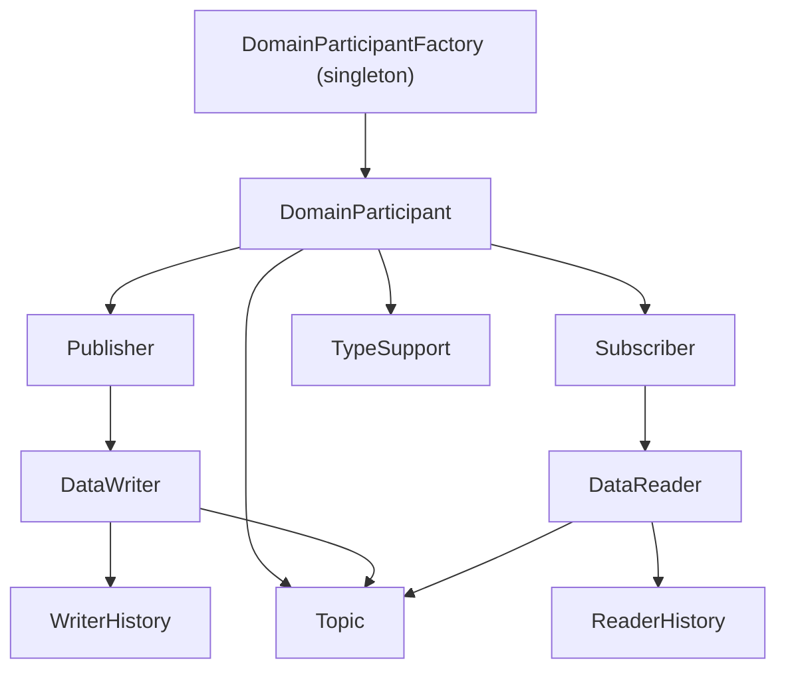

DDS （Data Distribution Service）是一种多对多通信协议，在同一域（domain）内的节点，可以通过“发布、订阅”方式进行通信，并且支持不同 QoS 配置。 DDS 通常基于 RTPS （Real-Time Publish-Subscribe）协议，RTPS 基于 UDP；当然，DDS 服务也能基于共享内存、TCP 等，满足其定义的语义即可。

* DDS Entity: containing a QoS Policy and a Lisenter (callback to standard DDS event). including Topic, Particpant, Publisher, Subsciber, DataWriter, DataReader.
* Domain Participant: binding with a domain number, participants in the same domain can communicate. containing Publishers,Subscribers and Topics.
* Publisher: binding with Topics and DataWriters.
* Subscriber: binding with Topics and DataReaders

## IDL 

DDS 用 `*.idl` 文件定义序列化数据格式。

## Publisher & Subscriber

以 FastDDS 为例，创建 Publisher 的过程：
1. 初始化一个消息（结构体对应 IDL 中定义）
2. 在 Domain 中创建一个 Participant，并定义其 QoS 
3. 通过 Participant 注册消息定义（IDL）
4. 通过 Participant 创建一个 Topic 
5. 创建一个 Publisher
6. 通过 Publisher 创建一个 DataWriter，绑定 Listener Callback 与 Topic。Callback 在每次绑定某个 Listener 时被调用，DataWriter 用于发送消息。

同理，DDS Subscriber 也对应一个 RTPS DataReader。

## Listener & Status 

| 状态名                        | 实体         | 核心含义                    |
| -------------------------- | ---------- | ----------------------- |
| Inconsistent Topic         | Topic      | Topic 定义冲突    |
| Offered Incompatible QoS   | DataWriter | Writer 提供的 QoS 无法满足对端   |
| Requested Incompatible QoS | DataReader | Reader 请求的 QoS 无法被满足    |
| Publication Matched        | DataWriter | Writer 成功匹配到 Reader     |
| Subscription Matched       | DataReader | Reader 成功匹配到 Writer     |
| Offered Deadline Missed    | DataWriter | Writer 未按 deadline 发布数据 |
| Requested Deadline Missed  | DataReader | Reader 未按 deadline 收到数据 |
| Sample Lost                | DataReader | 数据在传输过程中丢失       |
| Sample Rejected            | DataReader | 数据被本地丢弃     |
| Data Available             | DataReader | 有新数据可读                  |
| Data On Readers            | Subscriber | 某个 Reader 有数据（聚合通知）     |
| Liveliness Lost            | DataWriter | Writer 被认为失活            |
| Liveliness Changed         | DataReader | Reader 观察到对端存活状态变化      |

## QoS 

#### Desination Order Policy

`BY_RECEPTION_TIMESTAMP` 按 DataReader 的收报时间排序

`BY_SOURCE_TIMESTAMP` 按 DataWriter 的发送时间排序（报文 Timpstamp）

#### Durability Policy 

指即使没有 DataReader 存在， DataWriter 仍可以发布消息。在 DataReader 加入后，Durability Policy 规定如何处理 DataWriter 之前已发布的历史消息。

* `VOLATILE` 丢弃历史消息
* `TRANSIENT_LOCAL` 将近期缓存的历史消息发送给新加入的 DataReader History
* `TRANSIENT` 历史消息持久存储在磁盘中。将历史消息发送给新加入的 TataReader History

#### Reliability Policy 

管理 DDS 收报可靠性

* `BEST_EFFORT` 消息不会等待接收方确认。但是，保证消息的时间戳有序性。
* `RELIABLE` 可靠传输。

#### History Policy 

* `KEEP_LAST(N)` Writer 只保留最近的 N 条消息
* `KEEP_ALL` Writer 尝试保留所有消息，直到消息被发送给所有  Subscribers。实际上还受 ResourceLimitsPolicy 限制

#### Depth Policy 

#### Deadline Policy

超过一定时间后，如果没有新消息，警告。用于周期性消息发布。

#### Lifespan Policy 

Writer 写下的每个报文都有过期时间，过期后不再在历史中缓存。默认报文没有过期时间，持续缓存等待被处理。

#### Liveliness Policy 

类似主动心跳机制。

#### Compability 

RxO （Requested vs Offerd）是指 订阅者的需求（Requested）需要小于等于发布者的能力（Offered）

比如：
* `BEST_EFFORT < RELIABILITY`
* `VOLATILE < TRANSIENT_LOCAL` 
* `AUTOMATIC_LIVELINESS < MUNUAL_BY_PARTICIPANT < MUNUAL_BY_TOPIC`

## 参考

https://www.omg.org/spec/DDSI-RTPS/About-DDSI-RTPS/

https://fast-dds.docs.eprosima.com/en/latest/fastdds 