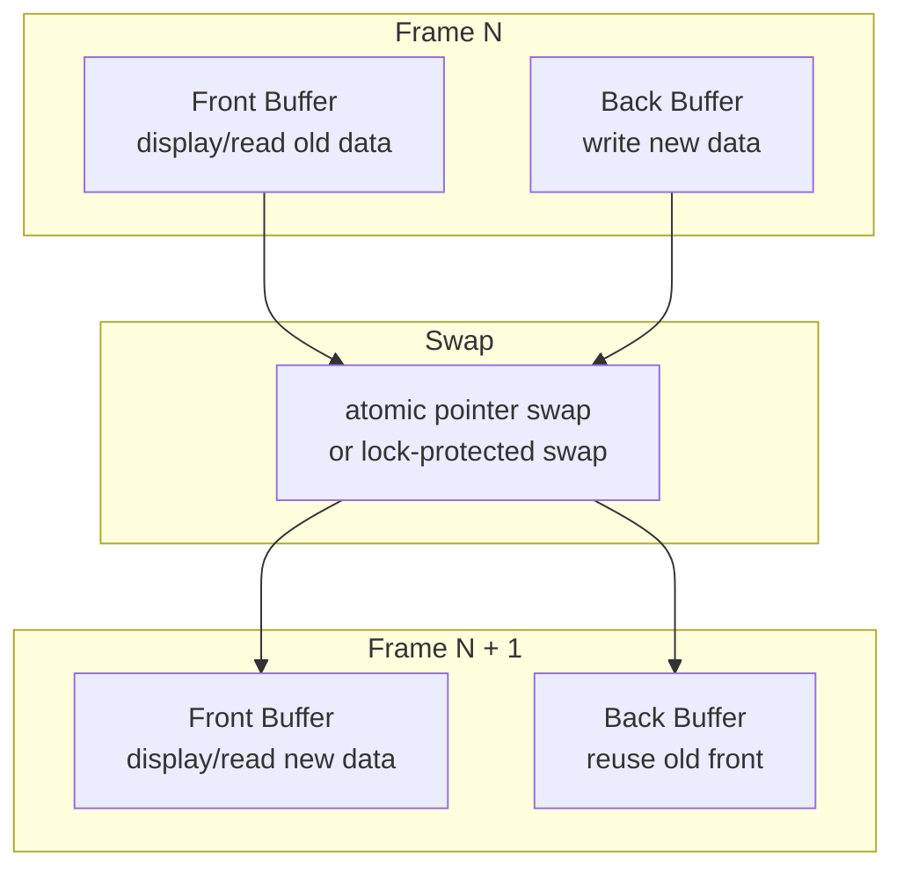

读者需要稳定快照，而写者又需要持续更新。由于数据块比较大，不能让读者看到半成品（撕裂），至少需要加锁。双缓冲区的思想是，让写者在后台完全准备好数据后，再通过交换一个原子索引（指针），原子地更新读视图。

注意这种情形：读者获取 A 缓冲区，写者换出 B  缓冲区并换入 A，写者修改 A，但此时读者可能仍持有并在读取 A。双缓冲区本身无法解决这个问题。双缓冲区只适用于这种场景：写者持续更新，读者的消费速度远快于生产速度。#TODO

```cpp
struct Buffer {
    int frame_id{};
    std::string payload;
};

class SharedDoubleBuffer {
public:
    SharedDoubleBuffer()
        : front_(std::make_shared<Buffer>()),
          back_(std::make_shared<Buffer>()) {}

    std::shared_ptr<const Buffer> read() const {
        return std::atomic_load_explicit(
            &front_,
            std::memory_order_acquire
        );
    }

    template<class Fn>
    void write(Fn&& fn) {
        std::lock_guard lock(writer_mutex_);

        fn(*back_); // 构建新版本

        // 记录当前 front，之后看看能不能复用
        auto old_front = std::atomic_load_explicit(
            &front_,
            std::memory_order_acquire
        );

        // 发布 back
        std::atomic_store_explicit(
            &front_,
            std::shared_ptr<const Buffer>(back_),
            std::memory_order_release
        );

        // 如果旧 front 没有 reader 持有，则复用它当新 back
        if (old_front.use_count() == 1) {
            back_ = std::const_pointer_cast<Buffer>(old_front);
        } else {
            // reader 还在持有旧 front，不能覆盖，只能分配新 back
            back_ = std::make_shared<Buffer>();
        }
    }

private:
    mutable std::mutex writer_mutex_;

    std::shared_ptr<const Buffer> front_;
    std::shared_ptr<Buffer> back_;
};
```