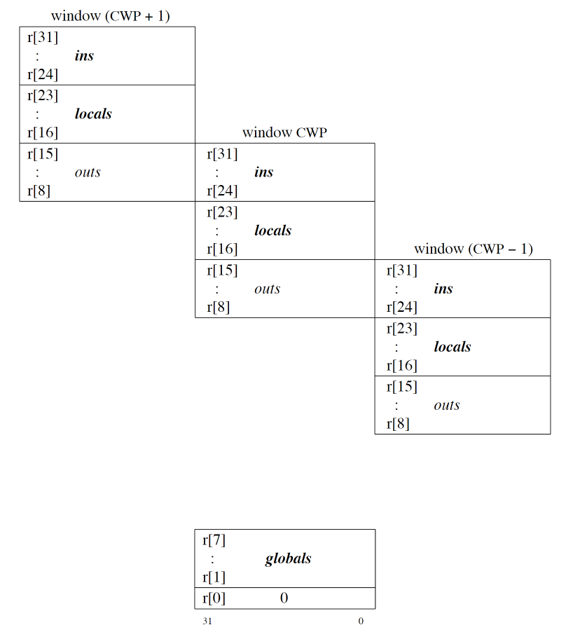

## 架构

SPARC V8 32b, Big Endian. 

组件:
- IU (Integer Unit)
- FPU (Floating-Point Operate, FPop)
- CP (Coprocessor Operate, Cpop)
- 寄存器窗口 (Reg Windows)

## 寄存器

分为数据寄存器和控制寄存器两种.

IU 的控制寄存器有:
- Processor State Register (PSR)
- Windows Invalid Mask (WIM). 每位代表一个寄存器窗口, `WIM=1` 代表窗口无效, `WIM[CWP]=1` 代表发生 window overflow/underflow 错误, 即窗口溢出. WIM 也意味着 SPARC V8 支持最多 32 个窗口, 最少 2 个.
- Trap Base Register (TBR)
- Multiply/Divide Register (Y)
- PC, nPC 

FPU 的控制寄存器:
- Floatering-Point State Register (FSR)

每组数据寄存器 (即一个寄存器窗口) 包括:
- 8 个全局寄存器 (g r), 和输入/本地寄存器不近邻.
- 8 个输入寄存器 (in r)
- 8 个本地寄存器 (local r)
- 下个寄存器窗口的输入寄存器, 和该窗口的本地寄存器近邻, 可以用作输出. (out r)

当前窗口的寄存器地址由 CWP (Current Windows Pointer) 给出, CWP 是 PSR 状态寄存器中的五位, 其值由 `RESTORE, SAVE` 两个指令控制. 某个窗口的有效性由 WIM 记录.



FPU 包含 32 个浮点数寄存器 (f), 但没有窗口机制, 即某时刻可以访问所有 32 个浮点数寄存器. 双精度浮点数需要近邻并地址对齐的一对浮点数寄存器....

### PSR 

```
PSR Fields:
| 31  28 | 27   24 | 23   20 | 19    14 | 13 | 12 | 11  8 | 7 | 6  | 5  | 4  0 |
| impl   | ver     | icc     | reserved | EC | EF | PIL   | S | PS | ET | CWP  |

icc (Integer Condition Codes) Fields of the PSR:
| 23 | 22 | 21 | 20 |
| n  | z  | v  | c  |
```

使用特权指令 `PDPSR, WDPSR` 可直接读写 PSR.
- `PSR.impl`, `PSR.ver` 用来确定 SPARC 的版本和实现.
- `PSR.icc`, (icc, integer_cond_codes) 是 IU 的整数操作标识, 任意以 `cc` 结尾的指令都会影响该标识. 
	- n (ALU negative), 
	- z (ALU zero), 
	- v (ALU overflow), 
	- c (ALU carry)
- `PSR.ec`, 硬件是否启用了 coprocessor
- `PSR.ef`, 硬件是否启用了 FPU 
- `PSR.pil`
- `PSR.s`, 1 代表特权模式.
- `PSR.ps`, previous supervisor. 存储最近一次 trap 时的 `PSR.s` 值.
- `PSR.et`, 1 代表启用 trap. 当陷入发生时, `PSR.et` 被归零, IU 终止, 中断请求暂停, 地址复位.

### TBR 

```
TBR Fields:
| 31        12 | 11     4 | 3      0 |
|    TBA       |    tt    |   zero   |
```

- `TBR.trap_base_address` 中断向量表的高 20b 地址.
- `TBR.trap_type` 一字节长, 用于中断向量表的偏移量. `tb[tt]`
- `TBR.zero` 置零不用.

### PC/nPC 

PC / next PC

## 内存模型 

### 数据字长

- signed integer, 8 16 32 64b
- unsigned integer, 8 16 32 64b
- floating point 32 64 128b

各长度定义为: (注意, 这里字的定义和 Windows API 定义完全不一样)
- 8b, byte
- 16b, halfword
- 32b, word
- 32b, tagged word, with 2 tag bits / 30b value bits
- 64b, double world
- 128b, quadword

### 内存映射

- RAM 
- 内存映射 I/O (MMIO): 用于和通用外设传输数据
- ROM/Flash 
- 未映射部分
- 寄存器映射: 位于更高位
	- 内核寄存器 (CPU 内部控制寄存器), 
	- 片上寄存器 (外设状态寄存器): DMA, PCI, DSU (Debug Support Unit), UART, Timer, WatchDog

## 指令

六大类指令:
- Load/store
- Arithmetic/logical/shift
- control trasfer
- read/write control register
- floating-point operate
- coprocessor operate

### Load/Store 

操作内存的指令, 支持 16b, 32b, 64b 访存, 并分别按 16b, 32b, 64b 内存对齐. 

其他操作内存指令为 priviledged load/store, 可以直接操作 一字节 内存, 必须运行在特权模式下.

### Arithmetic/Logical/shift

> The tagged arithmetic instructions assume that the least-significant 2 bits of the operands are data-type “tags”. These instructions set the overflow condition code bit upon arithmetic overflow, or if any of the operands’ tag bits are nonzero. There are also versions that trap when either of these conditions occurs.

[sparc architecture manualv8, page 14](appx/sparc%20architecture%20manualv8.pdf#page=14&selection=61,0,70,73)

### Control transfer

Control-transfer instructions (CTI) 包含: PC 分支, 调用, 跳转, 条件陷入 (trap) 等指令.
- Conditional Branch (Bicc, FBfcc, CBccc) --> PC 
- Call and Link (CALL) --> PC
- Jump and Link (JMPL) --> Register Indirect 
- Return from trap (RETT)
- Trap (Ticc) --> Register Indirect Vectored

DCTI (Delayed CTI) 指有分支预测槽的指令, 因为跳转指令通常较慢, 在其产生结果前, 其后续指令会被提前执行.

#### CALL/JMPL

CALL 将 PC 写入 `r[15]`, JMPL 将 PC 写入 `rd` 指定的数据寄存器中.

#### SAVE/RESTORE 

SAVE 执行一个加法操作, 同时将 CWP 减一. RESTORE 执行一个加法操作, 同时将 CWP 加一. 同时 SAVE/RESTORE 都会使用 WIM 检查新的窗口 CWP 是否有效.

## 中断机制

SPARC 提供很多底层的缺陷 (trap) 分类, 用户需要编写 缺陷向量表, 来处理不同类型的缺陷. 缺陷向量表的每一项都是一个单独的处理程序 (trap hhandlers). 

| Exception or Interrupt Request | tt     | disp                  |
| ------------------------------ | ------ | --------------------- |
| reset                          |        | |
| **data_store_error**               | `0x2b` | bus parity error, ...                      |
| instruction _access_MMU_miss   | `0x3c` |                       |
| *instruction_access_error*       | `0x21` |                       |
| *r_register_access_error*        | `0x20` |                       |
| instruction_access_exception   | `0x01` |                      |
| priviledged_isntruction        | `0x30` |while s=0, an attmpt to execute a priviledge instruction                       |
| **illegal_instruction**            | `0x02` |                       |
| fp_disabled                    |        |                       |
| cp_disabled                    |        |                       |
| unimplemented_FLUSH            |        |                       |
| watchpoint_detected            | `0x0B` |                       |
| **windows_overflow**           |        |                       |
| **windows_underflow**          |        |                       |
| **mem_address_not_aligned**    |        |                       |
| **fp_exception**               |        |                       |
| **cp_exception**               |        |                       |
| data_access_error              |        |                       |
| data_access_MMU_miss           |        |                       |
| data_access_exception          |        |                       |
| tag_overflow                   |        |                       |
| **division_by_zero**           | `0x2a` |                       |
| trap_instruction               |        |                       |
| ...                            |        |                       |

SPARC V8 中断处理机制, 涉及 PSR 寄存器的两个字段:
1. Processor Interrupt Level (PIL)
2. Trap Enable (ET)

et = 1 时, 中断使能. 在指向下一指令前, 挑选优先级最高的中断执行. 
- bp_IRL > PIL, (IRL 0~15 由外部传递到处理器)
- bp_IRL = 15 (unmaskable), 
- PIL 不是优先级, Priority 定义在 Table 7-1 

et = 0 时, 
- 任何 Interrupting Traps 都会被忽略. 
- 其他硬件 Trap 将导致错误模式 (error_code), 可能直接硬件复位 Reset (依赖于实现)

TBR: tt (8b) | tba (20b) | 0 (4b)
- tt 0~0x7f, hardware traps
- tt 0x80~0xff, software traps (caused by TICC insn)

Trap 发生时:
1. ET <- 0
2. 保存特权模式状态: PS <- S, S <- 1
3. 寄存器窗口递进 (不会检查和触发 windows overflow, 可能直接导致 error_mode)
4. trapped context: r[17] <- PC, r[18] <- NPC
5. 修改 TBR 的 tt 字段
6. 如果是 Reset Trap, PC <- 0, NPC <- 4
7. 如果是其他 Trap, PC <- TBR, NPC <- TBR + 4