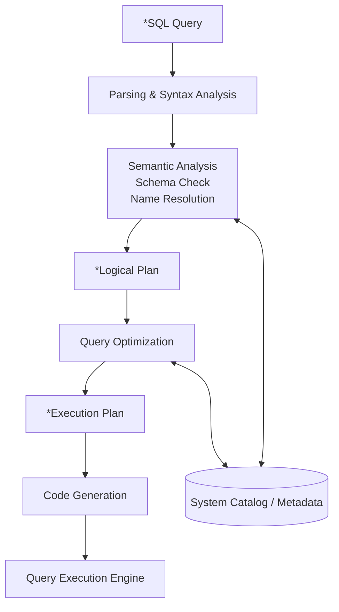

SQL (Structured Query Language) 是结构化查询语言, 专用于与数据库交互和通信. 语言类型为[声明式语言](../../../Language/Coding%20Patterns/编程范式.md), 其功能:
* Definition: 定义数据库对象
* Manipulation (CRUD): 查询、修改、插入、删除
* Control: 主要指访问控制模型
* Transaction: 数据库事务处理

## Fundamental Concepts 

Database (数据库)  

Table (表) is a structured listing of certain types of data 

Column (列) is a column represents a *field* within a table

Row (行) is a row represents a single *record* in a table

Schema (模式) deescribes the structural information of a database and tables 

Primary Key (主键) is a column (columns) that uniquely identifies each row, which always be defined in any table: 
* Values in a primary key column should not be upadted 
* Values in a pramary key column should not be reused 
* Primary Keys should not be based on values that may change in the future 

View (视图) is essentialy a stored query that appears as a virtual table to the user 

Index (索引) uses a B-Tree structure to reduce the time complexity of SQL queries.

CRUD: Create & Read & Update & Delete Data 

OLTP(Online Transaction Processing)

OLAP(Online Analytical Processing)

## SQL Implementation 

在底层，SQL 表按内存页存储，新插入数据会直接附加在现有内存后，可能是无序的。如 InnoDB 等引擎，会用 B-Tree 给 PRIMARY KEY 建立独立索引，但是其他辅助性索引需要用户自行创建，用内存消耗换取索引速度。

* Location Plan(Query Tree): 关注查询语义信息，进行语句的关系代数优化。
* Execution Plan(Execution Code): 关注物理执行开销。



## Create

| 对象                    | 创建操作      | 删除操作    | 修改操作    |
| ----------------------- | ------------- | ----------- | ----------- |
| 模式 <br> (无标准, 类似表命名空间) | create schema | drop schema |             |
| 表                      | create table  | drop table  | alter table |
| 视图                    | create view   | drop view   |             |
| 索引                    | create index  | drop index  | alter index            |

每个 Field 的数据类型详见 [SQL/数据类型](sql-field-types.md)。对于每个字段，定义格式为：`<name> <field_type> <column_constraints>`。表级约束则定义在末尾，如主键和外键约束。

```sql
	create table Student(
		Sno char(9),
		Sname char(20) unique,
		Ssec char(2) null, -- null: 允许空缺
		Cno char(4),
		Math int not null default 60, -- not null: 不允许空缺
		foreign key (Cno) reference Class(Cno),
		primary key (Sno)
	);
```

删除表: `drop table <t> [restrict | cascade]`
- restrict: 和 cascade 相反
- cascade: 若存在其他依赖该表对象, 相关依赖对象一起删除

定义视图：视图本质是嵌套子查询，不实际存储数据，可用于简化查询。

```sql
-- 创建视图
CREATE VIEW productscustomers AS
SELECT cust_name, cust_contact, prod_id FROM customers, orders, orderitems
WHERE cusomers.cust_id = orders.cust_id AND orderitems.order_num=orders.order_num;

-- 使用视图
SELECT * FROM productscustomers;

-- 查看某视图的SQL定义语句:
SHOW CREATE VIEW view_name

-- 删除视图, 视图一般不能更新.
DROP VIEW view_name;
```

## Read 

数据查询详见 [SQL/数据查询](sql-select.md).

```sql
select [all|distinct] <column_expr>[, ...]
from <table_name> [, ...] [as] <alias> 
[where <condition_expr>] 
[group by <column_name> [having <condition_expr>]]
[order by <column_name> [asc|desc]];
```

常见查询条件:

| 条件     | 谓词              |
| -------- | ----------------- |
| 比较     | =, >, <, <>       |
| 字符匹配 | (not) like        |
| 空值     | is (not) null     |
| 逻辑     | and, or, not      |
| 确定范围 | (not) between and |
| 确定集合 | (not) in          |
| 存在     | (not) exists             | 

检索所有列:

```sql
SELECT * FROM students;
```

检索不同行 (相同行只列一次), 使用 `DISTINCT` 修饰

```sql
SELECT DISTINCT name FROM students;
```

限制结果:

```sql
SELECT name FROM students LIMIT 5;
```

## Update & Delete 

### Insert

`insert` 插入行. 对于被频繁访问的数据库, 修改数据是很耗时的, 因为需要更新很多索引, 可使用 `insert low_priority into` 降低执行优先级.

```sql
/* 依赖于默认列顺序: */
insert into students values (null, 'yujiawei', null); -- id, name, math

/* 指定赋值顺序: */
insert into studets(name, id, math) values ('yujiawei', null, null); 
-- 该方法可以省略一些列
```

将检索的数据插入数据库中: `insert` + `select`. 注意, 从其他表导入数据时, 主键不能和现有的重复.
```sql
insert into students2(id, name, math) select id, name, math from students
```

### Update

`update` 和 `delete` 关键词要谨慎使用, 容易毁坏[数据完整性](../relational-theory/data-integrity.md).

```sql
update students
set email = 'yjw@email.com', math=99
where id = 1;
```

更新表结构:
```sql
-- 添加列
ALTER TABLE students ADD phone CHAR(20);

-- 删除列
ALTER TABLE students DROP COLUMN phone;

--- 定义外键, MySQL
ALTER TABLE orders 
ADD CONSTRAINT fk_orders_customers 
FOREIGN KEY (cust_id) REFERENCES customers (cust_id);
```

### Delete

```sql
delete from students where id=1;
```

删除表:
```sql
DROP TABLE students;
```

重命名表:
```sql
RENAME TABLE students TO students2;
```