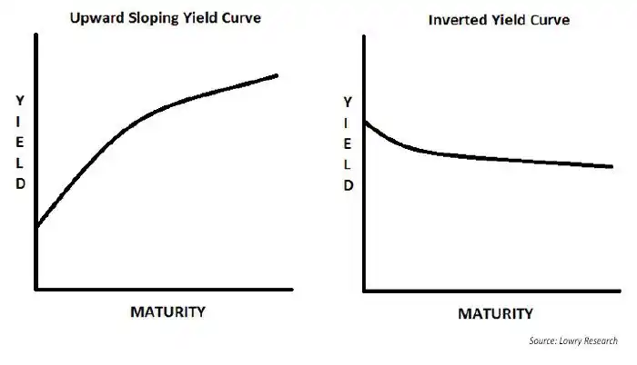

## 利率

本金 $PV$ (Present Value)，年利率 $r$ ，时间 (y) $t$ ，预期未来收益 $FV$ (Future Value)

* 单利率： $$FV=PV\times(1+rt)$$
* 复利率： $$FV_{annual}=PV\times(1+r)^{t}$$ 
* 月复利率（按月支付）： $$FV_\text{monthly}=PV\times \left( 1+\frac{r}{n} \right)^{t n},\quad n=12$$
* 连续利率：当 $r$ 足够小时，复利也可以视为连续利率
	$$FV\approx PV\times e^{rt}\approx PV \left(1 + rt + \frac{t(t-1)}{2}r^2 + \cdots \right),\quad n\to \infty$$

> 可以证明，月复利率最终的实际年利率（effective rate），高于名义年利率（nominal rate）。
> 即只要一年内发生多于一次 Compounding ，实际的利率就高于名义利率。
> 复利频率 $n$ 越高，实际利率越高，复利率随 $n$ 增加而单调递增，趋近于连续复利率（上界）。

### 年投资回报率 (Yield, Rate of Return)

复利率和投资回报率其实是数学上等价的。

Short-term investment (< 1y, use simple rate):

$$FV = PV \times (1 + \text{yield} \times \frac{d}{365})$$

$$\text{yield}=\left(\frac{FV}{PV} - 1\right)\times \frac{365}{d}$$

$$\text{effective yield} = \left(\frac{FV}{PV}\right)^{365/d} - 1$$

<br>

Long-term investment (for N years, use compounding rate per year):

$$FV = PV \times (1+ \text{yield})^n$$

$$\text{yield} = \left(\frac{FV}{PV}\right)^{1/n} - 1$$

<br>

假设 $d=30$ 天，短线投资下的收益关系为：

$$\text{30天实际收益率} < \text{简单年化 yield} < \text{复利年化 yield}$$

$$\frac{FV}{PV}-1 < \left(\frac{FV}{PV} - 1\right)\frac{365}{d} < \left(\frac{FV}{PV}\right)^{365/d}-1$$

和累计利率收益相反，短期投资反推年化利率时，*复利年化利率*要高于*简单年化利率*才能拉平总收益。
以切蛋糕为例，简单利率是平均分隔为 365 份，而复利率是按指数增长地切割，因此短期（近期）
切割出的蛋糕，复利率相反弱于简单利率。


### 资金的翻倍时间

设资金翻倍时间为 $T$ ，其满足： $$2PV=PV (1+r)^{T}$$ 

说明翻倍时间 $T$ 和本金没有关系，是固定的： $$T=\frac{\ln{2}}{\ln(1+r)}$$ 

### Discount (折现)

DF (Discount Factor) $\times$ FC = PV

```
        Compounding
PV  --------------------->  FV

PV  <---------------------  FV
        Discounting
```

#### DCF (Discounted Cash FLow) 

把一项资产未来 $t$ 年能产生的现金流 $CF_i$ ，通过折现率 $r$ ，折现为资产今天的价值 $PV$ 。
其中 $CF_0$ 是初始投资（本金），不计入折现计算，通常记为负数。

$$PV=\sum^T_{t=1} \frac{CF_t}{(1+r)^t}$$

净折现值（加上初始本金，注意本金是负数）：

$$NPV = CF_0 + PV$$


#### **IRR (Internal Rate of Return)**

IRR 目的是找到一个折现率 $r$ ，使得所有未来现金流折现回今天后，净现值 NPV 为零。
**通过 IRR，可以将现金流复杂的投资产品计算出一个近似的年化收益，方便投资比较**。

$$0=CF_0 + \sum^T_{t=1} \frac{CF_t}{(1+IRR)^t}$$


## Money Market

市场参与者：
* Borrower / Lender 
* Broker / Dealer 

市场风险：
* Credit Risk. Borrower may fail to repay 
* Liquidity Risk. Cannot sell assets into cash quickly 
* Market Risk. Assets value changes due to rate monvements 
* Inflation Risk. 

## Yield Curve


