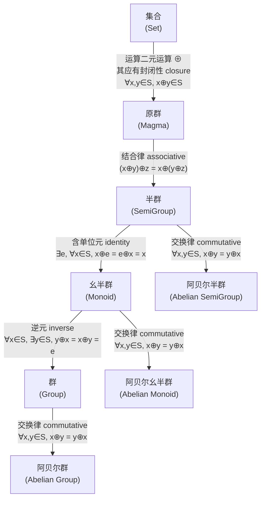
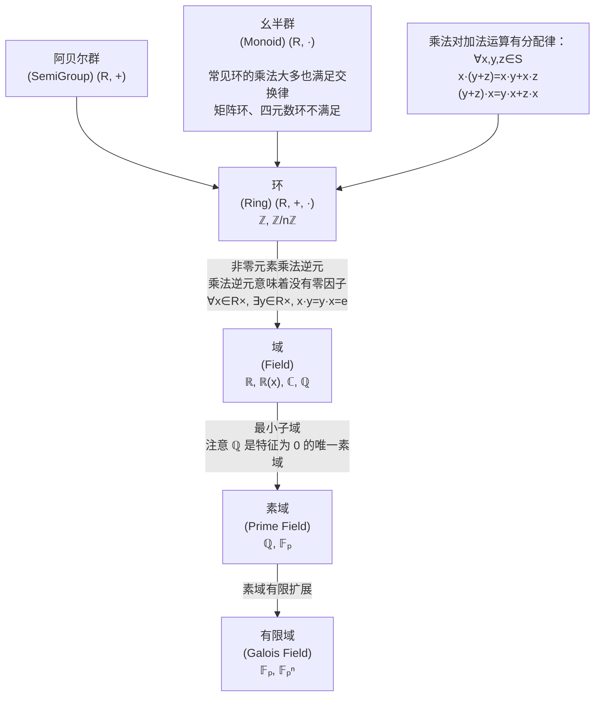

#### 数学结构

https://en.wikipedia.org/wiki/Mathematical_structure

集合上的结构指集合上附加的, 赋予集合特殊意义的数学对象. 

- 有序 (order)
- 代数
- 拓扑 (topo)
- 测度 (measure)
- 度量 (metric) / 几何
- 等价关系
- 范畴 (category)
- 微分结构

计算机的诞生侧近了离散数学等难以结构化的数学分支, 因此现代不再按*结构*划分数学领域.

#### 代数结构

https://en.wikipedia.org/wiki/Algebraic_structure

- 群
	- 交换群
	- 幺半群
	- ...
- 环
	- 无零因子环
	- 交换环
	- 整环
	- 域
- 模 (Module)
	- 向量空间 (Vector space)
	- 域代数 (Algebra Over a Field)
- 格 (Lattice)

| $(R^{*}, *)$        | 封闭 | 单位元 | 逆元 | 交换 | 例子                                               |
| ------------------- | ---- | ------ | ---- | ---- | -------------------------------------------------- |
| 幺环 (通常意义的环) | Y    | Y      |      |      |                                                    |
| 无零因子环          | Y    |        |      |      | $\mathbb{Z}\times \{0  \}$                         |
| 整环                | Y    | Y      |      | Y    | $\mathbb{Z}, \mathbb{F}_{p}[x]$                    |
| 除环/体             | Y    | Y      | Y    |      |                                                    |
| 域                  | Y    | Y      | Y    | Y    | $\mathbb{R}, \mathbb{Q},\mathbb{C}, \mathbb{R}(x)$ |

域一定是整环, 整环不一定是域 (即, 无零因子, 不意味着一定有逆元)

#### 抽象空间

https://en.wikipedia.org/wiki/Space_(mathematics)

- 代数空间
- 度量空间
- 希尔伯特空间

