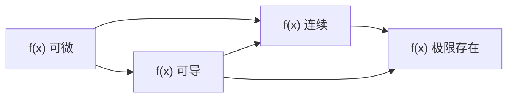
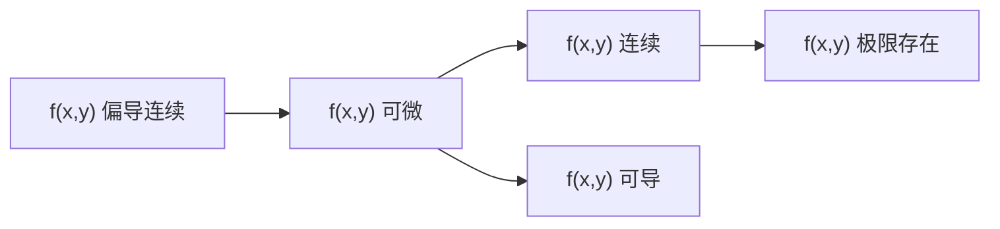

一元函数：

```mermaid
flowchart LR
    A["f(x) 可微"] --> B["f(x) 连续"]
    A --> C["f(x) 可导"]

    C --> B

    B --> D["f(x) 极限存在"]
    C --> D
```

二元函数：

```mermaid
flowchart LR
    A["f(x,y) 偏导连续"] --> B["f(x,y) 可微"]

    B --> C["f(x,y) 连续"]
    B --> D["f(x,y) 可导"]

    C --> E["f(x,y) 极限存在"]
```