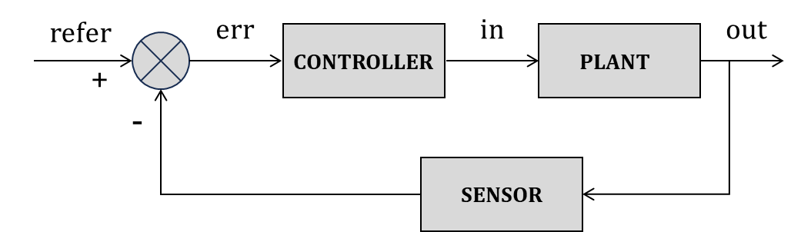

开环控制系统（Open Loop）：

闭环控制系统：

## Bode Plot 

**传递函数**

*增益（gain）*

*相位（phase）*

## LQR

## PID (Proportion Integration Differentiation)

PID 方法用于反馈控制，使系统输出 $y(t)$ 追踪期望参考值 $r(t)$ 。

误差定义为： $$e(t)=r(t)-y(t)$$

PID 控制律的*控制输入*定义为： $$u(t)=K_{p}e(t)+K_{i}\int^{t}_{0}e(\tau)d\tau +K_{d} \frac{de(t)}{dt}$$
* $K_{p}$ 比例增益，对误差立刻做出反应
* $K_{i}$ 积分增益，消除 *稳态误差（steady-state error）* 
* $K_{d}$ 微分增益，提高相位裕度

$K_{d}$ 微分项对噪声（高频信号）很敏感，因此会搭配低通滤波使用，或干脆不用。*带低通滤波的微分项（Dirty Derivative）* 定义为： $$D(s)=\frac{K_{d}s}{\tau s+1}$$

## Kalman Filter 

## 