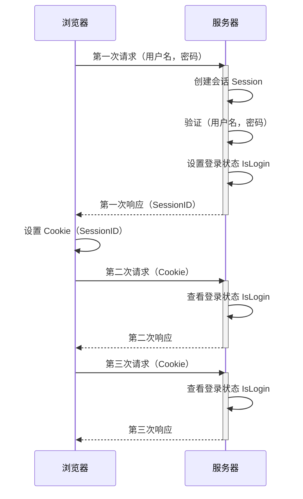
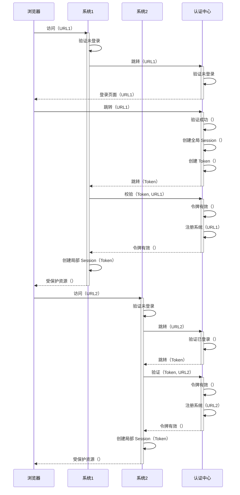
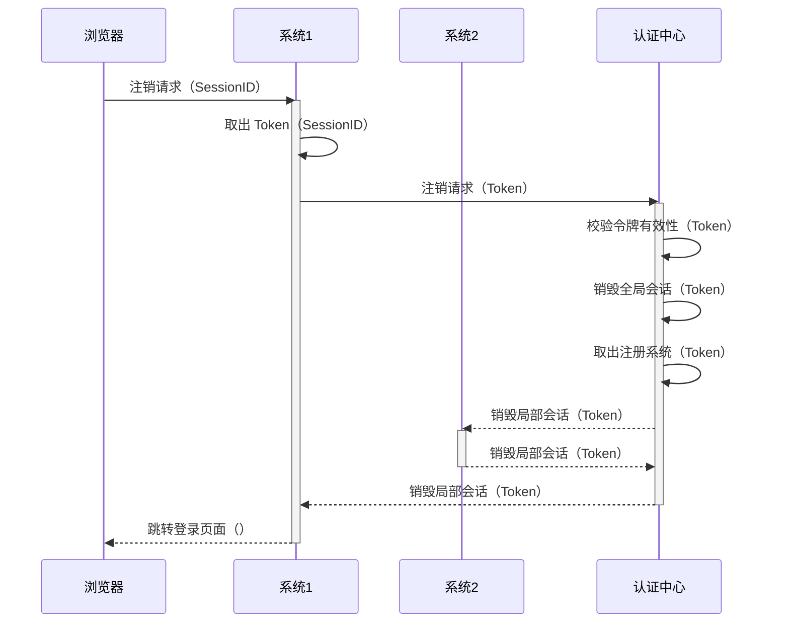

## Cookie

[HTTP](../../app-l5/HTTP.md) 是无状态协议, 使用 Cookie 记录用户会话登录状态, 以及其他信息 (用户喜好, 追踪分析行为). 用户登录后, 由服务端下发响应 Cookie, 内含 Session ID, 用来记录用户登录状态. 用户存储 Cookie, 再次请求时, 将其中信息一并上传.

Session 是服务器端的数据, 也用于存储用户数据. 当用户通过 Cookie 上传 Session ID, 服务器用此 ID 在数据库寻找对应 Session, 从而获取到该用户的数据. 

以下情况被称为*跨域 (Cross-Region)*:
- 不同域名, 如 `http://blog.example.com` 与 `http://store.example.com` 
- 不同端口, 如 `http://example.com:80` 与 `http://example.com:8080`
- 不同协议, 如 `http://example.com` 与 `https://example.com`

大多浏览器开启*同源政策 (Same-Origin Policy)*, 限制从一个域向另一个域的请求行为, 用以减少*跨站请求伪造攻击 (Cross-Site Request Forgery, CSRF)*. 典型 CSRF 如, 利用用户已登录信息伪装, 使用脚本窃取信息或执行操作.

使用 Cookie+Session 鉴权模式主要有如下缺点:
- **无法进行跨域授权**. 一是不安全, 易遭受 CSRF 攻击; 二是不同子域的技术栈不可能一样, 无法维持会话一致性.
- 普适性也不强, 只被浏览器广泛使用
- 每次请求都会带 Cookie, 哪怕是请求静态资源

## SSO

单点登录 (Single Sign On, SSO) 通过 SSO 认证中心来与各个子域建立会话. 用户与 SSO 认证中心的会话称为全局会话, 用户和子系统(不同域)之间的会话称为局部会话, 建立局部会话后, 访问资源将不再通过 SSO 认证中心.
1. 局部会话存在, 全局会话一定存在.
2. 全局会话存在, 局部会话不一定存在.
3. 全局会话销毁, 局部会话必须销毁.

