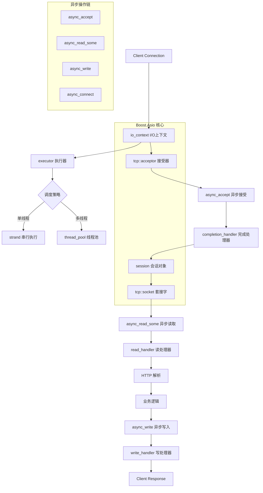

asio 是异步 IO 网络库，非常标准化

```mermaid
flowchart TD
    A[Client Connection] --> B[io_context I/O上下文]
    B --> C[executor 执行器]
    C --> D{调度策略}
    D -->|单线程| E[strand 串行执行]
    D -->|多线程| F[thread_pool 线程池]
    
    B --> G[tcp::acceptor 接受器]
    G --> H[async_accept 异步接受]
    H --> I[completion_handler 完成处理器]
    I --> J[session 会话对象]
    
    J --> K[tcp::socket 套接字]
    K --> L[async_read_some 异步读取]
    L --> M[read_handler 读处理器]
    M --> N[HTTP 解析]
    N --> O[业务逻辑]
    O --> P[async_write 异步写入]
    P --> Q[write_handler 写处理器]
    Q --> R[Client Response]
    
    subgraph "异步操作链"
        S[async_accept]
        T[async_read_some]
        U[async_write]
        V[async_connect]
    end
    
    subgraph "Boost.Asio 核心"
        B
        G
        J
        K
    end
```

## 参考

流程图来源： https://github.com/linkxzhou/mylib/