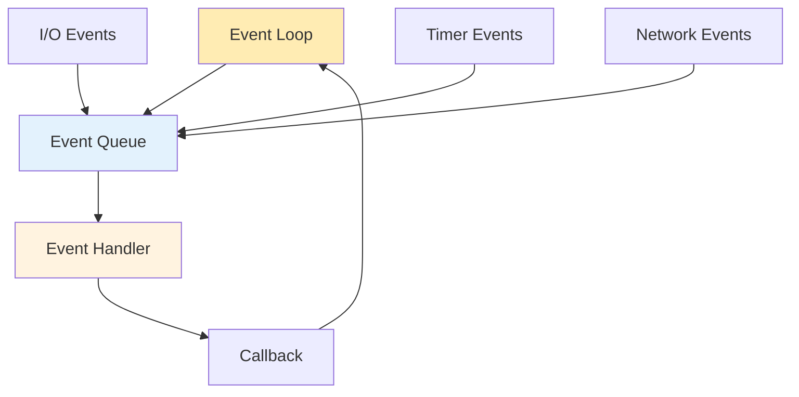

## IO 多路复用模式

在多路 IO 复用模式中，应用需要向内核（或后台程序）注册 `handler`，同时放弃阻塞等待 IO 事件。当 IO 事件发生时，内核会调用 `handler` 以唤醒注册程序。该调度过程被称为 EventLoop。

### EventLoop 

EventLoop 模型适合 IO 密集型应用，用单线程达到并发处理多个 IO 事件的目的，避免阻塞等待。

### Reactor 

Reactor 模型中，内核将 IO 事件转发给应用，应用自行读写。如果是非阻塞读写，由于内核不知道交付目标，因此内核不保证 IO 能够完成，应用需要维护状态机。

Reactor 将事件检测和事件处理分离。

### Proactor 

Proactor 模型中，应用将交付目标提交给内核，内核负责 IO 操作与维护状态机，在 IO 完成后再通知应用。此时，应用可以直接获得 IO 操作的结果，是完全异步的。

Proactor 在一些场景下有优势：
* 减少内核、用户态切换。Reactor 模型下，后续*读写*也需要独立的内核调用。
* 便于批处理。IO 状态机下沉到内核，内核直接合并多个 IO 事件。

### 实例

|              | Actor    |
| ------------ | -------- |
| libevent     | Reactor  |
| Netty (Java) | Reactor  |
| UNIX [select](../../os/io/select.md) & [poll](../../os/io/poll.md) | Reactor  |
| Windows IOCP         | Proactor |
| Linux [epoll](../../os/io/poll.md)  | Reactor  |
| Linux [io_uring](../../os/io/linux-io_uring.md) | Proactor |
| POSIX AIO    | Proactor |
| ASIO         | Proactor |

