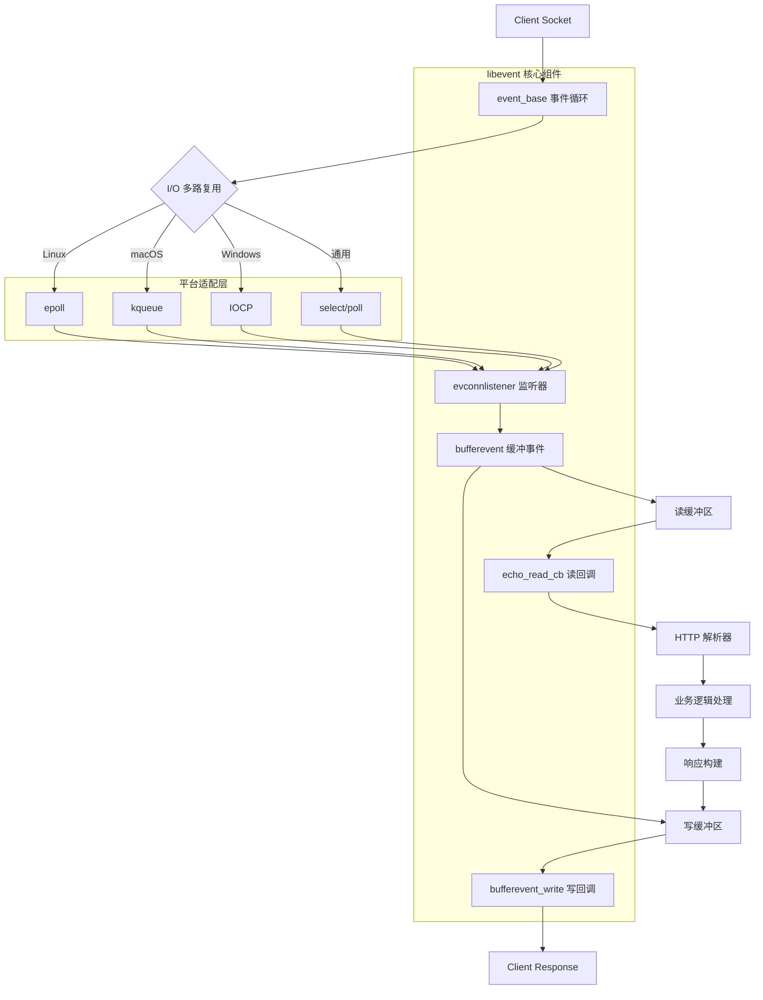

libevent 是经典的事件驱动库，轻量并被广泛使用。

```mermaid
flowchart TD
    A[Client Socket] --> B[event_base 事件循环]
    B --> C{I/O 多路复用}
    C -->|Linux| D[epoll]
    C -->|macOS| E[kqueue]
    C -->|Windows| F[IOCP]
    C -->|通用| G[select/poll]
    
    D --> H[evconnlistener 监听器]
    E --> H
    F --> H
    G --> H
    
    H --> I[bufferevent 缓冲事件]
    I --> J[读缓冲区]
    I --> K[写缓冲区]
    
    J --> L[echo_read_cb 读回调]
    L --> M[HTTP 解析器]
    M --> N[业务逻辑处理]
    N --> O[响应构建]
    O --> K
    K --> P[bufferevent_write 写回调]
    P --> Q[Client Response]
    
    subgraph "libevent 核心组件"
        B
        H
        I
        L
        P
    end
    
    subgraph "平台适配层"
        D
        E
        F
        G
    end
```

## 参考

流程图来源： https://github.com/linkxzhou/mylib/