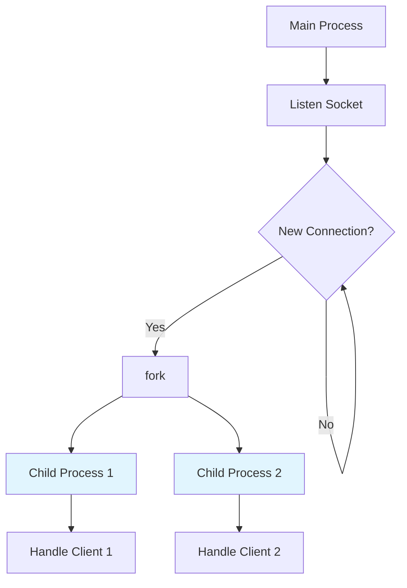
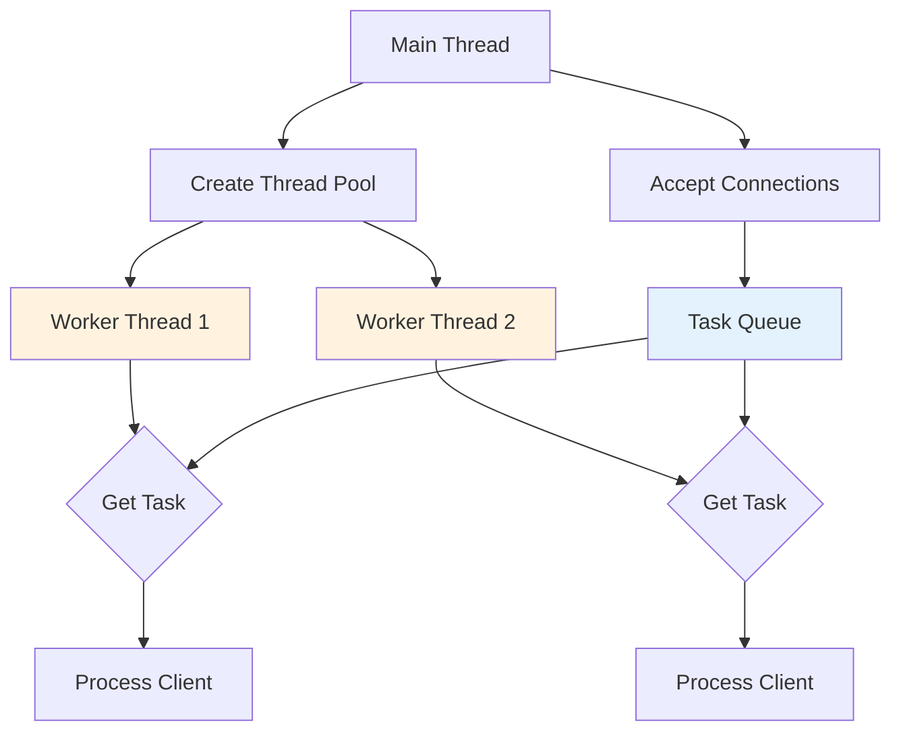

### 普通多进程服务器

fork-per-connection 模式：
* 监听 socket 后进入 accept 循环，每次接受新连接后立即 `fork()` 出子进程
* 子进程关闭关闭监听 socket ，处理完客户端连接的 IO 操作后退出
* 主进程关闭客户端 socket ，继续监听新连接，通过 signal 或 `waitpid()` 回收僵尸进程

### 多线程模型

thread-per-connection，类似 fork-per-connection，但可以共享一些内存。

### 线程池模型

预先创建一定数量工作线程，有 socket 连接时进行负载分配。参考 [algorithm/conc/thread-pool](../../algo/concurrency/thread-pool.md) 中实现。

### Leader&Follower Model 

任意时刻，只有一个 Leader 线程在多路复用器上等待 IO 事件。事件抵达时，Leader 从 Followers 中选举出新的 Leader，然后将自己降级为工作线程去处理事件，处理结束后变为 Follower 等待选举。

核心优点：减少线程间调度竞争，避免惊群效应。

### corotines 

见 C++ [Coroutines](../../langs/cpp/concurrency/coroutine.md)

### pipeline 

* on_request 
* on_headers 
* on_body 
* on_eom 

## 参考

https://github.com/linkxzhou/mylib/blob/master/c%2B%2B/concurrency_server/