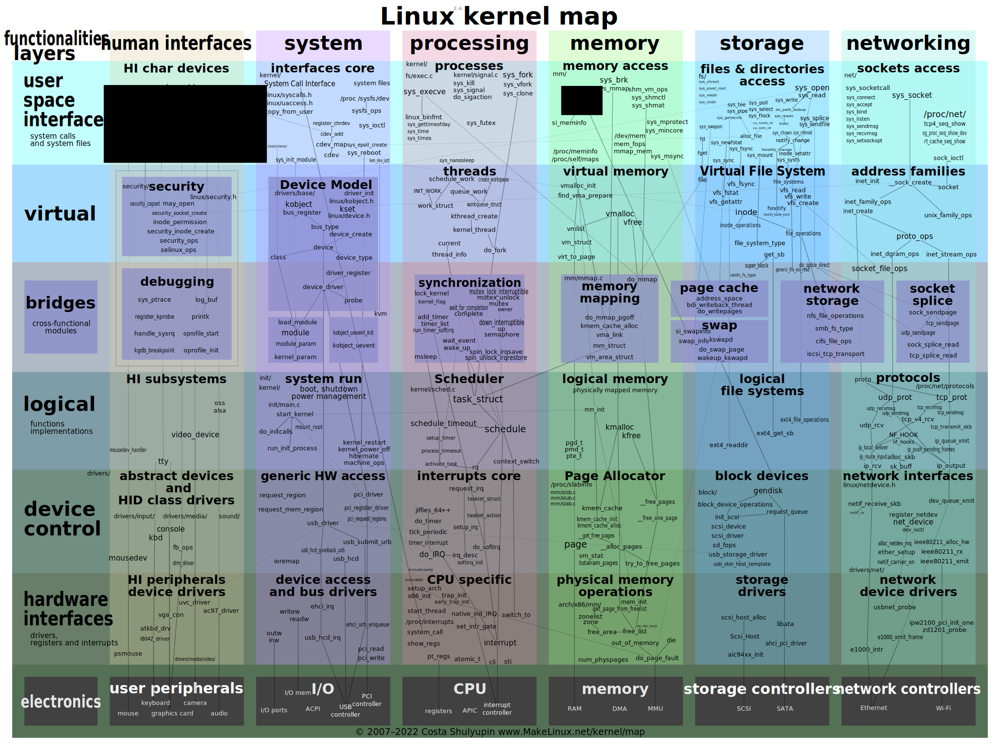

[Linux 系统组成](linux.md):
1. 内核
2. Shell
3. 文件系统
4. 应用程序

| Linux 内核架构 | 安卓内核架构 |
| -------------- | ------------ |
|         |              |
Linux 内核组成: (五个子系统)
- SCHED 进程调度. 
- MM 内存管理. 和进程调度系统的耦合度较高.
- VFS 虚拟文件系统
- NET 网络接口
- IPC 进程间通信.

## Kernel 

Kernel 工作在三个情景下:
- system calls from userspace. 
- interrupt handlers triggered by hardware. 
- long-lived kernel threads (wakeup)
- exceptions from traps and faults

内核线程安排如下:
- 第一个内核线程是 `init` (`systemd`), `pid = 1`, 启动 Userland
- 第二个内核线程是: `kthreadd`, `pid = 2`, 创建所有其他内核线程. 
- 其他内核线程:
	- 每个 CPU 核有独立的: ksoftirqd, watchdog, kworkers
	- 子模块线程: io, mm, fs, dev 

> "Kernel is system's core, always resident, always privileged, and always in control".

### 其他内核线程

每个 CPU 绑定：
* `ksoftirqd/N` 每个 CPU 一个，用于处理软中断
* `kworker/*` 通用的工作队列线程
* `migration/N` 用于 CPU 之间迁移任务
* `watchdog/N` 检查 CPU 是否有死锁
* kswapd 内存回收线程
* kcompactd 内存碎片整理线程

## 内核执行模型

- Process Context: 用户态, 通过系统调用陷入内核. 拥有完整虚拟地址空间.
- Kernel Thread: 内核态, 本质是调度实体 `task_struct`, 但没有独立的用户态虚拟地址空间. 不能直接访问用户空间的数据.
- SoftIRQ / Tasklet: 延迟执行的中断处理程序. 取代原本的中断上下半区机制.
- IRQ Handler: 硬件中断处理函数, 不参与调度, 直接抢占 CPU. 中断, 以及延迟处理的中断上下文中, 均不允许睡眠或阻塞, 也禁止使用可能触发调度的函数. 

内核执行模型详见:
- [linux-irq-model](../proc/linux-irq-model.md)
- [linux-proc-model](../proc/linux-proc-model.md)

### System Calls Execution Flow 

1. User Space Process 
	- issue a syscall (`read(), write(), execve()`)
	- use architectur-specific instruction (e.g. `syscall` on x64)
	- switch from ring n to ring 0
2. Syscall Entry (Architecture-Specific)
	- enter via syscall handler (e.g. `entr_SYSCALL_64` on x64)
	- save user registers, set up kernel stack 
3. Syscall Dispatch Table 
4. Device / File Backend 
	- Filesystem (e.g. `ext4`)
	- Device driver (e.g. `block, pipe, char`)
	- Socket/NIC (e.g. `net`)
5. Return To Userspace (Exit Path)
	- copy result to userspace buffer, restore registers
	- switch from ring 0 to ring n

### Internal Kernel Thread & System Maintenance 

1. Kernel Thread Creation (Boot, or Runtime)
	- `kthread_create()`
	- associated with a `stack_struct`
2. Kernel Thread Main Event Loop 

### Hardware Interrupt Handling 

详见 [linux-irq-model](../proc/linux-irq-model.md)

E.G. Network Stack (NIC):  
packet received --> IRQ (Top-Half) --> SoftIRQ (Bottom-Half) --> NAPI Polling --> build `sk_buff`, deliver to socket buffer --> idle 

E.G. Disk:  
I/O done --> IRQ (Top-Half) --> Workqueue (Bottom-Half) --> Workqueue --> complete I/O req, update page cache --> idle 

## 内核对象

这里按子系统列出一些常见内核对象. 具体细节和成员含义, 请参见具体的场景.

进程信息: 用 `unsigned long` 表示地址, 64b 机器上为 64b, 32b 机器上为 32b. 

mm:
* `struct vm_area_struct` 一块虚拟内存区域
* `struct mm_struct` 持有多块虚拟内存区域 `vm_area_srtuct`，表示实际进程空间 
* `struct page` 一个物理页
* `struct address_space` 表示物理地址空间

proc:
* `struct task_struct` 一个进程（线程） 
	* `mm_struct mm` 进程地址空间
	* `files_struct files` 打开的文件表
	* `task_struct parent` 进程派生关系 

fs:
* `struct inode` 一个文件系统节点
* `struct super_block` 管理 `inodes` 的元信息块
* `struct dentry` 一个目录项，缓存 字符串路径名 与 `inode` 的映射

dev:
* `struct device` 一个设备
* `struct device_driver` 设备驱动，下挂多个同类型设备

net:
* `sk_buff` 
* `struct sock`  协议状态机实现
* `struct socket` 实现 VFS 的虚函数，持有 `sock` 
* 

### 内核计时器

`jiffies_64, jiffies` 全局变量. 通过定时器中断, 维护的一种全局时钟. 