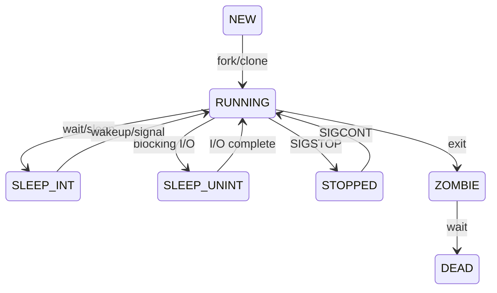

每个进程都不断在 CPU burst 和 I/O burst 间交替，因而会不断状态交替（运行态、阻塞态、就绪态）。处于运行态的进程有一段可执行时间，称为时间片（Time Slice），耗尽后会进入就绪态，或者在时间片耗尽前进入阻塞态。

进程调度由**调度程序, Scheduler** 负责选择一就绪程序, 由**分派程序, Dispatcher** 负责进程切换. 进程状态改为运行态后, 系统切换为用户态, 跳转到程序对应位置开始执行.

进程调度的原则是：提高 CPU 利用率，提高系统任务吞吐量，通过减少等待时间来减少总周转时间，提高系统的总任务吞吐量；同时确保某些实时任务的响应时间。对于 IO 密集型程序，CPU 大量短执行，可以赋予更高优先级；对于 CPU 密集型程序，不能让其长时间占用 CPU，应降低其优先级并抢占 CPU。


## 进程状态

Linux 的进程状态划分：
- running(R). 就绪态，**可能正在运行，也能处于就绪队列**
- interruptible sleep(S). 可中断睡眠，等待事件或 IO，但可以取消等待
- uninterruptible sleep / disk(D). 不可中断睡眠，等待事件，必须完成，否则会破坏一致性
- stopped / traced(T). 停止执行。比如收到 SIGSTOP 信号进入调试断点
- dead(X). 进程已删除




在 Unix 系统下，有一个特殊状态被称为 Zombie（Z），指进程已经完成 `exit`，但是仍在等待父进程通过 `wait()` 系统调用读取其退出状态，因此一些进程资源未被释放。

## 进程调度性能指标

* 周转时间：从任务提交到运行结束的总时间，包括：调度等待时间、CPU 执行时间、IO 等待时间
* 响应时间：从任务提交到 CPU 第一次响应的时间
* CPU 利用率： CPU Busy Time / (Busy Time + IDLE Time)
* 公平性：是否有进程饥饿

普通调度器主要关注总吞吐量，实时调度器还需要保证时间约束。

## Linux 调度类

Linux 内核中，每个 CPU 绑定一个*运行队列* `struct rq` ，其下按调度类划分*子运行队列*，`struct cfs_rq, struct rt_rq, struct dl_rq` 。运行队列中的调度单位是 `struct sched_entity` ，这个调度单位是对线程类的成员 `task_struct->se` 的引用。

| 调度类           | 策略                         | 描述                   |
| ---------------- | ---------------------------- | ---------------------- |
| `stop_sched_class` |                              |                        |
| `idle_sched_class` | `SCHED_IDLE`                 | CPU 空闲时摸鱼         |
| `fair_sched_class` | `SCHED_NORMAL` `SHCED_BATCH` | CFS 完全公平调度策略   |
| `rt_sched_class`   | `SCHED_RR` `SCHED_FIFO`      | RR / FIFO 等实时调度类 |
| `dl_sched_class`   | `SCHED_DEADLINE`             | EDF 算法                       |

Linux 的不同调度类之间也有优先级：stop > deadline > real-time > fair > idle

## CFS (Completely Fair Schedulr)

对于每个任务，追求虚拟运行时间 `vruntime` 的公平分配。`SCHED_NOFRMAL` 用于日常交互任务，`SCHED_BATCH` 用于吞吐任务。**CFS 是 Linux 默认的调度策略**。

经典 CFS 调度类中，`vruntime` 则表示在“理想而公平的 CPU” 中，该进程已经运行了多少时间，这是一个经过 `nice` 值加权的虚拟时间，大概计算方式如下：

```c
// 为了减少 ^ 的计算损耗，内核实际在用查表法，这里只是近似值
// NICE_0_LOAD 意思就是 nice = 0 时，load_weight = 1，因而 vruntime 和实际时间接近一致
load_weight = 1024 / 1.25 ^ nice; // 

delta_exec = now() - exec_start;
sum_exec_runtime += delta_exec;
delta_vruntime = delta_exec * NICE_0_LOAD / load_weight; // delta_exec * 1.25 ^ nice 

vruntime += delta_vruntime;
```

也就是说，`nice` 越小，`vruntime` 增长越慢。经典 CFS 算法将所有实体的 `vruntime` 放在一个红黑树里排序，每次选择最小的 `vruntime` 进行调度（树最左实体）。Linux 6.6+ 后，CFS 调度时不再仅选择`vruntime` 最小的实体，而是逐步切换到更复杂的 EEVDF（见下）。

在完整的调度周期中，线程进入 `RUNNING` 状态就会触发调度，此时会更新 `vruntime` 并选择最终负载。当任务的时间片耗尽、陷入阻塞等情况触发调度时，`vruntime` 也会被重新计算。

```c
struct sched_entity {
	struct load_weight load;
	struct rb_node run_node; 
	u64 exec_start;
	u64 sum_exec_runtime;
	u64 vruntime;
	unsigned char on_rq;
};

struct cfs_rq {
	struct load_weight load;
	unsigned int nr_queued;
	
	s64 sum_w_vruntime;
	u64 sum_weight;
	u64 zero_vruntime; 
	
	struct rb_root_cached tasks_timeline; // vruntime 红黑树
	struct sched_entity *curr;  // 当前任务负载
	
	struct sched_avg avg;
};
```

每个 CPU 持有独立的 `struct cfs_rq` ，调度主要发生在本 CPU 核心内。跨 CPU 的调度由复杂均衡器负责。

## RT Class 

实时调度器。**按固定任务优先级抢占调度 (Priority Scheduling, PR)，优先级 0~99（99 最
高**）。同一优先级中，`SCHED_FIFO` 表示任务不轮转，`SCHED_RR` 表示按时间片任务轮转。

FIFO 模式下，高优先级线程永远抢占低优先级线程。没有时间片抢占，高优先级线程会持续执行，
直到阻塞或被更高优先级线程抢占。

RT Class 也被称为 Fixed Priority Class ，采用经典调度方式（RM, 周期越短，优先级越高）的条件下，其可调度的充分条件是 ($U$ 是 CPU 利用率):

$$ U\leq n(2^{1/n} - 1) $$

这个 $U$ 的上界是 $ln2$，远小于 100%。实际体感上，也是任务数越多，RT 配置越复杂。

## EDF (Earliest Deadline First, EEVDF)

对于单核，EDF 调度器在以下情况被证明是最优的：对于 deadline 小于等于 period 的单核的周期性或偶发性任务（不包括突发任务）。每个 EDF 任务的参数如下，每次调度时，绝对截止日期最近的任务会被选择。

* Runtime： WCET 最坏执行时间，即某个任务完成所需的至多 CPU 时间
* Period：任务释放（release）的时间间隔
* Deadline：一个任务从释放（release）开始，多久必须完成。

对于 deadline 不明确的任务，EDF 调度器也能胜任，但是须保证任务集满足 
$\sum U = \sum runtime/period \leq 1$ 。即只要预期的总 CPU 利用率不超过 100%，EDF 总能找到可行调度。

| task | runtime (WCET) | period | deadline |
| ---- | ---------------|-------|-----------|
| $T_1$ | 1  | 4 | 4 |
| $T_2$ | 2 | 6 | 6 |
| $T_3$ | 3 | 8 | 8 |

整体 CPU 利用率为： 
$$U=1/4 + 2/6 + 3/8 = 23/24$$ 

此任务对 EDF 是可调度的，但是对 Fixed Priority 是不可调度的。

### EDF Parameters 

总体选择方式是： 

$$ runtime \leq deadline \leq period $$

如果低估 $runtime$ (WCET, worst-case execution time), 线程会被节流，
直到下个周期预算补充。可能导致偶发长尾抖动。

如果高估 $runtime$ ，会占用调度容量。如果 runtime 接近 deadline，会导致其他任务
几乎不可被调度。

### EDF vs. RT (Fixed Prior)

**在配置 EDF 调度器时，不需要关注其他任务的优先级（抢占顺序），只要总 CPU 时间占用
不超过 100% 就可以。EDF 调度的 Context Switch 会更小，在系统抢占关系复杂时，
调度配置比 Fixed Priority 调度器简单。**

EDF 的缺点是，不保证任务的**最小响应时间**，只保证 deadline 前会执行任务。在多核
调度下，EDF 也不能保证是最优的，事实上多核最优调度是 NP Hard 问题。

## MLQ 

多级队列调度, MultiLevel Queue Scheduling, MLQ. 比较偏教科书的方式.

举例: 三级就绪队列,
- Q0, RR, 时间片为8ms
- Q1, RR, 时间片为16ms
- Q2, FCFS


调度策略:
- 新进程先进入 Q0, 若无法在 8ms 时间片完成, 进入 Q1 
- Q1 中, 若无法在 16ms 时间片完成, 进入Q2
- Q2 采用先来先服务 一次性运行完
- 抢占, 高级队列抢占低级队列.

## Reference 

https://docs.kernel.org/scheduler/sched-design-CFS.html 

[Deadline scheduling part 1 — overview and theory, Daniel Bristot, 2018](https://lwn.net/Articles/743740/)