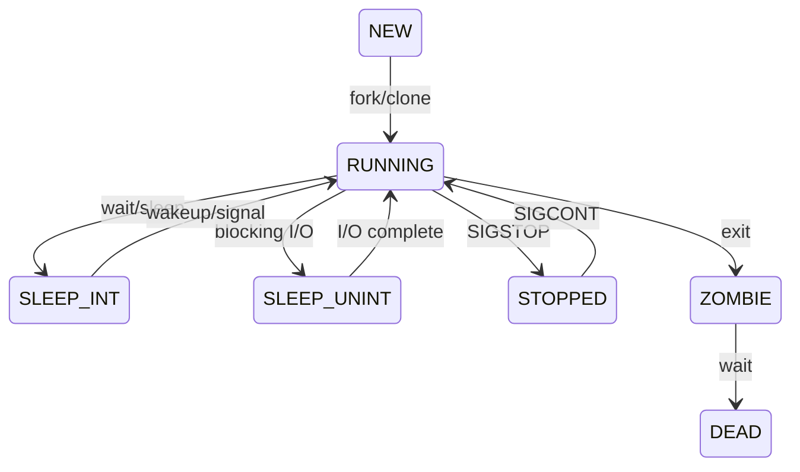

调度分三个层次, 
- 长程调度: 又称作业调度, 从提交的作业中选出一个调入内存并创建进程.
- 短程调度: 又称进程调度, 从就绪队列选出进程调入 CPU 运行.
- 中程调度: 将进程换入/换出内存, 节省内存.

| 调度层次 | 来源       | 切换频率 | 开销   | 位置       | 进程状态              |
| -------- | ---------- | -------- | ------ | ---------- | --------------------- |
| 作业调度 | 提交的作业 | 频率低   | 开销大 | 外存到内存 | 创建态 -> 就绪态        |
| 内存调度 | 挂起队列   | 频率中   | 开销大 | 外存到内存 | 挂起态 -> 就绪态/阻塞态 |
| 进程调度 | 就绪队列   | 频率高   | 开销小 | 内存到CPU  | 就绪态 -> 运行态                      |

## 进程状态

Linux 的进程状态划分：
- running(R). 就绪态，**可能正在运行，也能处于就绪队列**
- interruptible sleep(S). 可中断睡眠，等待事件或 IO，但可以取消等待
- uninterruptible sleep / disk(D). 不可中断睡眠，等待事件，必须完成，否则会破坏一致性
- stopped / traced(T). 停止执行。比如收到 SIGSTOP 信号进入调试断点
- dead(X). 进程已删除

在 Unix 系统下，有一个特殊状态被称为 Zombie（Z），指进程已经完成 `exit`，但是仍在等待父进程通过 `wait()` 系统调用读取其退出状态，因此一些进程资源未被释放。

## 进程调度

需考虑 CPU 执行特点: 大量短执行, 少量长执行. 如何最大化 CPU 利用率?

每个进程都不断在 CPU burst 和 I/O burst 间交替，因而会不断状态交替（运行态、阻塞态、就绪态）。处于运行态的进程有一段可执行时间，称为时间片（Time Slice），耗尽后会进入就绪态。

进程调度由**调度程序, Scheduler** 负责选择一就绪程序, 由**分派程序, Dispatcher** 负责进程切换. 进程状态改为运行态后, 系统切换为用户态, 跳转到程序对应位置开始执行.

### 进程调度评价指标

CPU 利用率: $=\frac{\text{CPU工作时间}}{\text{总时间}}$

吞吐量: $=\frac{\text{完成进程数}}{\text{总时间}}$

周转时间: 作业从提交到运行结束的时间, 包括"作业调度时间, 进程调度时间, CPU 执行时间, I/O 时间".   
- $平均周转时间=\frac{周转时间}{作业数}$
- $带权周转时间=\frac{周转时间}{运行时间}$, 评价运行时间和等待时间的比例.

等待时间: 等待时间之和, = 周转时间 - 运行时间.

响应时间: 从提交作业到处理机第一次响应的时间. 

### 常见进程调度算法

- 先来先服务, FCFS
- 短作业优先, SJF, Shortest Job First
- 高响应比优先, HRRN, High Response Ratio Next. 响应比 $R=\frac{W+S}{S}$, $W$ 是进程等待时间, $S$ 是进程需要的总运行时间.
- **优先级调度, PR, Priority scheduling**
- **时间片轮转调度, RR, Round Robin. 抢占式算法.** RR 时间片一般稍大于 80% CPU 时间.

其中 FCFS, SJF, HRRN 关注点是公平性及周转时间. 而 PR, RR 关注点则是响应时间. 非抢占式算法在"当前进程运行结束时, 或陷入等待态时"开始调度; 抢占式算法还可以在"新进程到达时, 时间片结束时"开始调度. 非抢占式算法更灵活, 应用广泛, 但需要注意[线程安全](进程同步与互斥.md)

现代操作系统结合使用 PR 与 RR, 按如下方式处理优先级: 
1. 考虑用户指定优先级
2. 提高进入等待态更频繁的进程的优先级, 即优先处理 IO 密集型进程 (IO Bound Thread), 而 CPU 密集型进程 (CPU Bound Thread) 优先级较低.
3. 提高长时间得不到执行的进程的优先级.
4. 用时间片轮转保证不会有进程长时间占据 CPU.

| 算法     | 抢占 (Preemption)        | 饥饿 | 优点                     | 缺点       |
| -------- | ----------- | ---- | ------------------------ | ---------- |
| FCFS     | 非抢占      | 不会 | 公平, 简单               | 护航效应   |
| SJF/SRTF | 非抢占/抢占      | 会   | 最短平均等待/周转时间    | 长作业饥饿 |
| HRRN     | 非抢占      | 不会 | 综合                     |            |
| RR       | 抢占        | 不会 | 公平, 用于分时系统       | 切换开销大 |
| PR       | 非抢占/抢占 | 可能 | 区分优先级, 用于实时系统 | 可能有饥饿 |
| MLFQ     | 抢占        | 可能 | 适用广                   |            |

#### 多级队列调度

多级队列调度, MultiLevel Queue Scheduling, MLQ.

举例: 三级就绪队列,
- Q0, RR, 时间片为8ms
- Q1, RR, 时间片为16ms
- Q2, FCFS

调度策略:
- 新进程先进入 Q0, 若无法在 8ms 时间片完成, 进入 Q1
- Q1 中, 若无法在 16ms 时间片完成, 进入Q2
- Q2 采用 FCFS, 一次性运行完
- 抢占, 高级队列抢占低级队列.
