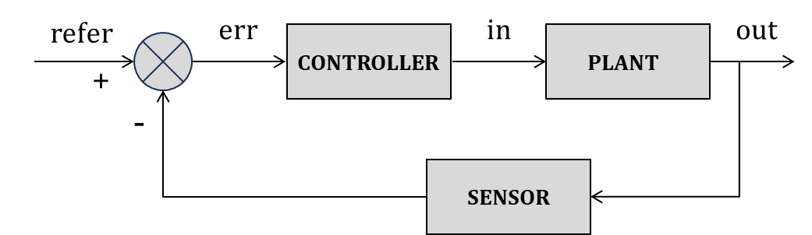
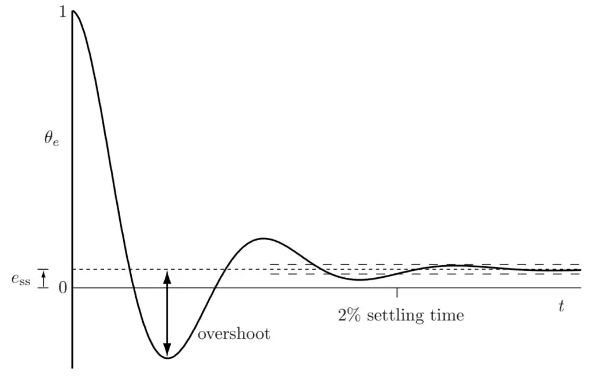

开环控制系统（Open Loop）：

闭环控制系统：

控制理论目的是借由控制器的工作让系统稳定在设定值，而不会有误差或震荡。设定值不变的控制称为*调节*，设定值快速变化的控制称为*伺服*。

当 $t\to \infty$ 时，系统响应达到稳态后的误差被称为*稳态误差*（steady-state error） $e_{ss}$

当 $t\to 0$ 时，系统的瞬时响应则有两个参数：

* *overshoot*
* *2% settling time*

*2% settling time* $T$ 是指系统首次达到：
$$|\theta_{e}(t)-e_{ss}|\leq 0.02 \times [\theta_{e}(0)-e_{ss}],\quad \forall; t\geq T$$
*overshoot* 一般是指首次较大幅度的调整：
$$\text{overshoot}=\left| \frac{\theta_{e,min}-e_{ss}}{\theta_{e}(0)-e_{ss}}\right|\times 100\%$$
其中 ${} \theta_{e,min}$ 是指最小的正值误差。

## 线性系统的误差方程

误差随时间的波动构成一组*动力学* p 阶常微分方程：

$$
\newcommand{\E}{\theta_{e}}
a_{p}\E^{(p)}+ a_{p-1}\E^{(p-1)} + \cdots +a_{2}\dot{\dot{\E}}+ a_{1}\dot{\E} + a_{0} \E=c
$$

* $c=0$ 时，homogeneous，没有外部输入，纯系统动态。这是大多数情况，因为 $c$ 在计算误差时（目标值减去实际值）通常能被消除掉。
* $c\neq 0$ 时，nonhomogeneous，有外部驱动。

## Bode Plot

**传递函数**

*增益（gain）*

*相位（phase）*

## LQR

## PID (Proportion Integration Differentiation)

PID 方法用于反馈控制，使系统输出 $y(t)$ 追踪期望参考值 $r(t)$ 。

误差定义为： 

$$\theta_{e}(t)=r(t)-y(t)$$

PID 控制律的*控制输入*定义为： 

$$u(t)=K_{p}\theta_{e}(t)+K_{i}\int^{t}*{0}\theta*{e}(\tau)d\tau +K_{d} \frac{d\theta_{e}(t)}{dt}$$

* $K_{p}$ 比例增益，对误差立刻做出反应。可能产生震荡（oscillation）。
* $K_{i}$ 积分增益，消除 *稳态误差（steady-state error）*
* $K_{d}$ 微分增益，提高相位裕度（阻尼、damping）。

$K_{d}$ 微分项对噪声（高频信号）很敏感，因此会搭配低通滤波使用，或干脆不用。*带低通滤波的微分项（Dirty Derivative）* 定义为： 

$$D(s)=\frac{K_{d}s}{\tau s+1}$$

## Kalman Filter

