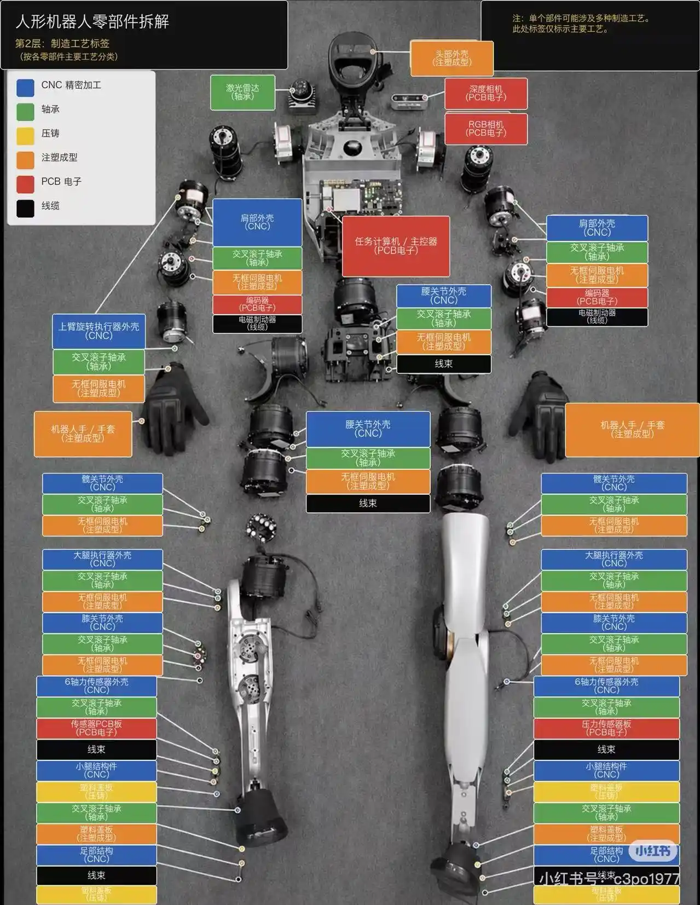

## Humanoid Hardwares

[Humanity's Last Machine](https://www.humanityslastmachine.com/)

关机（执行器 Actuator）：
* 伺服电机（Servo Motor）
* 减速器（Gear Reducer），行星减速器、谐波减速器
* 编码器（Encoder），检测位置和转速
* 制动器（Brake），减速器不支持自锁时，可选
* 电机驱动

电机通过减速器带动外部实际关节，因此电机转角和关节转角需要换算。

### 编码器

* 电机编码器：电机内部的编码器，测量电机轴转角 $m$ 
* 外置编码器：机器人关节外的编码器，测量关节角 $q$ 

外置编码器在重启后，仍能判断关节的实际角度；
而电机编码器，依赖软件换算关节角，在断电重启后，可能丢失关节实际位置。

两个编码器的关系为： 

$$\Delta m = \Delta q \times \pm 1 \times \text{gear\_ratio}$$

其中 $\Delta q = q - q_0$ ，其中 $q_0$ 已知。

给电机发令时，换算 $m$；从电机接收反馈时，换算 $q$。
