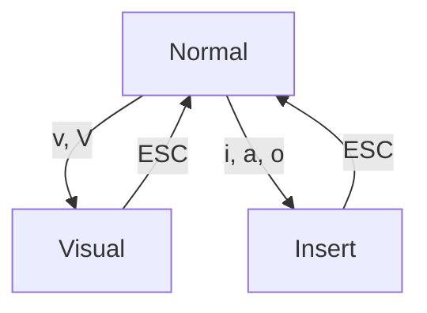

## 会话

文件被读取到内存后，vim 将其称为 *buffer* ，（而不是主流的 tab 称呼），buffer 被存储在单个进程的 buffer list 里。而 windows 则是显式一个 buffer 的区域。同一个界面可以被分屏，整体被称为 *tab* ，tab 基本不用，更多是直接用 buffer list。

### 管理全局缓冲区

```vim
:bn           " 切换到下一个缓冲区, buffer next
:bp           " 切换到上一个缓冲区, buffer previous
:b2           " 切换到第二个标签页, 用 :buffers 查看编号
:bd <buffer>  " 删除缓冲区, buffer delete
:ls
:buffers      " 列出全局缓冲区列表
:e <file>     " 激活新 buffer, 隐藏当前 buffer
```

### 管理分屏窗口

```vim
:sp  <file>           " 分屏
:vs  <file>           " 垂直分屏
:new <file>
^w w                  " 窗口间切换
^w h/j/k/l            " 在窗口间按方向键切换
^w H/L/x              " 窗口之间调换
^w c                  " 关闭分屏
:only
:q                    " 关闭当前窗口
:set (no)scrollbind   " 左右屏同时滚动

^w <, ^w <            " 修改左右侧分屏的宽度
^w +, ^w -            " 修改上下分屏的高度
^w =                  " 让分屏大小平均
```

## 模式与操作

Vim 有三种类型操作:
- [移动](移动.md), action, 用于移动光标, 如 `h, j, k, l, w, b`
- [操作符](宏.md), operator, 用于对某区域执行操作, 如 `d, ~, gU, >`. 默认区域有**字符和行**, 字符操作用小写字母, 行操作用大小字母.
- **文本对象, text-objects**, 用于选中特殊区域 (如当前光标所在的括号, 单词, 句子), 形式为 `i` (inner), `a`(around) 加上对象标识符. 如 `diw` 删除当前单词, `di"` 删除引号中内容, `da(` 删除当前括号及其中内容. 

Vim 有三种操作模式用于不同目的:
- 普通模式 (Normal Mode), 先输入操作符, 再输入动作, 如 `>j`
- 插入模式 (Insert Mode), 用于输入文本.
- [选中模式 (Visual Mode)](范围与区域.md), 先选中区域, 然后按操作符.
- PS: 还有一种命令模式, 输入 `:` 后键入控制命令.



> 比如: `d2a(` 和 `2da(` 等价, `4da(` 和 `2d2a(` 等价.
>
> `:h navigation`, `:h operator`, `:h text-objects`

## 与 shell 的交互

执行 shell 命令: 结果显示在临时窗口.

```vim
:!my_command
```

执行命令, 并替换所选范围内的文本为命令输出: (范围也可以先用 `V` 选中, 而非指定)

```vim
:.,+4!ls
:$!ls                " 在文件末尾输出 ls 命令结果
```

执行命令, 并将输出添加到光标处:

```vim
:r !command
```

在普通模式, 连续输入 `!!` , 相当于执行 `:.!`

## 历史

| 临时编辑历史     | 列出所有条目 | 跳转到上一历史(的位置) | 跳转到下一历史 |
| -------- | ------------ | ---------------------- | -------------- |
| 跳转历史 | `:jumps`     | `[cnt]<c-o>`           | `[cnt]<c-i>`   |
| 变更历史 | `:changes`   | `[cnt]g;`              | `[cnt]g,`      |
| 命令历史 |    | `:<c-p>`               | `:<c-n>`               |

vim 的*变更历史*以行为单位，即，行内改动会被合并为同一个历史。vim 的历史是树形结构，当撤销时，有两种回退历史的方式：
* 按分支遍历 `:redo`, `:undo` ，从 quux 回退 bar
* 按时间遍历 `g-`, `g+` ，从 quux 回退 baz 
* `:earlier 1f` 回退到最近一次保存时

```
	 foo(1)
  	 / 
	bar(2)
   /    \
baz(3)  quux(4)
```

注意，编辑历史和跳转历史都是临时的，退出 Vim 时清空。不会被保存在 swap 里。

