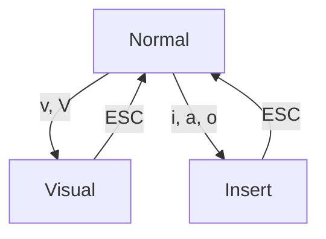

## 会话

文件被读取到内存后，vim 将其称为 *buffer* ，（而不是主流的 tab 称呼），buffer 被存储在单个进程的 buffer list 里。而 windows 则是显式一个 buffer 的区域。同一个界面可以被分屏，整体被称为 *tab* ，tab 基本不用，更多是直接用 buffer list。

### 管理全局缓冲区

```vim
:bn           " 切换到下一个缓冲区, buffer next
:bp           " 切换到上一个缓冲区, buffer previous
:b2           " 切换到第二个标签页, 用 :buffers 查看编号
:bd <buffer>  " 删除缓冲区, buffer delete
:ls
:buffers      " 列出全局缓冲区列表
:e <file>     " 激活新 buffer, 隐藏当前 buffer
```

### 管理分屏窗口

```vim
:sp  <file>           " 分屏
:vs  <file>           " 垂直分屏
:new <file>
^w w                  " 窗口间切换
^w h/j/k/l            " 在窗口间按方向键切换
^w H/L/x              " 窗口之间调换
^w c                  " 关闭分屏
:only
:q                    " 关闭当前窗口
:set (no)scrollbind   " 左右屏同时滚动

^w <, ^w <            " 修改左右侧分屏的宽度
^w +, ^w -            " 修改上下分屏的高度
^w =                  " 让分屏大小平均
```

## 模式与操作

Vim have three operators: 
- [motion](vim-motion.md), used to move the cursor. `h, j, k, l, w, b`
- text-objects. like char, word, row (range), paragraph, code structure, and surroundings. 
	- `i` inner. `xxx` in `{xxx}`
	- `a` around. `{xxx}` in `{xxx}`
- [operator](vim-operator.md), used to operate some text-objects. `d, x, ~, gU, >` 
	- for **char**: `x` 
	- for **row**: `dd` delte this line, `d5j` delete the next 5 lines. 
	- for **word** (surrounded by spaces): `dw` delete this word 
	- for **paragrph** (surrounded by blank line): `dp` delete the pragraph
	- for **code structure**: `dif` delete inside function, `yac` copy around class
	- for **surrounding**: `di"` delete the content inside quotes 


Vim 有三种操作模式用于不同目的:
- 普通模式 (Normal Mode), 先输入操作符, 再输入动作, 如 `>j`
- 插入模式 (Insert Mode), 用于输入文本.
- 选中模式 (Visual Mode) 先选中区域, 然后按操作符.
- 命令模式, 输入 `:` 后键入控制命令.



> `d2a(` 和 `2da(` 等价, `4da(` 和 `2d2a(` 等价.

### Ranges 

Ranges 特指 Vim 的行范围
- `.` 当前行（默认）
- `$` 最后一行
- `%` 全文件
- `1` 文件第一行
- `n` 文件第 N 行
- `+n` 从当前行计的第 N 行
- `'<, '>` 选中区域的开始、结尾。`'` 是引用标记的意思，详见 [vim 标记](vim-motion.md)

比如，删除从第一行开始到第五行：`:1,5d`；删除全文件 `%d`


## 与 shell 的交互

执行 shell 命令: 结果显示在临时窗口.

```vim
:!my_command
```

执行命令, 并替换所选范围内的文本为命令输出: (范围也可以先用 `V` 选中, 而非指定)

```vim
:$!ls                " append the ls output in the end of file
:%!cmd               " file content -> stdin -> shell cmd -> stdout -> replace file content
:.!cmd               " line content -> stdin -> shell cmd -> stdout -> replace line content
:r !cmd              " shell cmd -> stdout -> insert here
:.!bash              " use bash to execute this line 
```

## 历史

| 临时编辑历史     | 列出所有条目 | 跳转到上一历史(的位置) | 跳转到下一历史 |
| -------- | ------------ | ---------------------- | -------------- |
| 跳转历史 | `:jumps`     | `[cnt]<c-o>`           | `[cnt]<c-i>`   |
| 变更历史 | `:changes`   | `[cnt]g;`              | `[cnt]g,`      |
| 命令历史 |    | `:<c-p>`               | `:<c-n>`               |

vim 的*变更历史*以行为单位，即，行内改动会被合并为同一个历史。vim 的历史是树形结构，当撤销时，有两种回退历史的方式：
* 按分支遍历 `:redo`, `:undo` ，从 quux 回退 bar
* 按时间遍历 `g-`, `g+` ，从 quux 回退 baz 
* `:earlier 1f` 回退到最近一次保存时

```
	 foo(1)
  	 / 
	bar(2)
   /    \
baz(3)  quux(4)
```

注意，编辑历史和跳转历史都是临时的，退出 Vim 时清空。不会被保存在 swap 里。

## 搜索

### 替换

`:[scope]s/OLD/NEW/[g|c|i]`

- `scope` 作用范围,
- `g` 默认每行仅匹配第一个，`g` 匹配每行所有。
- `c`: 开启二次确认
- `i`: 大小写不敏感，默认大小写敏感。

### 查找

- `/{pattern}`
- `n, N` 下一个/上一个匹配项
- `*` 查找当前光标所在的单词

```vim
*
:%s//hello/g        " // 表示上一次的搜索模式
```

### 全局命令

在所有符号条件的行上执行某命令

```vim
:g/{regexp}/{cmd}
```

这就是 [grep 的命名由来](https://robots.thoughtbot.com/how-grep-got-its-name)：

```vim
:global/regexp/print
```

### 正则表达式

Vim 支持以下[正则表达式](../../appx/regular-expr-reference.md)字符：

| 元字符   | 说明                                                         |
| -------- | ------------------------------------------------------------ |
| `.`      | 匹配任意一个字符                                             |
| `[abc]`  | 匹配方括号中的任意一个字符. 可用 `-` 表示范围, 如 `[a-z0-9]` |
| `[^abc]` | 匹配除方括号中字符之外的任意字符                             |
| `\t`     | 匹配 `<TAB>` 字符                                            |
| `\s`     | 匹配空白字符                                                 |
| `$, ^, \<, \>`      | 匹配位置                                                     |
| `\n`     | 匹配换行符                                                   |
| `\_`     | 匹配....                                                     |
| `\+, \?, *, \{n,m}`     | 表示匹配数量                                                     |
| `\*, \., \\, \[` | 转义, 匹配保留字符         |          

