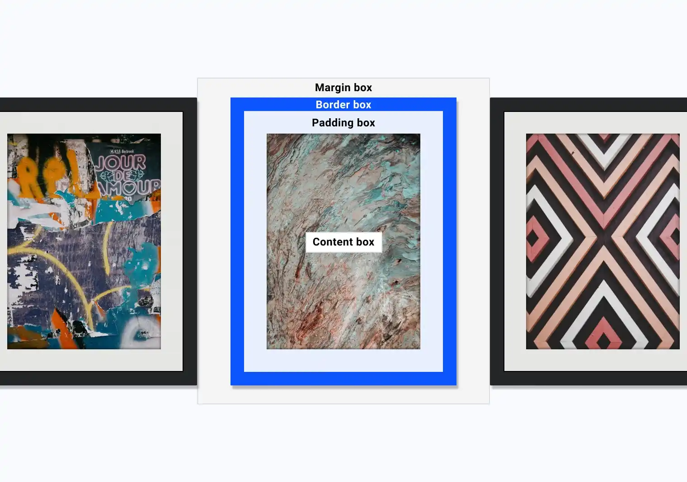

## Box Model

* box: 
    * context box: (标准盒模型)，border 和 padding 会增加元素总尺寸
    * border box: （IE 盒模型），`width * height` 包含 content、padding、border，border 会挤占 content 的空间。
* padding: padding is inside the content box, and share box's background.
    * scrollbar lives in padding box 
* border: usually a visual frame for the content. 
* margin: 
    * `outline` in here. outline has no effect on the size of box
    * `box-shadow` also lives in here 

## Spacing 

## Shadows

## Borders

