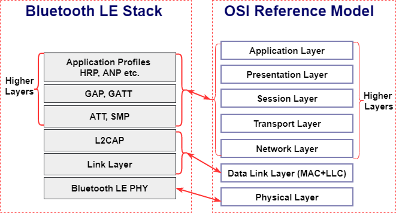

蓝牙标准由 **Bluetooth SIG (Special Interest Group)** 维护. 主要版本如下:
- 2.0 + EDR, 2004. 引入增强数据率 (EDR, Enhanced Data Rate), 传输速度最高达 3Mbps
- 3.0 + HS, 2009. 引入高速传输 (HS)
- 4.0, 2010. 引入低功耗蓝牙 (BLE, Bluetooth Low Energy), 主要用于传感器.
- 4.2, 2014. 支持 IPv6.
- 5.0, 2016. 

蓝牙有两种主要工作模式: BR/EDR, 以及 LE, 两者差别局限在物理层 (调制解调, 频率等) 和数据链路层 (数据链路层包格式, CRC 校验等, 代指为 LL) 之中. SIG 规定的通用蓝牙芯片 (蓝牙控制器), 内部封装了 RF/基带逻辑, 向上 (向操作系统驱动) 则通过串口暴露 HCI 接口.

蓝牙主机 (Host) 和控制器 (Controller) 间通过 HCI 协议接口通信, HCI 协议工作于链路层, 底层可以是 USB, UART 等总线协议. Controller 负责蓝牙的无线收发, Host 负责应用逻辑.

## 协议层次

蓝牙是一种多层次协议, 以 Linux 内核的视角来看: 大部分应用层和连接管理放在用户态 BlueZ 中, Socket (L2CAP, RFCOMM, SCO, BNEP) 和 HCI 逻辑放在内核中. 

- 应用层:
	- A2DP: 音频传输, 用于蓝牙耳机
	- HFP: 免提通话
	- HID: 键盘鼠标
	- GATT=based Profiles: 传感器, 心率 (HRP) / 电池 (BAS) / 温度 (HTP) 等
- 通用访问配置层: 
	- GAP (Generic Access Profile), 定义设备如何**广播, 扫描, 连接, 配对**
	- GATT (Generic Attribute Profile): BLE 的高层应用协议, 用于描述设备如何暴露服务.
- 属性层: ATT (Attribute Protocol), 定义设备属性
- 安全管理: SMP (Security Manager Protocol): 配对, 加密, 认证等功能. 密码协议使用 AES-CCM 
- 逻辑链路控制: L2CAP (Logical Link Control and Adaption Protocol), 
- 主机控制接口 HCI (Host Controller Interface), 主机和蓝牙控制器间的标准接口.

### 模块架构

* (Baseland) Resource Manager, 控制数据 QoS, 流量与拥塞控制, 硬件资源控制.
* 控制报文称为 C-plane, 数据报文称为 U-plane.

### 设备通信模式

P2P, Braodcast, MESH

## 

## 参考

https://www.bluetooth.com/learn-about-bluetooth/tech-overview/

https://www.mathworks.com/help/bluetooth/ug/bluetooth-protocol-stack.html

图片来源: https://documentation.espressif.com/projects/esp-idf/en/latest/esp32c5/api-guides/bt-architecture/overview.html